# PERTEMUAN 1

Pengenalan Sistem Operasi & Instalasi

## 1. LATIHAN KONSEPTUAL

### 1.1 Latihan 1.1

#### SOAL

Jelaskan 5 fungsi utama sistem operasi dengan contoh konkret dari minimal 2 OS berbeda (Windows, macOS, atau Linux).

#### JAWABAN

Sistem Operasi (OS) ibarat seorang manajer umum di sebuah pabrik. Ia bertugas memastikan semua sumber daya (perangkat keras) dan para pekerja (aplikasi/perangkat lunak) bekerja secara harmonis, efisien, dan aman. Tanpa OS, komputer hanyalah tumpukan logam dan silikon yang tidak bisa menjalankan perintah apa pun.

Berikut adalah 5 fungsi utama Sistem Operasi beserta Contoh konkret penerapannya di berbagai OS:

##### 1. Process Management
Sistem operasi bertanggung jawab untuk membuat, menjadwalkan, dan menghentikan proses (program yang sedang berjalan). OS memastikan setiap aplikasi mendapatkan waktu prosesor (CPU) yang adil sehingga kita bisa melakukan multitasking dengan lancar.

> Contoh di Windows: Task Manager menampilkan proses yang berjalan dan penggunaan sumber daya.

> Contoh di Linux: Perintah ps, top, dan htop untuk memantau proses

##### 2. Memory Management
Fungsi ini melacak bagian mana dari memori (RAM) yang sedang digunakan dan oleh aplikasi apa. Jika RAM fisik penuh, OS akan dengan cerdas meminjam ruang dari hard drive atau SSD sebagai "memori virtual".

> Contoh di Windows: Windows secara otomatis mengalokasikan ruang di penyimpanan utama menggunakan file tersembunyi bernama pagefile.sys untuk memori virtual (disebut Paging).

> Contoh di Linux: Linux menggunakan pendekatan yang sedikit berbeda dengan mendedikasikan seluruh partisi khusus yang disebut Swap space (atau Swap file) untuk menampung limpahan data dari RAM.

##### 3. File Management
Sistem operasi menentukan bagaimana data diatur, disimpan, dinamai, dan dilindungi di dalam media penyimpanan melalui sebuah arsitektur yang disebut Sistem File (File System).

> Contoh di Windows: Menggunakan sistem file NTFS (New Technology File System) dan membagi penyimpanan berdasarkan huruf drive (misalnya C:\ untuk sistem, D:\ untuk data pribadi).

> Contoh di macOS: Menggunakan sistem file modern APFS (Apple File System). Berbeda dengan Windows, macOS (dan Linux) memiliki struktur hierarki yang dimulai dari satu direktori puncak yang disebut Root (/), tanpa menggunakan huruf drive.

##### 4. I/O Management
OS bertindak sebagai penerjemah antara program perangkat lunak dan perangkat keras fisik (seperti printer, keyboard, webcam, dan kartu grafis) menggunakan program perantara yang disebut Driver.

> Contoh di Windows: Dilengkapi dengan fitur Device Manager, Windows sangat handal dalam Plug and Play. Mencolokkan mouse baru akan membuat Windows secara otomatis mencari driver generiknya sehingga mouse dapat  langsung digunakan dalam hitungan detik.

> Contoh di macOS / Linux: Untuk urusan manajemen printer, keduanya menggunakan standar yang sama yaitu CUPS (Common UNIX Printing System), sebuah sistem sumber terbuka yang mengatur antrean dan komunikasi tugas pencetakan ke mesin printer.

##### 5. Security and Protection
Fungsi ini meliputi verifikasi identitas pengguna, kontrol akses ke sumber daya berdasarkan izin, proteksi data, dan pencatatan aktivitas sistem untuk pemantauan keamanan.

> Contoh di Windows: Windows menggunakan chip TPM (Trusted Platform Module) di motherboard yang kunci pemulihannya disimpan di akun Microsoft atau diprint sebagai kode 48 digit menggunakan algoritma standar AES (biasanya 128-bit atau 256-bit).

> Contoh di macOS: MacOS mengandalkan chip keamanan Aple T2 atau Apple Silicon (M1/M2/M3) dengan kunci pemulihan yang disimpan di akun iCloud menggunakan algoritma standar AES-XTS 128-bit atau 256-bit. 

### 1.2 Latihan 1.2

#### SOAL

Kapan sebaiknya menggunakan Windows vs Linux vs macOS? Analisis berdasarkan use case: gaming, development, server, creative work, dan enterprise. 

#### JAWABAN

Setiap OS memiliki filosofi desain dan ekosistem yang berbeda. Berikut adalah analisis mendalam mengenai kapan sebaiknya kamu menggunakan Windows, Linux, atau macOS berdasarkan use case yang kamu sebutkan:

##### 1. Gaming

> Windows: Mendominasi industri secara mutlak karena dukungan optimal terhadap teknologi grafis (seperti DirectX) dan ketersediaan judul game terbanyak.

> Linux: Mulai berkembang sebagai alternatif melalui teknologi penerjemah (seperti Proton), namun masih sering bermasalah dengan game kompetitif yang memiliki sistem anti-cheat.

> macOS: Tidak direkomendasikan karena dukungan perangkat keras grafis dan ekosistem game yang sangat terbatas.

##### 2. Development

> macOS: Fleksibel karena berbasis Unix namun memiliki antarmuka yang stabil. Menjadi syarat wajib untuk pengembangan aplikasi ekosistem Apple (iOS dan macOS).

> Linux: Standar utama untuk pengembangan backend, infrastruktur cloud, sistem tertanam (embedded systems), dan kecerdasan buatan (AI).

> Windows: Pilihan utama untuk pengembangan game (Unity/Unreal) serta perangkat lunak bisnis yang berfokus pada ekosistem Microsoft (seperti C# dan .NET).

##### 3. Server dan Infrastruktur

> Linux: Menguasai mayoritas infrastruktur server global. Sangat efisien, aman, gratis (open-source), dan hemat memori karena dapat berjalan tanpa antarmuka grafis.

> Windows: Digunakan secara spesifik pada lingkungan institusi yang infrastruktur jaringannya bergantung penuh pada layanan Microsoft (seperti Active Directory).

> macOS: Tidak lagi relevan atau digunakan untuk kebutuhan server secara umum di industri modern.

##### 4. Creative Work (Pekerjaan Kreatif)

> macOS: Menjadi standar industri kreatif karena akurasi manajemen warna yang tinggi dan optimasi aplikasi yang sangat baik (seperti Final Cut Pro atau Logic Pro).

> Windows: Sangat mumpuni dan lebih diunggulkan untuk kebutuhan rendering 3D atau animasi karena fleksibilitas penggunaan kartu grafis bertenaga tinggi.

> Linux: Kurang disarankan untuk industri komersial karena absennya perangkat lunak standar seperti Adobe Creative Cloud.

##### 5. Enterprise (Lingkungan Perusahaan)

> Windows: Standar baku di perkantoran karena kemudahan manajemen ribuan perangkat keras secara terpusat oleh tim IT dan kompatibilitas perangkat lunak bisnis yang maksimal.

> macOS: Semakin banyak diadopsi perusahaan modern karena sistem keamanan yang kuat dan tingkat kerusakan sistem harian yang rendah.

> Linux: Penggunaannya di perkantoran sangat spesifik, umumnya hanya diberikan kepada divisi teknis seperti system administrator atau pengembang perangkat lunak, bukan staf umum.

## 2. LATIHAN PRAKTIKAL

### 2.1 Latihan 1.3

#### SOAL

Install Ubuntu Server 22.04 LTS di VirtualBox dengan langkah berikut:
1. Download Ubuntu Server ISO dari website resmi
2. Create VM baru di VirtualBox (RAM: 2GB, Disk: 25GB)
3. Install dengan automatic partitioning (guided)
4. Buat user account dengan password yang kuat
5. Reboot dan login ke sistem
6. Dokumentasikan proses instalasi dengan screenshot key steps

#### JAWABAN

##### Hasil download Ubuntu Server ISO dan VirtualBox
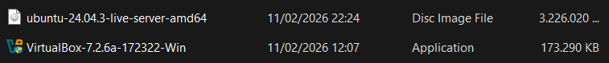

##### Membuat VM baru di VitrtualBox
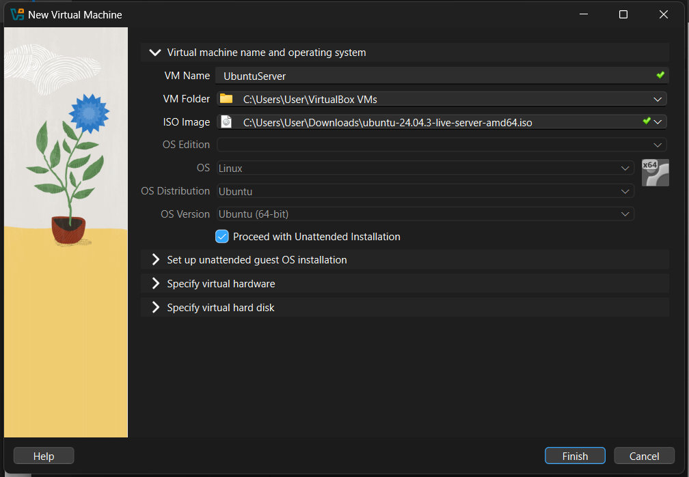

##### Mengalokasikan memori sebesar 2048 MB (2 GB) dan CPU sebesar 2 GHz
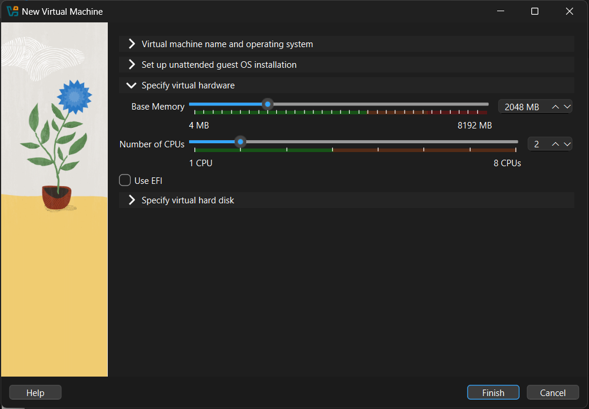

##### Mengalokasikan disk sebesar 25 GB
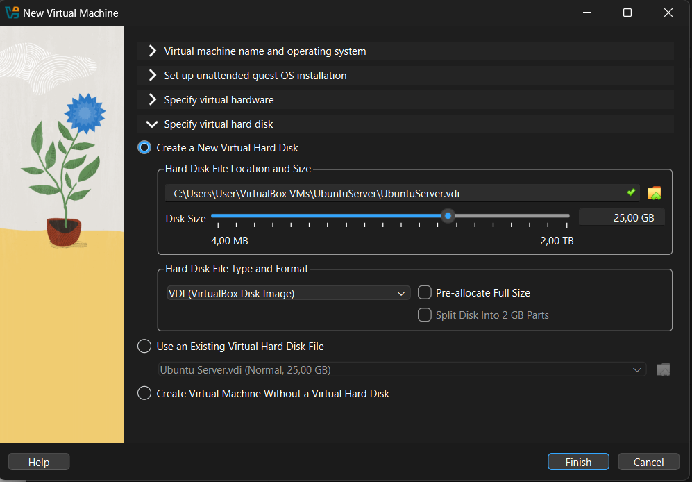

##### Membuat user account dengan password yang kuat
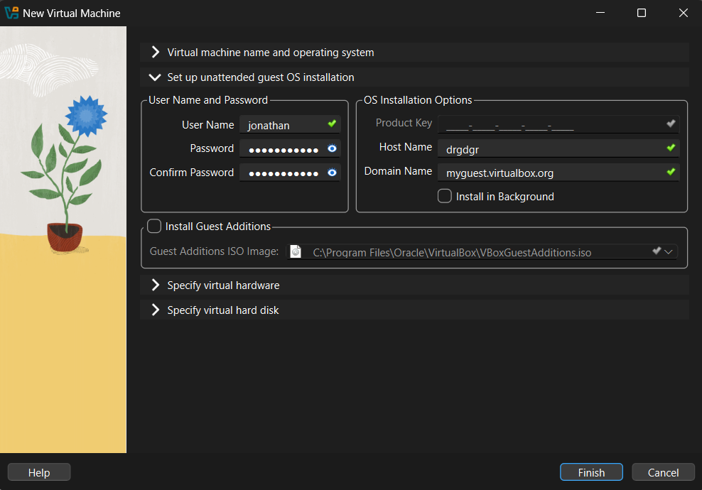

### 2.2 Latihan 1.4

#### SOAL

Setelah instalasi Ubuntu Server, lakukan tasks berikut:
1. Update package list: sudo apt update
2. Upgrade packages: sudo apt upgrade
3. Install neofetch: sudo apt install neofetch
4. Jalankan neofetch dan screenshot hasilnya
5. Check disk usage dengan df -h
6. Check memory dengan free -h
7. Dokumentasikan output dari setiap command

#### JAWABAN

##### Update package list

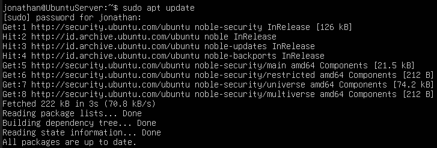

```sudo apt update```

##### Upgrade packages

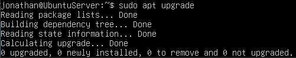

```sudo apt upgrade``` 

##### Install neofetch

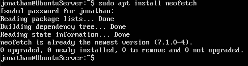

```sudo apt install neofetch```

##### Menjalankan neofetch

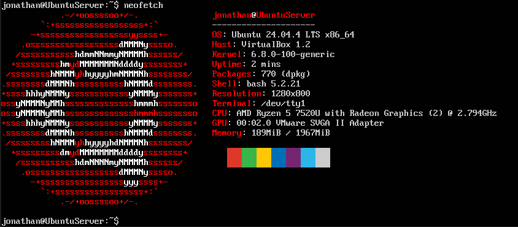

```neofetch```

##### Check disk usage

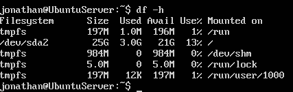

```df -h```

##### Check memory

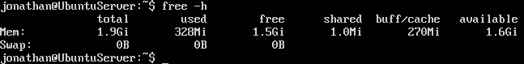

```free -h```

### 2.3 Latihan 1.5

#### SOAL

Eksplorasi sistem yang baru diinstall:
1. Tampilkan informasi OS: cat /etc/os-release
2. Tampilkan versi kernel: uname -r
3. List partisi: lsblk
4. Check network connectivity: ping -c 4 google.com
5. Install dan jalankan htop untuk melihat resource usage
6. Buat laporan singkat tentang konfigurasi sistem Anda

#### JAWABAN

##### Menampilkan informasi OS

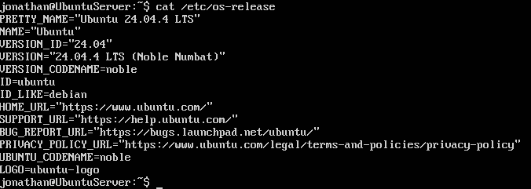

##### Menampilkan versi kernel

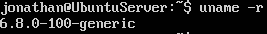

##### Menampilkan list partisi

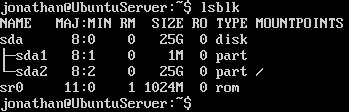

##### Checking network connectivity

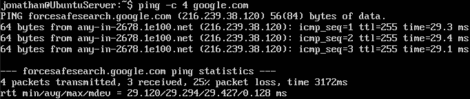

##### Installing htop

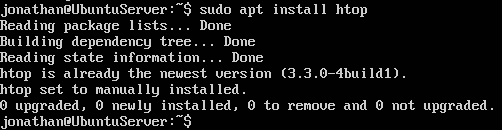

##### Menjalankan htop untuk melihat resource usage

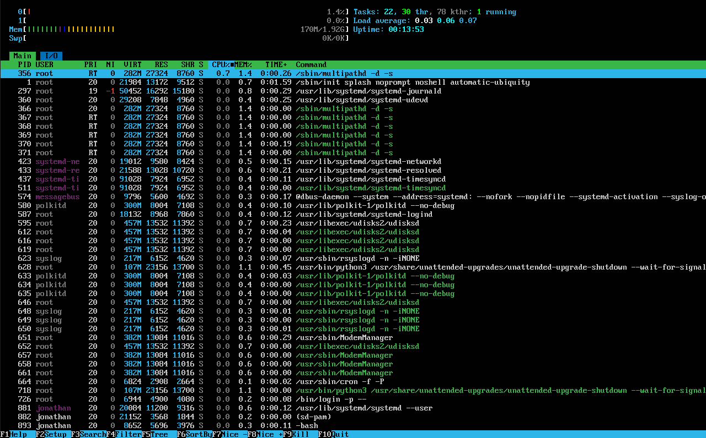

##### Laporan singkat tentang konfigurasi sistem
> Sistem operasi saya adalah Linux dengan distribusi Ubuntu versi 24.04.4 LTS (Noble Numbat) yang merupakan salah satu turunan dari Debian. 

> Linux memiliki kernel sendiri yakni bernama Linux Kernel. Kernel merupakan bagian inti sistem operasi yang mengatur semua hardware agar dapat digunakan oleh aplikasi. Versi kernel yang saya gunakan saat ini adalah 6.8.0-100-generic yang artinya berversi 6.8, build ke-100 dari Ubuntu, tipe generic (normal desktop). 

> Kemudian, di dalam Ubuntu saya terdapat sebuah disk bernama sda dan sebuah perangkat ROM bernama sr0. Disk sda memiliki dua partisi, yaitu sda1 dan sda2.

> Saya melakukan pengecekan terhadap konektivitas jaringan dengan menjalankan command “ping -c 4 google.com” yang artinya sistem akan mengirimkan empat paket permintaan (ICMP echo request) ke domain google.com untuk menguji apakah koneksi jaringan berjalan dengan baik serta mengukur waktu respons dari server tersebut. 
> Berdasarkan hasil pengujian, dari 4 paket yang dikirimkan, 3 paket berhasil diterima dan 1 paket mengalami packet loss (25% kehilangan paket). Waktu respons rata-rata (average) yang diperoleh adalah sekitar 29 ms, yang menunjukkan bahwa koneksi jaringan berjalan cukup stabil dan memiliki latensi yang rendah.

> Terakhir, saya melakukan pengunduhan terhadap package htop yang ternyata sudah ada dalam Ubuntu saya.
> Setelah menjalankan htop, ditampilkan informasi mengenai penggunaan sumber daya sistem secara real-time, seperti penggunaan CPU, memori (RAM), jumlah proses yang berjalan, serta daftar proses yang aktif beserta detailnya. Berdasarkan hasil tampilan, sistem Ubuntu berjalan dalam kondisi normal dan ringan. Beban CPU (load average) tergolong rendah, penggunaan RAM masih kecil, serta tidak terdapat proses yang menggunakan sumber daya secara berlebihan. Hal ini menunjukkan bahwa sistem berjalan dengan stabil.

## 3. LATIHAN REFLEKSI

### 3.1 Latihan 1.6

#### SOAL

Ceritakan pengalaman Anda dengan sistem operasi:
1. Sistem operasi apa yang Anda gunakan sehari-hari? (Windows, macOS,
Linux, atau lainnya)
2. Berapa lama Anda menggunakan sistem operasi tersebut?
3. Apa yang Anda sukai dari sistem operasi tersebut?
4. Apa tantangan atau masalah yang pernah Anda hadapi?
5. Apakah Anda pernah menggunakan sistem operasi lain? Bandingkan
pengalaman Anda.
6. Setelah mempelajari bab ini, apakah ada sistem operasi lain yang ingin
Anda coba? Mengapa?

Tulis refleksi Anda dalam 300-500 kata disertai dengan dokumentasi.

#### JAWABAN

1. Saya menggunakan sistem operasi Windows dalam keseharian saya.

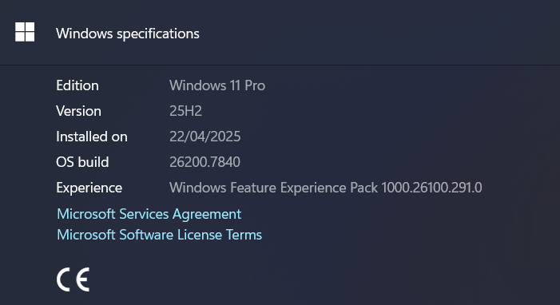

2. Saya mulai menggunakan Windows sejak membeli laptop pertama saya pada sekitar tahun 2019 hingga sekarang, sehingga terhitung sudah sekitar 7 tahun saya menggunakan Windows.

3. Windows memberikan kemudahan kepada penggunanya. Mayoritas orang di dunia ini juga menggunakan Windows sebagai sistem operasi mereka sehingga memudahkan saya dalam mencari tutorial dan bantuan ketika mengalami masalah. Itulah yang saya ketahui sebelum mempelajari mata kuliah Sistem Operasi.

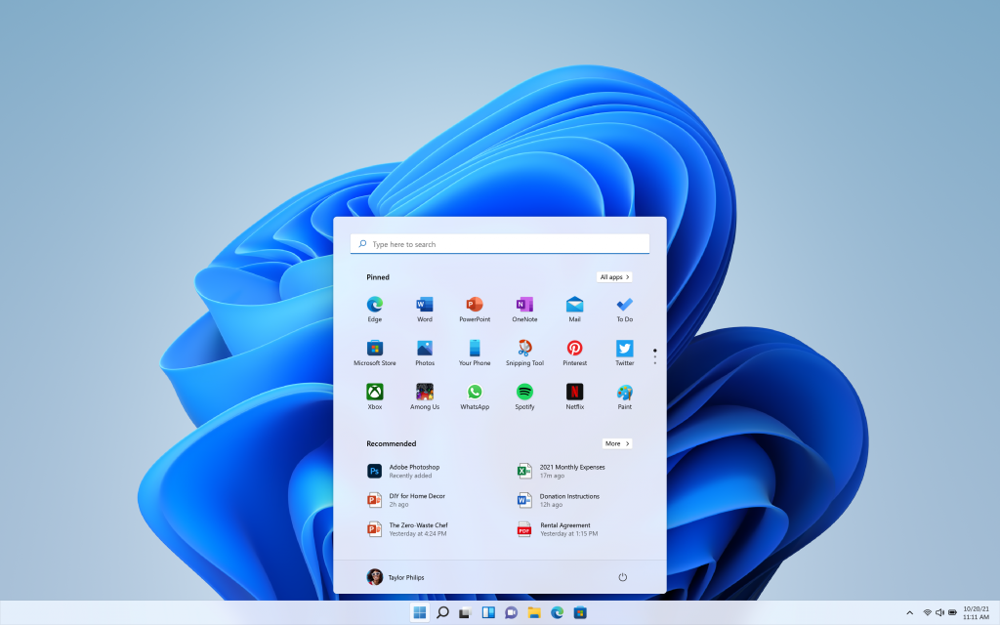

Setelah mempelajari Sistem Operasi, saya mulai menyadari bahwa Windows tidak hanya memberikan kemudahan dan memiliki popularitas tinggi, tetapi juga memiliki kompatibilitas perangkat lunak yang sangat luas, mulai dari Microsoft Office hingga berbagai permainan (gaming), semuanya tersedia. Selain itu, Windows juga memberikan dukungan yang luas terhadap perangkat keras seperti printer, scanner, VGA, dan lain-lain.

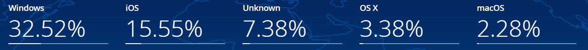

4. Salah satu tantangan yang saya hadapi sejak pertama kali menggunakan Windows hingga sekarang adalah masalah **aktivasi**. Saat pertama membeli laptop, saya belum memahami tentang sistem operasi dan lisensi aktivasi, sehingga ketika menghadapi masalah tersebut, saya sempat menggunakan kode aktivasi tidak resmi yang saya temukan di YouTube. Setelah mempelajari Sistem Operasi, saya merasa menyesal atas tindakan tersebut. Meskipun aktivasi tidak terlalu memengaruhi performa laptop, hal ini cukup mengganggu karena beberapa fitur kustomisasi tidak dapat digunakan.


Namun kini, saya menyadari bahwa aktivasi merupakan hal yang penting karena tanpa lisensi resmi, saya merasa seolah-olah hanya membeli perangkat keras tanpa sistem operasi yang sepenuhnya legal dan utuh.

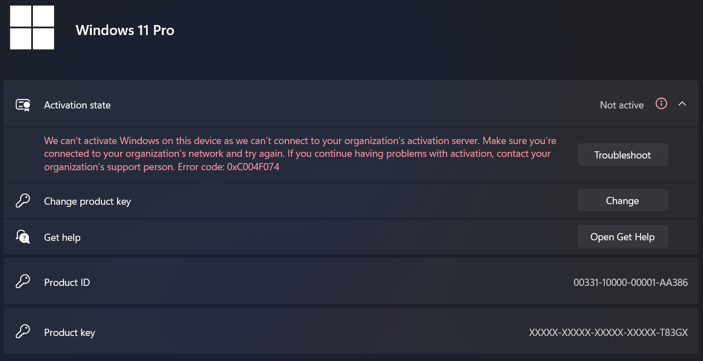

Laptop baru saya sebenarnya memiliki sistem operasi bawaan Linux. Namun, karena saya membelinya melalui proses distribusi dengan bantuan teman ibu saya, beliau meminta kepada customer service untuk mengganti sistem operasinya menjadi Windows. Mungkin karena menurut beliau Windows lebih populer sehingga dianggap lebih baik daripada Linux. Jujur, saya cukup menyesal atas keputusan tersebut.

5. Ya, saat ini saya beberapa kali menggunakan Ubuntu untuk mengerjakan tugas mata kuliah Sistem Operasi, namun masih bergantung pada Windows sebagai host dan belum menggunakannya secara penuh. Karena penggunaan Linux yang saya lakukan masih terbatas pada terminal, saya belum dapat membandingkan pengalaman penggunaan secara keseluruhan. Untuk saat ini, perbandingan yang dapat saya lakukan hanya dari segi terminal. Di Windows, pengguna cukup menjalankan Command Prompt untuk menggunakan terminal, sedangkan di Linux, pengguna perlu masuk ke sistem dan memasukkan kata sandi terlebih dahulu. Selain itu, perintah di Linux cenderung lebih kuat dan fleksibel dibandingkan Windows yang fungsinya relatif lebih terbatas.

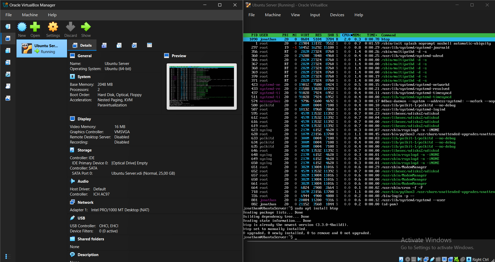

6. Ya, saya ingin mencoba menggunakan Linux dengan distribusi yang belum saya tentukan, mengingat setiap distribusi memiliki keunggulannya masing-masing. Saya masih perlu mempelajari berbagai distribusi agar dapat memilih yang sesuai dengan kebutuhan saya sebagai mahasiswa. Saya ingin mencoba Linux karena ingin mempelajari hal baru, yaitu sistem operasi selain Windows. Selain itu, alasan lainnya adalah karena laptop ini sebenarnya memiliki bawaan Linux, serta karena saya tertarik mengikuti teman saya yang menggunakan Arch Linux, dan juga karena menurut saya terlihat keren.

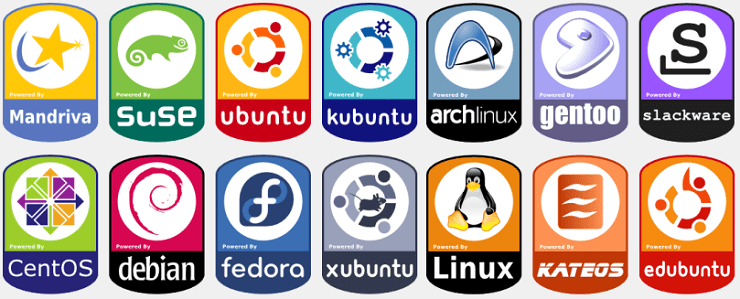