# PERTEMUAN 10

Manajemen Memori & System Call

## Praktikum 10.1

1. 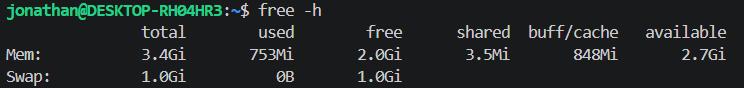

2. 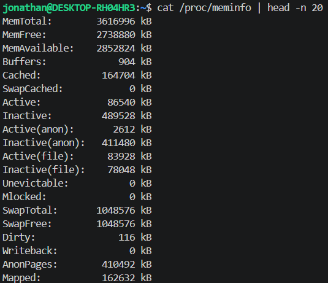

### Analisis

1. Available : 2.7 | Total : 3.4

Presentase memori tersedia = 2.7 / 3.4 x 100%
                           = 79.4% (Hasilnya di atas 10% artinya sistem tidak kekurangan memori)

2. Ya. Artinya kernel belum pernah memindahkan data ke disk karena RAM masih cukup

3. Buffers: 904 kB | Cached: 164704 kB | buff/cache pada `free-h` : 848Mi

1 Mi = 1024 KiB = 1024 x 1024 B = 1048576 B = 1048.576 kB

## Studi Kasus 10.1

1. `free -h`

jonathan@DESKTOP-RH04HR3:~$ free -h
               total        used        free      shared  buff/cache   available
Mem:           3.4Gi       753Mi       2.0Gi       3.5Mi       848Mi       2.7Gi
Swap:          1.0Gi          0B       1.0Gi

2. `top`

    
Hasil `top`

    top - 15:20:02 up 26 min,  3 users,  load average: 0.12, 0.08, 0.08
Tasks:  45 total,   1 running,  44 sleeping,   0 stopped,   0 zombie
%Cpu(s):  0.6 us,  0.8 sy,  0.0 ni, 98.6 id,  0.0 wa,  0.0 hi,  0.1 si,  0.0 st 
MiB Mem :   3532.2 total,   2652.0 free,    767.2 used,    191.0 buff/cache     
MiB Swap:   1024.0 total,   1024.0 free,      0.0 used.   2765.0 avail Mem 

    PID USER      PR  NI    VIRT    RES    SHR S  %CPU  %MEM     TIME+ COMMAND                 
    971 root      20   0   11.3g 162656  54400 S   3.0   4.5   0:14.12 node                    
   1207 root      20   0   21.9g 170456  54912 S   2.0   4.7   1:02.76 node                    
   1178 root      20   0 1023268  65528  44928 S   1.0   1.8   0:02.24 node                    
   1177 root      20   0    3136   1292   1152 S   0.7   0.0   0:00.65 Relay(1178)             
   1276 root      20   0 1067776  77612  48896 S   0.7   2.1   0:04.88 node                    
   1253 root      20   0 1029008  71724  48384 S   0.3   2.0   0:04.20 node                    
      1 root      20   0   21672  11992   9048 S   0.0   0.3   0:01.31 systemd                 
      2 root      20   0    3120   2176   2048 S   0.0   0.1   0:00.03 init-systemd(Ub         
      7 root      20   0    3120   1792   1792 S   0.0   0.0   0:00.00 init                    
     43 root      19  -1   50448  15744  14848 S   0.0   0.4   0:00.43 systemd-journal         
     93 root      20   0   25412   6400   4864 S   0.0   0.2   0:01.01 systemd-udevd           
    149 systemd+  20   0   21460  12672  10496 S   0.0   0.4   0:00.24 systemd-resolve         
    153 systemd+  20   0   91028   7552   6784 S   0.0   0.2   0:00.19 systemd-timesyn         
    159 root      20   0    4236   2432   2304 S   0.0   0.1   0:00.01 cron                    
    160 message+  20   0    9632   4736   4352 S   0.0   0.1   0:00.15 dbus-daemon             
    170 root      20   0   18156   8064   7296 S   0.0   0.2   0:00.14 systemd-logind          
    174 syslog    20   0  222508   5120   4352 S   0.0   0.1   0:00.17 rsyslogd                
    186 root      20   0    3160   1792   1792 S   0.0   0.0   0:00.01 agetty                  
    194 root      20   0    3116   1792   1664 S   0.0   0.0   0:00.01 agetty                  
    200 root      20   0  107008  22268  13056 S   0.0   0.6   0:00.15 unattended-upgr         
    300 root      20   0    6668   4224   3584 S   0.0   0.1   0:00.01 login                   
    345 root      20   0   20108  10880   9088 S   0.0   0.3   0:00.13 systemd                 
    346 root      20   0   21160   3376   1664 S   0.0   0.1   0:00.00 (sd-pam)                
    370 root      20   0    6072   4736   3328 S   0.0   0.1   0:00.02 bash                    
    835 root      20   0    6664   4096   3712 S   0.0   0.1   0:00.02 login                   
    880 jonathan  20   0   20320  11008   9088 S   0.0   0.3   0:00.14 systemd                 
    881 jonathan  20   0   21156   3516   1792 S   0.0   0.1   0:00.00 (sd-pam)                
    905 jonathan  20   0    6072   5248   3584 S   0.0   0.1   0:00.03 bash                    
    958 root      20   0    3124    900    768 S   0.0   0.0   0:00.00 SessionLeader           
    959 root      20   0    3140   1288   1152 S   0.0   0.0   0:00.00 Relay(960)              
    960 root      20   0    2800   1664   1664 S   0.0   0.0   0:00.00 sh                      

### Analisis

1. 

available

MiB Mem :   3532.2 total,   2371.0 free,    684.1 used,    553.1 buff/cache     
MiB Swap:   1024.0 total,   1024.0 free,      0.0 used.   2848.1 avail Mem 

Available : 2848.1 MiB (Mebi byte) = 2986.44931 MB (lebih dari 200 MB)

--> Server tidak kekurangan memori

2. Ya. Artinya kernel sedang menggunakan swap, yang berarti performa menurun

3. Proses ini
`1207 root      20   0   21.9g 170456  54912 S   2.0   4.7   1:02.76 node`

Proses dengan %mem terbesar : root

## Praktikum 10.2

1. `vmstat 1 5` 

Hasil eksekusi

jonathan@DESKTOP-RH04HR3:~$ vmstat 1 5
procs -----------memory---------- ---swap-- -----io---- -system-- -------cpu-------
 r  b   swpd   free   buff  cache   si   so    bi    bo   in   cs us sy id wa st gu
 1  0      0 2461324  59108 484696    0    0   593    27  819    1  0  1 99  0  0  0
 1  0      0 2810208    608 194068    0    0  1296     0 1770 2064  0  3 96  0  0  0
 1  0      0 2811228    608 194644    0    0   292     0  965  421  0  7 93  0  0  0
 1  0      0 2808376    608 194644    0    0     0     0 1778 2036  1  3 97  0  0  0
 0  0      0 2807648    608 194676    0    0     0     0  929  671  0  1 99  0  0  0

### Analisis : 

Semua nilai si dan so bernilai 0, karena tidak pernah ada aktivitas swap.
Jika si dan so terus-menerus lebih dari 0, sistem dalam kondisi memory pressure serius — performa turun drastis karena akses disk jauh lebih lambat dari RAM.

## Praktikum 10.3

1. Membuat file berukuran 512 MB sebagai calon swap

2. Mengatur permission file menjadi 600 - hanya root yang boleh membaca dan menulis

3. Memformat file sebagai area swap, lalu mengaktifkannya

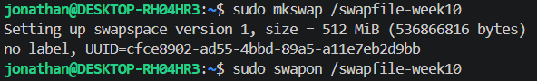

4. Memverifikasi swap aktif

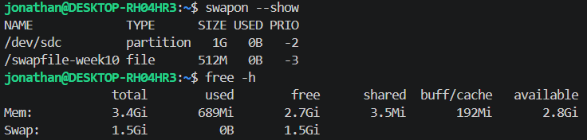

5. Memeriksa nilai swappiness, mengubah sementara, dan memverifikasi perubahan.

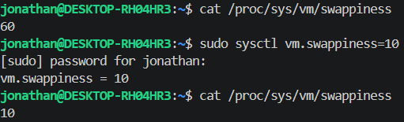

### Analisis

1. Nilai swappiness default adalah 60, nilai ini merupakan titik keseimbangan (moderat). Kernel akan mulai memindahkan data yang jarang diakses ke swap agar RAM memiliki ruang lebih untuk file system cache, yang berguna mempercepat proses pembacaan data.

2. Pada swappiness dengan nilai 10, kernel akan sangat protektif terhadap disk, selama masih ada sisa ruang di RAM, semua data akan tetap di RAM hingga tetes terakhir RAM. Namun, jika RAM benar-benar penuh total, sistem dapat tiba-tiba melambat atau hang sejenak karena harus memindahkan data ke disk secara mendadak dan besar.

3. Muncul karena telah mengatur permission file menjadi 600 yang mana artinya hanya root yang boleh membaca dan menulis.

## Praktikum 10.4

1. Mengambil snapshot proses diurutkan dari penggunaan memori terbesar

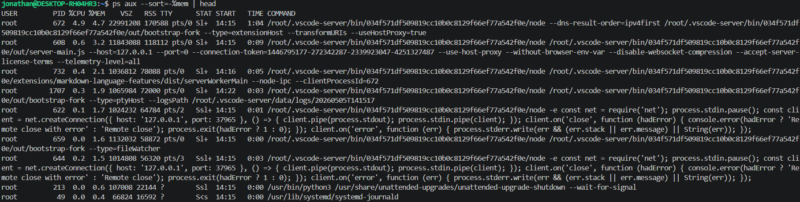

2. Memantau secara real-time dengan `top`

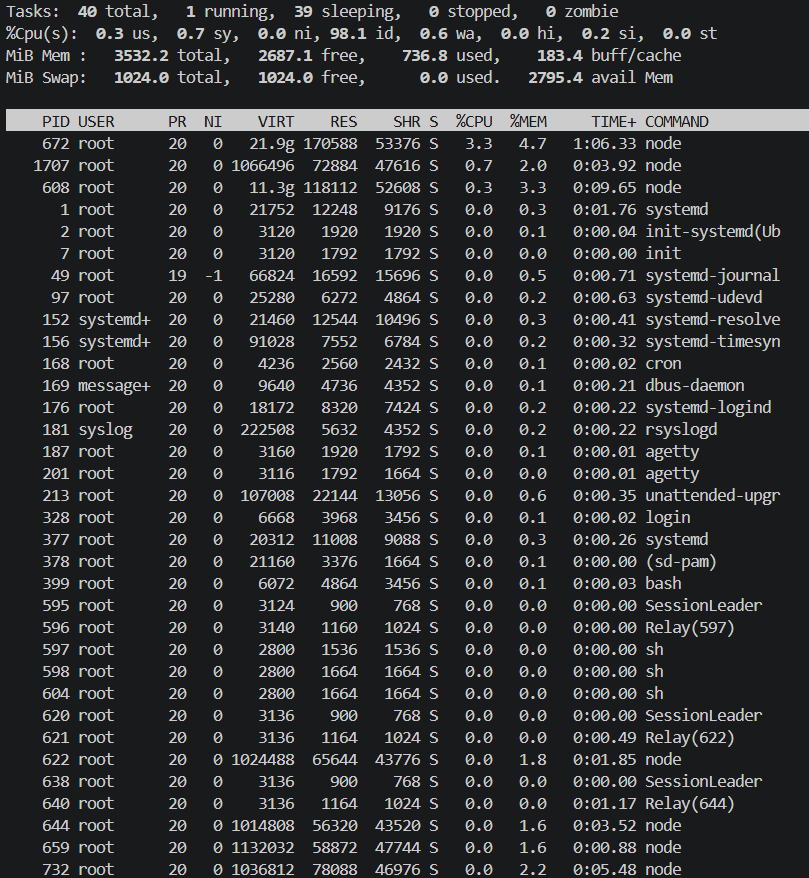

### Analisis

1. Proses yang berada di urutan pertama adalah node (vscode-server extensionHost) dengan nilai %MEM sebesar 4.7 dan RSS sebesar 170588 KB.

2. RSS = 170588 KB --> 170588/1024 = 166.6 MB
Sangat wajar, berdasarkan hasil analisis, angka tersebut berasal dari VS Code Server. Angka 166 MB untuk proses utama editor kode (VS Code Server) tidak menunjukkan adanya kebocoran memori atau perilaku anomali. Sistem sedang berjalan dengan sehat.

3. VSZ (Virtual Size) selalu terlihat sangat besar karena ia mencakup segala kemungkinan alamat memori yang dimiliki proses, sedangkan RSS hanyalah subset kecil yang "sedang aktif bekerja" di dalam keping RAM fisik.

4. Jika kita menjalankan `ps -aux --sort=-%mem | head` dan membandingkannya dengan `top` (setelah menekan M), proses yang berada di urutan teratas akan tetap konsisten sebagai pengguna memori terbesar di kedua perintah tersebut.

Jika ada perbedaan posisi pada proses-proses kecil di urutan bawah, itu hal yang wajar karena dinamika sistem operasi yang terus berubah setiap milidetik.

## Praktikum 10.5

1. Masuk ke direktori kerja dan membuat file script

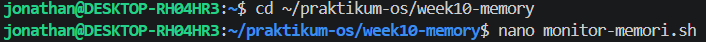

2. Mengetik script

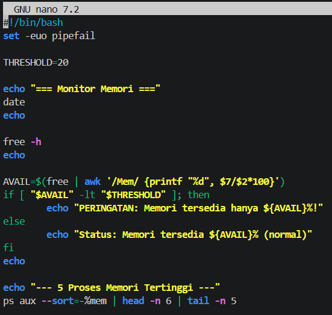

3. Memberi akses eksekusi dan menjalankan script monitor

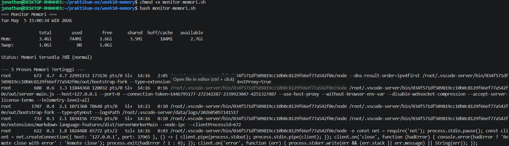

### Analisis

1. Available : 2.7 Gi | Total : 3.4 | 2.7/3.4 * 100 = 79% (tertulis 78% di hasil)

2. Karena nilai yang didapat adalah 78, dan 78 lebih dari 20, maka kondisi tersebut bernilai false.

3. Mengubah nilai THRESHOLD menjadi 90

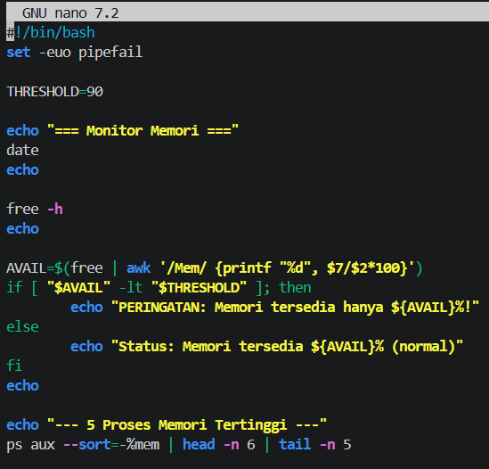

Menjalankan ulang bash

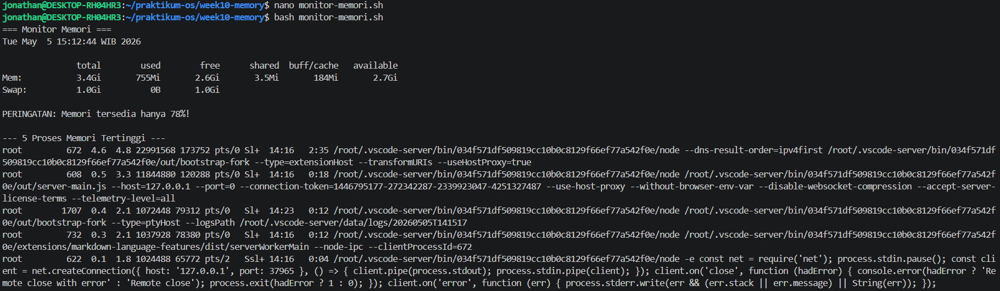

Ya, output berubah dari `Status: Memori tersedia 78% (normal)` menjadi `PERINGATAN: Memori tersedia hanya 78%!`. Output berubah karena `THRESHOLD` yang menjadi ambang batas atau penentu juga diubah. Karena awalnya 20, dan hasil operasi adalah 78 maka 78 masih lebih dari 20 sehingga output normal, kemudian karena nilai `THRESHOLD` diubah menjadi 90 dan 78 tidak lebih besar dari 90, maka output berubah.

## Studi Kasus 10.2

1. Membuat direktori dan file konfigurasi contoh

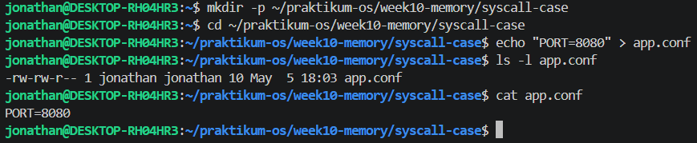

2. Mensimulasikan permission bermasalah

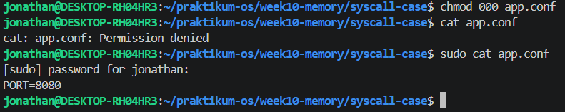

3. Mengembalikan permission dan verifikasi

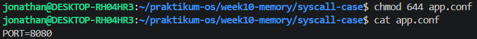

### Analisis

1. Pesan error "Permission denied" muncul karena perintah `chmod 000` telah menghapus seluruh izin akses pada file tersebut sehingga kernel menolak permintaan system call `openat()` saat program `cat` mencoba membacanya.

2. Perbedaan antara kedua pesan error tersebut terletak pada status keberadaan filenya, di mana "Permission denied" berarti file masih ada namun aksesnya dilarang oleh sistem, sedangkan "No such file or directory" berarti file tersebut sudah benar-benar tidak ditemukan setelah dihapus dengan perintah `rm`.

3. Pengaturan permission `644` memberikan hak akses yang berbeda untuk tiap kategori pengguna, yaitu pemilik file (owner) memiliki izin untuk membaca dan menulis, sementara anggota grup serta pengguna lainnya hanya diberikan izin terbatas untuk membaca file saja.

## Praktikum 10.6

1. Melihat 30 baris pertama system call dari perintah `ls`

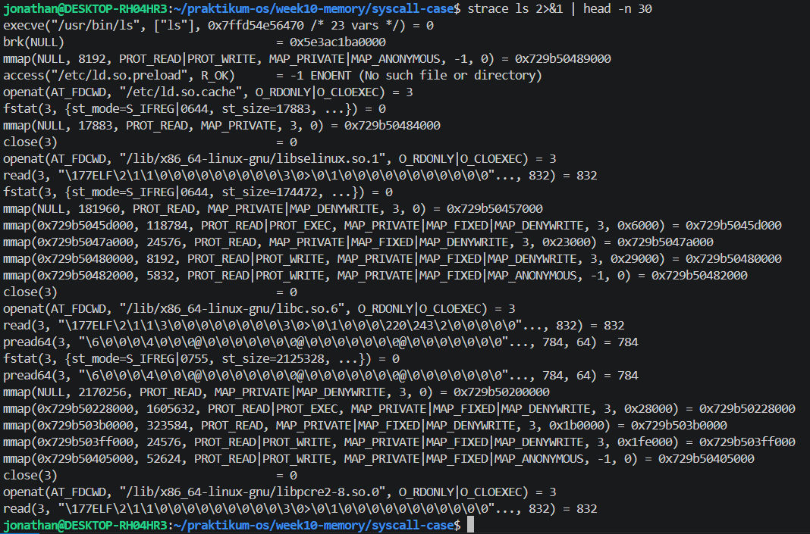

2. Melihat ringkasan statistik dan membandingkan 2 direktori berbeda

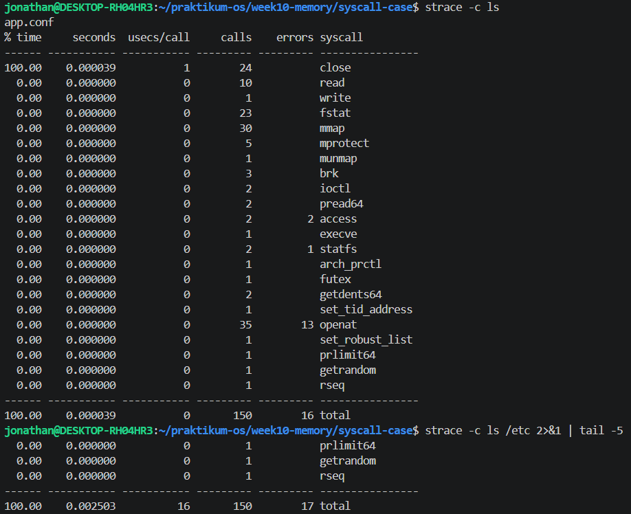

### Analisis

1. Berdasarkan data output Langkah 1, empat system call berbeda yang dapat diidentifikasi adalah execve yang berfungsi untuk mengeksekusi berkas biner program ls, brk yang digunakan untuk mengelola atau mengubah batas alokasi memori data segment, mmap yang bertugas memetakan berkas atau mengalokasikan ruang memori virtual baru, serta openat yang berfungsi membuka lokasi berkas tertentu seperti pustaka sistem untuk dibaca.

2. System call yang paling sering dipanggil dalam tabel statistik ringkasan strace -c adalah openat dengan total sebanyak 35 panggilan, hal ini terjadi karena sistem perlu melakukan pencarian dan membuka berbagai berkas pustaka bersama atau shared libraries seperti libc dan libselinux untuk memuat dependensi lingkungan sebelum program utama dijalankan.

3. Di dalam output tersebut terdapat beberapa system call dengan nilai error lebih dari nol seperti openat yang menghasilkan 13 error dan access dengan 2 error, yang mana hal ini bukan menandakan program sedang rusak melainkan bagian normal dari logika program saat mencoba mencari atau menguji keberadaan berkas konfigurasi opsional di beberapa jalur direktori sistem secara berurutan.

4. Jumlah total keseluruhan system call antara perintah ls dan ls /etc pada tangkapan layar tersebut secara kebetulan sama-sama berjumlah 150 panggilan, namun jumlah kegagalan atau error-nya berbeda yaitu 16 berbanding 17 error karena faktor perbedaan target lokasi yang diakses memengaruhi banyaknya pemeriksaan izin serta pembacaan struktur entri data di dalam direktori terkait.

## Tugas Praktikum

### Tugas 10.1

1. Modifikasi `memory-audit.sh` dengan nano

2. Menuliskan script

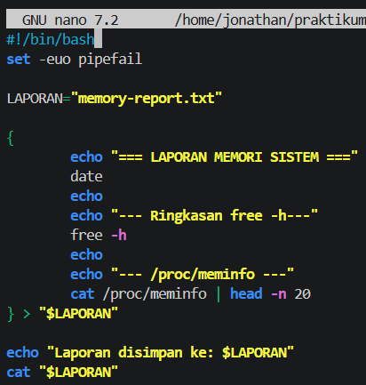

3. Menjalankan script

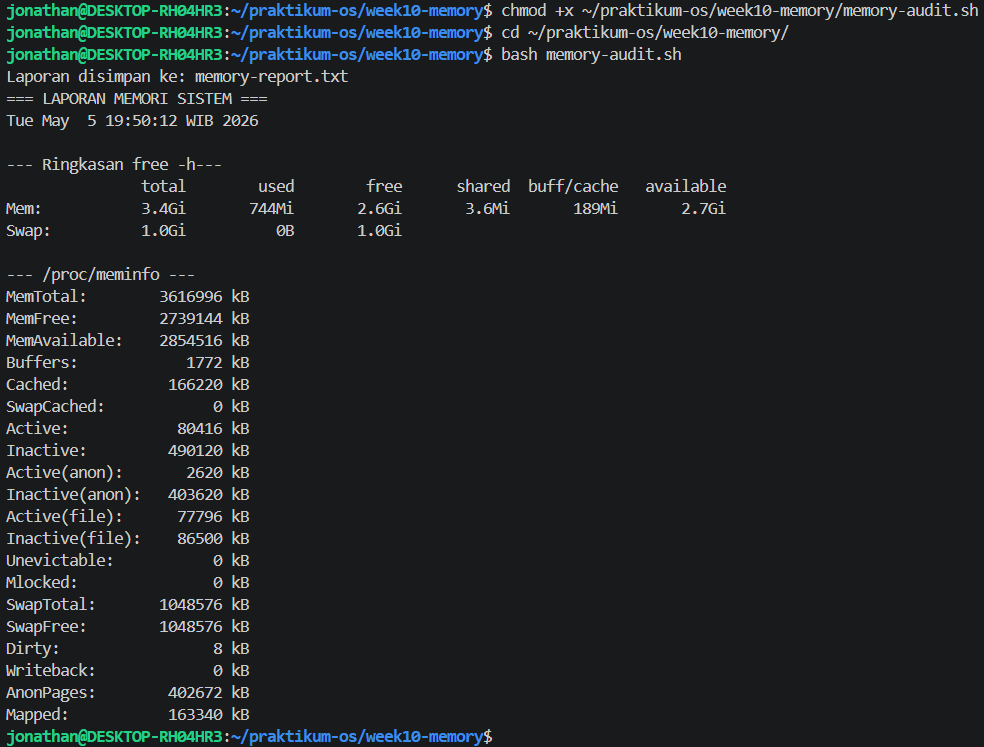

### Analisis

1. Presentasi memori tersedia :

Available : 2.7 Gi
Total : 3.4 Gi

Presentase memori tersedia = 2.7 / 3.4 x 100%
                           = 79.4% (Hasilnya di atas 10% artinya sistem tidak kekurangan memori, kondisi normal)

2. `buff/cache` tidak dihitung sebagai memori terpakai karena kernel Linux hanya "meminjam" ruang tersebut untuk mempercepat akses data dari disk, namun akan segera melepas dan memberikannya kembali kepada aplikasi secara otomatis jika aplikasi membutuhkan memori tambahan.

3. Pada sistem Linux umumnya, SwapTotal akan bernilai lebih besar dari 0 sebagai cadangan memori virtual, sementara nilai SwapFree menunjukkan sisa kapasitas swap yang belum digunakan, yang mana angka pastinya dapat Anda lihat dengan menjalankan perintah grep ^Swap /proc/meminfo pada terminal Anda.

### Tugas 10.2

Menyimpan daftar 10 proses pengguna memori terbesar ke file

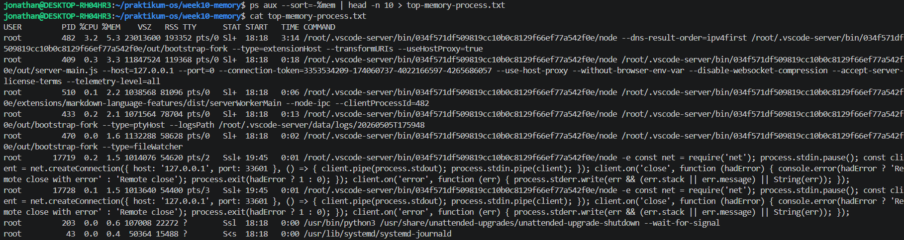

#### Analisis

1. Proses yang berada di urutan pertama adalah node (vscode-server extensionHost) dengan nilai %MEM sebesar 5.3 dan RSS sebesar 193352 KB.

2. RSS = 193352 kB / 1024 = 188.82 MB. Nilai ini sangat wajar untuk sebuah proses backend editor modern seperti VS Code Server yang sedang menjalankan berbagai ekstensi.

3. Jumlah total %MEM dari lima proses teratas (5.3, 3.3, 2.2, 2.1, dan 1.6) adalah 14.5%, yang berarti kelima proses tersebut secara bersama-sama menggunakan hampir lima belas persen dari total kapasitas RAM sistem.

### Tugas 10.3

1. Membuat dan mengaktifkan swap file tugas

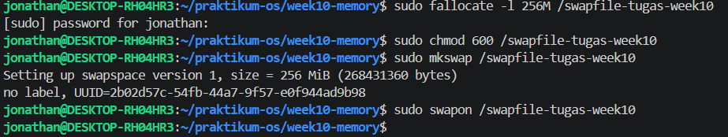

2. Verifikasi, simpan, dan tampilkan hasil

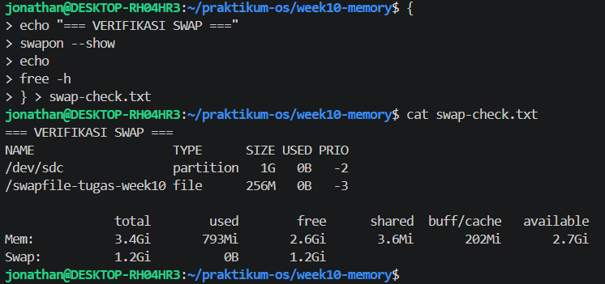

#### Catatan

Berhasil membersihkan setelah selesai

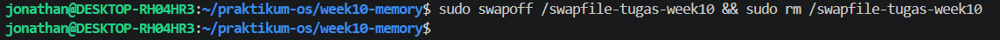

#### Analisis

1. Berdasarkan output perintah `swapon --show`, kolom NAME berisi `/dev/sdc` (partisi) dan /swapfile-tugas-week10 (file), kolom TYPE menunjukkan jenis `partition` dan `file`, kolom SIZE masing-masing adalah `1G` dan `256M`, serta kolom USED menunjukkan keduanya masih `0B` (belum digunakan).

2. Nilai total pada baris Swap di perintah `free -h` telah bertambah menjadi 1.2Gi, yang mana angka ini merupakan akumulasi dari swap partisi bawaan sebesar `1Gi` ditambah swap file baru yang baru saja dibuat sebesar `256M`.

3. Aturan permission 600 sangat penting karena file swap berisi salinan data langsung dari RAM yang mungkin memuat informasi sensitif seperti password atau kunci enkripsi, sehingga jika diatur ke 644, pengguna lain dalam sistem dapat membaca isi file tersebut (read access) dan berisiko mengakibatkan kebocoran data pribadi yang fatal.

### Tugas 10.4

Menyimpan ringkasan dan detail system call

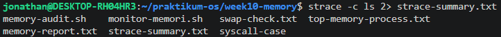

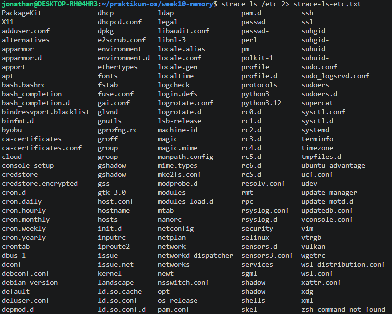

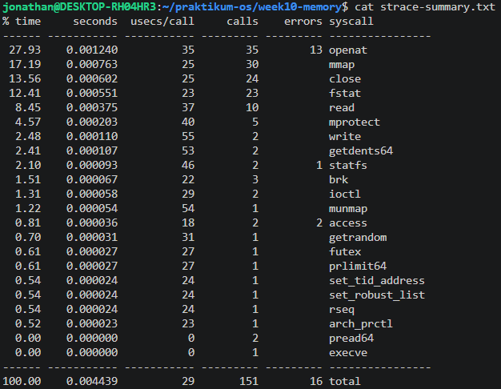

#### Analisis

1. Lima system call dari strace-summary.txt beserta fungsinya adalah sebagai berikut:

openat: Berfungsi untuk membuka file atau direktori guna mendapatkan file descriptor yang akan digunakan pada proses selanjutnya.

mmap: Berfungsi untuk memetakan file atau perangkat ke dalam memori virtual proses, sering digunakan untuk memuat library atau alokasi memori.

close: Berfungsi untuk menutup file descriptor yang sudah tidak digunakan lagi agar sumber daya sistem dapat dilepaskan.

fstat: Berfungsi untuk mengambil informasi atau status dari sebuah file (seperti ukuran atau izin akses) berdasarkan file descriptor.

read: Berfungsi untuk membaca data dari file descriptor ke dalam buffer memori agar bisa diproses oleh program.

2. System call yang paling sering dipanggil adalah openat dengan total 35 panggilan. Hal ini terjadi karena setiap kali perintah ls dijalankan, sistem perlu mencari dan membuka banyak file library bersama (shared libraries) serta memeriksa konfigurasi sistem di berbagai lokasi sebelum akhirnya menjalankan fungsi utamanya.

3. Di dalam output tersebut terdapat beberapa error, khususnya pada openat (13 error), statfs (1 error), dan access (2 error), namun program tetap berjalan dengan normal. Kegagalan ini merupakan hal yang umum dalam logika sistem karena program sering kali mencoba mencari file konfigurasi atau library di beberapa jalur direktori yang berbeda secara berurutan, dan sistem akan terus mencari ke jalur berikutnya jika jalur pertama menghasilkan error "file tidak ditemukan".

### Tugas 10.5

1. Membuka dan mengedit file dengan `nano`

2. Mengisi file diagnosa-server.sh

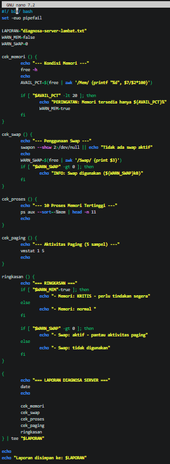

3. Menjalankan script diagnosa

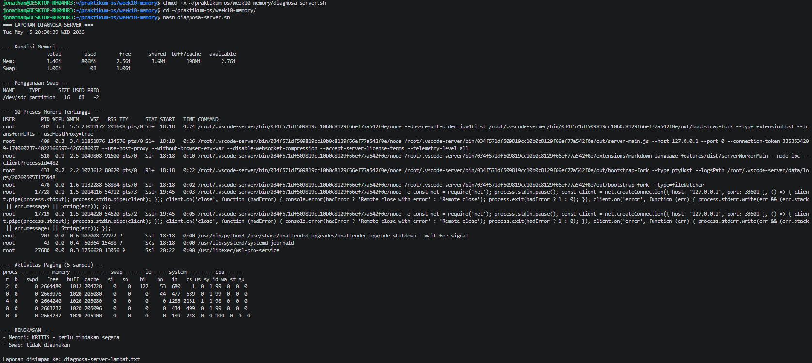

#### Analisis

1. Peran fungsi `cek_memori` adalah menghitung persentase memori yang tersedia dibandingkan total RAM, `cek_swap` untuk memantau penggunaan ruang swap, `cek_proses` untuk mendata aplikasi paling rakus memori, `cek_paging` untuk memantau perpindahan data RAM ke disk, dan `ringkasan` untuk memberikan vonis akhir kondisi sistem. Diagnosa dipecah menjadi fungsi terpisah agar script lebih mudah dibaca, dikelola, serta memungkinkan pengembang untuk memperbarui satu bagian logika saja tanpa mengganggu bagian lainnya.

2. Kondisi sistem dinyatakan KRITIS bukan karena RAM benar-benar habis, melainkan karena nilai variabel `AVAIL_PCT` (persentase memori tersedia) berada di bawah angka 20 sesuai dengan logika perintah `if [ "$AVAIL_PCT" -lt 20 ]`. Pada output sebelumnya, memori yang `available` adalah 2.7Gi dari total 3.4Gi (sekitar 79%), namun pesan kritis bisa muncul jika terjadi kesalahan pembacaan variabel atau jika script dijalankan pada saat terjadi lonjakan penggunaan sesaat yang menyentuh ambang batas tersebut.

3. Script menggunakan `tee "$LAPORAN"` bertujuan agar hasil diagnosa dapat ditampilkan secara real-time di layar terminal sekaligus disimpan ke dalam file teks secara bersamaan. Keuntungan utamanya adalah administrator dapat langsung berinteraksi dan melihat masalah saat itu juga tanpa harus membuka file laporan secara manual setelah script selesai dijalankan.

4. Dari output `cek_paging`, nilai pada kolom `si` (swap-in) dan `so` (swap-out) menunjukkan angka 0, yang berarti tidak ada aktivitas pemindahan data antara RAM dan disk. Implikasinya adalah performa server saat ini masih sangat optimal karena seluruh beban kerja diproses langsung di dalam RAM yang memiliki kecepatan jauh lebih tinggi dibandingkan media penyimpanan disk.