# PERTEMUAN 11

Manajemen File & User/Group

## Praktikum 11.1

1. Membuat direktori kerja dan dua file uji

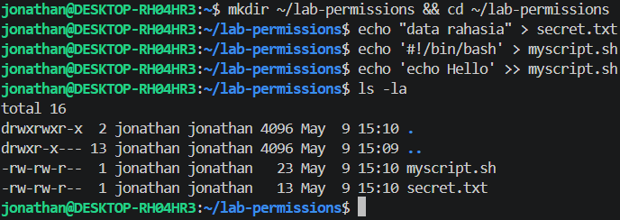

2. Menjadikan secret.txt privat hanya untuk owner

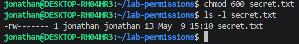

3. Menjadikan myscript.sh dapat dijalankan

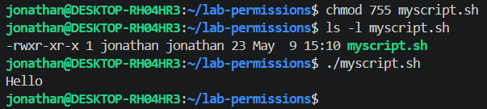

4. Membuat direktori bersama dan mengamati efek SGID sederhana

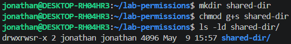

5. Menguji efek umask pada file baru

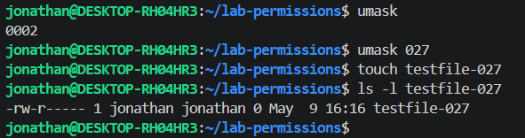

### Analisis

#### Pertanyaan

1. Mengapa secret.txt tidak dapat dibaca oleh group dan others setelah chmod 600?

2. Apa perbedaan arti 600 dan 755 terhadap file yang diuji?

3. Setelah umask 027, permission apa yang dihasilkan untuk file baru, dan mengapa bukan 777?

#### Jawaban

1. Karena chmod 600 berarti mengubah permission file menjadi privat, yakni hanya mengizinkan owner yang dapat melakukan read dan write. 

600 terdiri dari 6, 0, dan 0, yang secara berturut-turut merupakan izin untuk owner, group, dan others. 6 dalam oktal jika dikonversi ke biner akan menjadi 110 dan 0 dalam oktal jika dikonversi ke biner akan menjadi 000.

110 secara berturut-turut merupakan jenis izin yang diberikan, yakni read, write, dan execute, artinya user dapat melakukan read dan write. Untuk 000, artinya group dan others tidak dapat melakukan apapun terhadap file, tidak dapat read, tidak dapat write, serta tidak dapat execute.

2. 600 hanya memberikan akses read dan write pada owner, sedangkan 755 artinya memberikan izin penuh (read, write, dan execute) pada owner dan memberikan izin read dan execute pada group dan others.

755 terdiri dari 7, 5, dan 5. 

7 (oktal) --> 111 (biner) (read, write, execute)    [owner]

5 (oktal) --> 101 (biner) (read, execute)           [group]

5 (oktal) --> 101 (biner) (read, execute)           [others]

3. Karena `umask` digunakan untuk mengurangi permission default file baru melalui perubahan, file berangkat dari 666, sedangkan direktori dari 777. 

Setelah dilakukan `umask 027`, permission dikurangi dari (karena file) 666 dikurangi 027 secara biner.

Owner : 6 (110) dicabut sebanyak 0 (000) (tidak ada perubahan) = 6 (110)

Group : 6 (110) dicabut sebanyak 2 (010) (dicabut izin writenya, 1 di tengah) = 4 (100)

Others: 6 (110) dicabut sebanyak 7 (111) (dicabut semua izinnya, 1 di semua posisi) = 0 (000)

Sehingga, hasil akhirnya 640  (rw-r-----)

### Tantangan

#### Soal

Ubah owner atau group salah satu file uji ke akun atau group lain yang tersedia di sistem, kemudian jelaskan perubahan output ls -l sebelum dan sesudahnya.

#### Jawaban

1. Membuat file uji baru dan mengecek permission-nya dengan `ls -l`

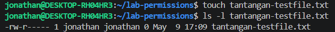

Owner sekaligus group pada file tersebut secara berturut-turut adalah `jonathan` dan `jonathan`.

2. Mengubah owner menjadi root

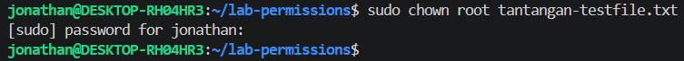

3. Mengubah group menjadi adm

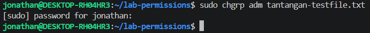

4. Mengecek kembali permission file dengan `ls -l`

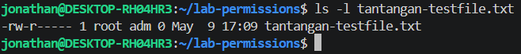

Dapat dilihat bahwa owner dan group dari file tersebut sudah berubah secara berturut-turut menjadi `root` dan `adm`.

## Praktikum 11.2

1. Menyiapkan file dan melihat permission standar tanpa ACL tambahan

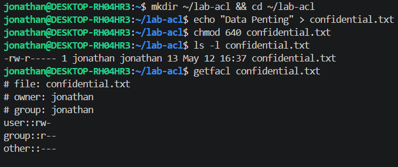

2. Memberi akses baca ke satu user tertentu tanpa mengubah owner atau group

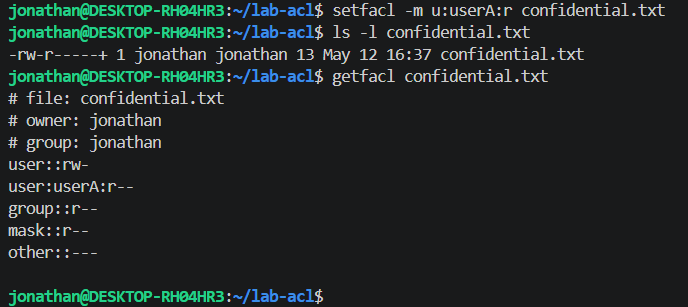

3. Membuat direktori bersama yang mewariskan ACL ke file baru

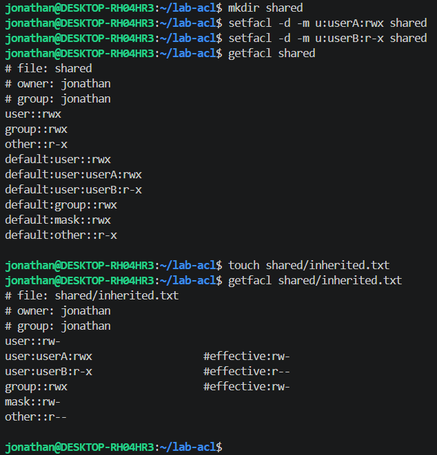

### Analisis

#### Pertanyaan

1. Mengapa getfacl confidential.txt awalnya tidak menampilkan user tertentu?

2. Setelah setfacl -m u:userA:r confidential.txt, apa perbedaan output ls -l dan getfacl?

3. Mengapa file inherited.txt mewarisi ACL dari direktori shared?

#### Jawaban

1. Karena belum dimodifikasi atau ditambahkan user baru dalam permission file `confidential.txt`, sehingga user hanya satu, yakni user default.

2. Perintah `ls -l` hanya menampilkan permission pada default, yakni owner, group, dan others yang default. Sedangkan, `getfacl` menampilkan seluruh akses yang ada pada file/direktori tertentu, mulai dari seluruh user yang memiliki akses pada file/direktori, kemudian group, bahkan mask, dan others.

3. Karena file inherited.txt berada di dalam direktori shared, dan menurut aturan default ACL, direktori akan mewariskan ACL pada konten (file atau direktori) di dalamnya, namun file baru tidak akan mewarisi execute dari default ACL bila ia file reguler, sedangkan subdirektori tetap mempertahankan execute karena x pada direktori berarti izin masuk.

### Tantangan

#### Soal

Tambahkan satu ACL lagi agar group readonly-group hanya dapat membaca confidential.txt. Setelah itu, hapus ACL untuk userA dan verifikasi hasil akhirnya dengan getfacl.

#### Jawaban

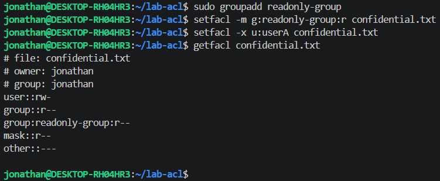

## Praktikum 11.3A

1. Membuat dua user baru

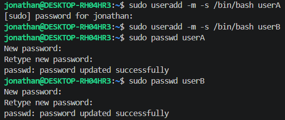

2. Memverifikasi

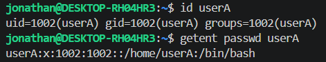

3. Memodifikasi shell userA

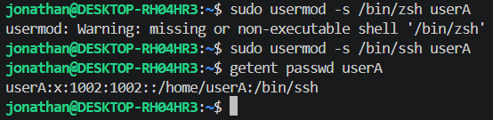

4. Lock dan unlock userB

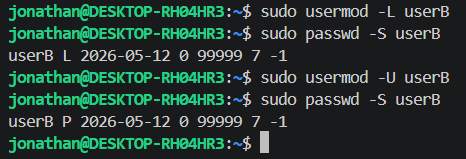

### Pertanyaan

1. Apa perbedaan output id userA sebelum dan sesudah menambah group?

2. Bagaimana status passwd -S userB berubah saat akun di-lock?

### Jawaban

1. Dengan berasumsi bahwa adanya modifikasi group terhadap user A, maka sebelum menambahkan group, `id userA` hanya akan menampilkan satu group (biasanya group utama yang namanya sama dengan user). Setelah adanya penambahan group, maka bagian groups akan bertambah, misalnya `groups=1001(userA),27(sudo)`

2. Saat akun di-lock, status akan berubah dari `P` atau Password set menjadi `L` atau Locked.

## Praktikum 11.3B

1. Membuat dua group

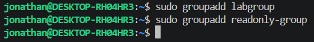

2. Menambahkan userA ke dalam kedua group dan userB ke readonly-group

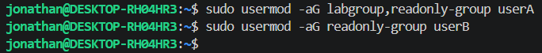

3. Memverifikasi

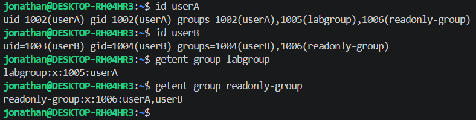

### Pertanyaan

1. Apa yang ditampilkan id userA vs groups userA?

2. Mengapa -a pada usermod -aG penting?

### Jawaban

1. Perintah `id userA` menampilkan `uid=1002(userA) gid=1002(userA) groups=1002(userA)`, yakni uid, gid, dan groups yang memiliki user tersebut. Sedangkan, perintah `groups userA` menampilkan `userA : userA labgroup readonly-group`, mirip seperti perintah sebelumnya, hanya saja perintah ini hanya menampilkan groups yang memiliki user tersebut, tanpa uid dan gid.

2. Tambahan `-a` berarti append, ini sangat penting, karena ia menambahkan user ke dalam group yang diinginkan tanpa menghapus user ini dari group yang lain.

## Praktikum 11.3C

1. Menge-set aging policy untuk userA

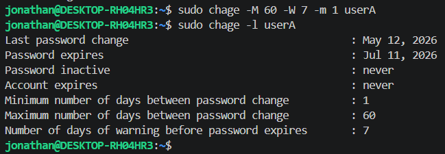

2. Memasksa userA ganti password saat login pertama

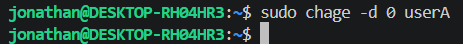

3. Mengunci password userB

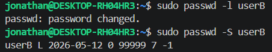

4. Meng-unlock kembali

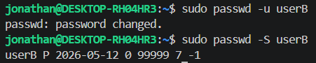

### Pertanyaan

1. Apa arti nilai yang ditampilkan chage -l userA?

2. Bagaimana cara membuktikan userB terkunci dari output passwd -S?

3. Kapan sebaiknya menggunakan chage -d 0 vs passwd -e?

### Jawaban

1. Perintah chage -l (CHange AGE) digunakan untuk melihat informasi kedaluwarsa password dan masa aktif akun secara mendetail. Ini jauh lebih lengkap daripada sekadar melihat status kunci (lock).

- Last password change: Tanggal terakhir ganti password (12 Mei 2026).

- Password expires: Tanggal password hangus (11 Juli 2026), didapat dari rentang 60 hari.

- Password inactive: Akun tidak pernah dinonaktifkan meski password sudah expired.

- Account expires: Akun berlaku selamanya (tidak ada tanggal kedaluwarsa akun).

- Min/Max number of days: Jeda minimal ganti password (1 hari) dan umur maksimal password (60 hari).

- Warning days: Peringatan ganti password akan muncul 7 hari sebelum hangus.

2. Dari output `passwd -S`, jika output `L` maka artinya user locked/terkunci, sedangkan jika output yang didapat adalah `P` maka artinya user password set/tidak terkunci.

3. - `passwd -e (Expire)`
Fungsi: Langsung menyatakan password saat ini sudah kedaluwarsa.

Kapan digunakan: Kasus darurat atau standar keamanan cepat (misal: password user baru saja bocor atau reset password oleh admin).

Kelebihan: Perintahnya sangat pendek dan mudah diingat.

   - `chage -d 0 (Date 0)`

Fungsi: Mengatur "Tanggal Terakhir Ganti Password" menjadi 0 (artinya dianggap belum pernah ganti password sejak tahun 1970).

Kapan digunakan: Saat mengelola manajemen umur password yang lebih kompleks (aging). Karena chage adalah alat khusus untuk aging, perintah ini lebih umum digunakan dalam script otomatisasi pendaftaran user baru.

Kelebihan: Bagian dari paket perintah chage yang lebih mendetail.

### Tantangan

#### Soal

Buat user bernama intern yang:

- memiliki shell /bin/bash;

- menjadi anggota labgroup;

- dipaksa ganti password pada login pertama;

- password expired setelah 45 hari dengan warning 7 hari sebelumnya.

#### Jawaban

1. Menambahkan user baru dan memodifikasinya

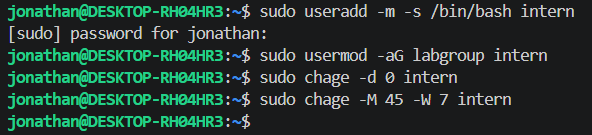

2. Memverifikasi user

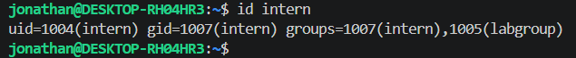

3. Memverifikasi modifikasi `chage`

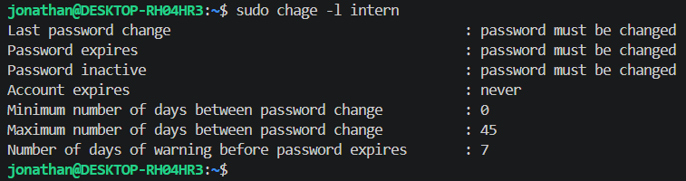

## Praktikum 11.4

1. Membuat file konfigurasi sudo khusus untuk userA

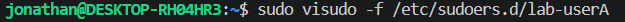

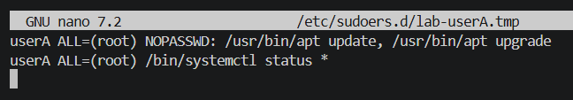

2. Memverifikasi aturan yang aktif dan menguji hasilnya

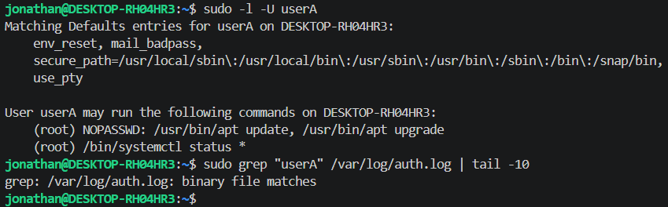

### Analisis

#### Pertanyaan

1. Mengapa aturan disimpan di /etc/sudoers.d//, bukan langsung di /etc/sudoers?

2. Mana perintah yang bisa dijalankan tanpa password, dan mana yang masih perlu autentikasi?

3. Informasi apa saja yang dicatat di log sudo?

#### Jawaban

1. Menyimpan aturan di /etc/sudoers.d/ lebih aman karena mencegah kerusakan pada file utama /etc/sudoers dan memudahkan pengelolaan konfigurasi secara terpisah tanpa risiko mengunci akses administrator secara tidak sengaja.

2. Perintah yang bisa dijalankan tanpa password adalah apt update dan apt upgrade karena adanya parameter NOPASSWD, sedangkan perintah systemctl status tetap memerlukan autentikasi password sesuai kebijakan normal.

3. Log sudo mencatat informasi mengenai siapa yang menjalankan perintah, waktu eksekusi, lokasi terminal, direktori kerja, user target sebagai siapa perintah dijalankan, dan detail perintah spesifik yang dieksekusi.

### Tantangan

#### Soal

Tambahkan satu aturan baru agar userA boleh menjalankan /bin/systemctl restart ssh tetapi tidak boleh menjalankan reboot.

#### Jawaban

1. Membuat file konfigurasi sudo khusus untuk userA

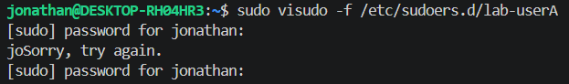

2. Menginputkan skrip

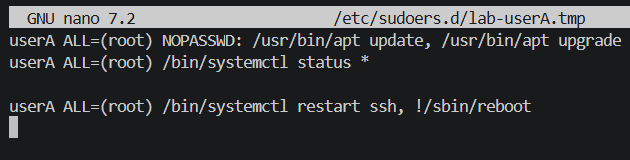

3. Memverifikasi

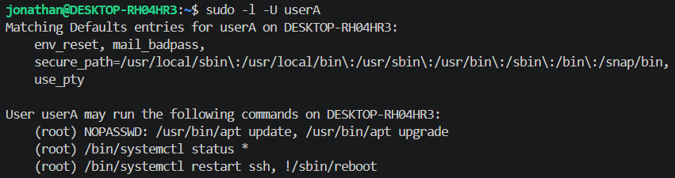

## Praktikum 11.5

1. Membuat images filesystem kecil dan mount dengan opsi quota

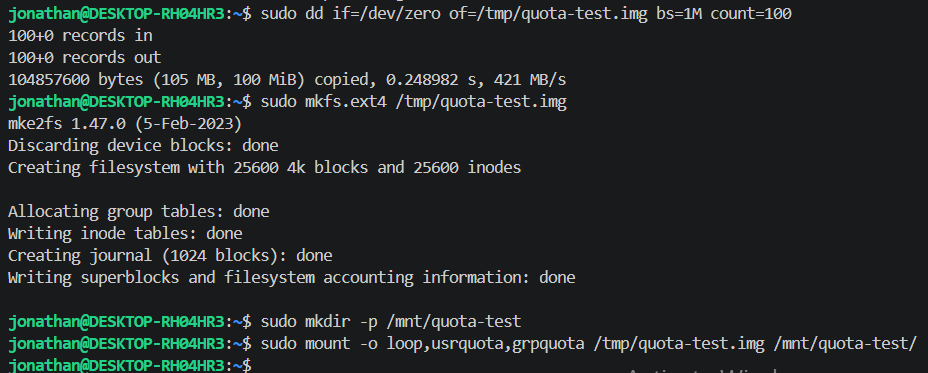

2. Membuat database quota dan mengaktifkan enforcement

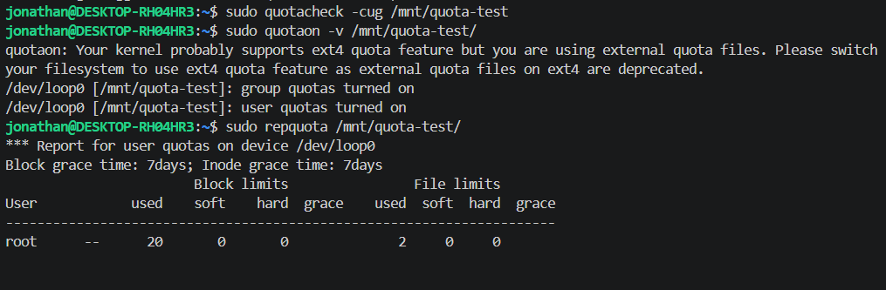

3. Menetapkan quota untuk user uji dan mengamati hasilnya

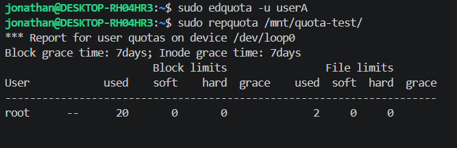

4. Melakukan modifikasi

5. Melihat perubahan dengan `sudo repquota -avug`

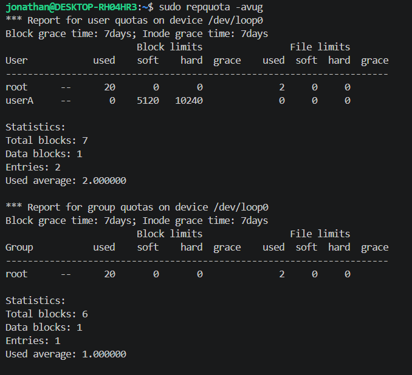

6. Membersihkan lingkungan uji setelah selesai

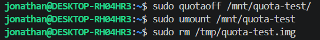

### Analisis

#### Pertanyaan

1. Apa perbedaan soft limit dan hard limit saat quota mulai terlampaui?

2. Mengapa praktikum ini memakai loopback filesystem, bukan langsung /home/?

3. Dari output repquota, informasi apa yang menunjukkan quota sudah aktif?

#### Jawaban

1. Soft limit adalah batas ambang peringatan di mana pengguna masih bisa menambah data namun akan diberikan waktu tenggang (grace period) untuk mengurangi penggunaannya, sedangkan hard limit adalah batas mutlak yang tidak bisa dilampaui sama sekali oleh pengguna; sistem akan langsung menolak penulisan data baru jika angka ini tercapai.

2. Penggunaan loopback filesystem bertujuan untuk isolasi keamanan agar praktikum tidak merusak atau memodifikasi struktur sistem file utama, serta menghindari risiko kegagalan sistem saat melakukan eksperimen konfigurasi kuota yang bisa berdampak pada stabilitas direktori kritis seperti /home.

3. Informasi yang menunjukkan kuota sudah aktif pada output repquota adalah munculnya baris laporan yang mencantumkan kolom used, soft, dan hard untuk pengguna tertentu, serta adanya status grace period yang menandakan bahwa sistem sedang melakukan pengawasan terhadap batasan yang telah ditetapkan.

### Tantangan

#### Soal

Coba atur quota baru untuk userA dengan batas inode yang sangat kecil, kemudian jelaskan kapan pembatasan inode lebih penting daripada pembatasan block.

#### Jawaban

1. Persiapan image dan mounting

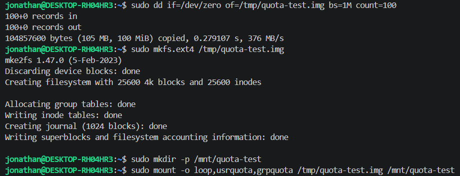

2. Inisialisasi database dan aktivasi

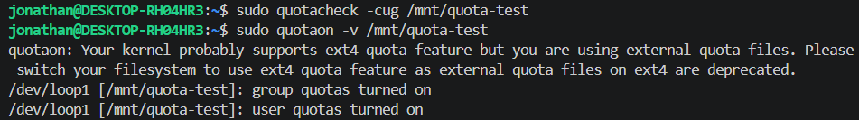

3. Mengatur batas kuota (konfigurasi)

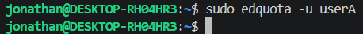

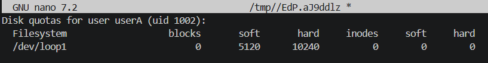

4. Pengujian dan verifikasi

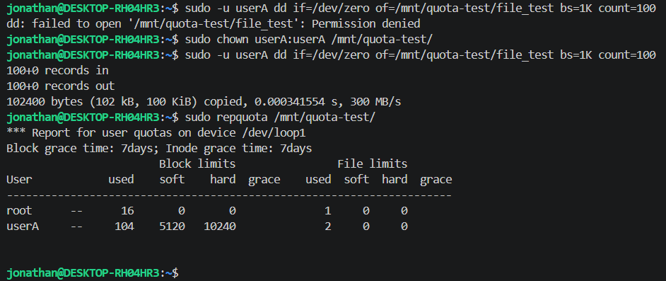

5. Pembersihan (setelah selesai)

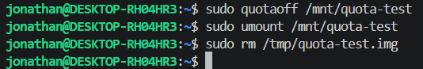

Pembatasan inode lebih krusial daripada block pada sistem yang menangani banyak sekali file berukuran kecil, seperti direktori cache, server email, atau repositori kode sumber (source code). Pada kasus ini, kapasitas penyimpanan (block) mungkin masih sangat lega, namun sistem bisa mengalami "kemacetan" atau error "No space left on device" karena kehabisan nomor indeks file (inode) yang mengakibatkan sistem tidak mampu lagi membuat file baru meskipun ruang disk masih tersedia banyak.

## Latihan

### Latihan 11A

#### Soal

1. Temukan file SUID aktif dengan find / -perm -4000 -type f 2>/dev/null, lalu jelaskan tiga file yang Anda kenali beserta alasannya.

2. Cari direktori world-writable dan tentukan mana yang valid dan mana yang berisiko.

3. Rancang konfigurasi permission standar dan ACL untuk direktori proyek /srv/webapp/ agar group webapp-team dapat menulis, user deploy hanya membaca, dan file baru selalu mewarisi group proyek.

#### Hasil find / -perm -4000 -type f 2>/dev/null

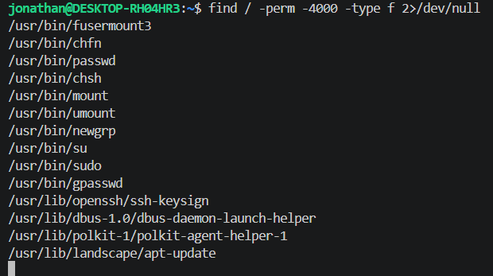

#### Jawaban

1. File dengan bit SUID (Set User ID) memungkinkan pengguna biasa menjalankan program dengan hak akses pemilik file tersebut (biasanya root). Tiga file yang umum dikenali dari daftar adalah:

- `/usr/bin/passwd`: Digunakan untuk mengubah kata sandi. File ini butuh hak akses root agar bisa menulis perubahan ke dalam file sensitif /etc/shadow yang tidak bisa diakses oleh pengguna biasa.

- `/usr/bin/sudo`: Digunakan untuk menjalankan perintah sebagai superuser. SUID diperlukan agar program bisa memverifikasi kredensial pengguna dan mengalihkan hak akses ke root secara aman.

- `/usr/bin/mount`: Digunakan untuk memasang filesystem. Proses mounting memerlukan interaksi langsung dengan perangkat keras dan kernel, sehingga pengguna biasa butuh hak akses tinggi sementara untuk melakukannya.

2. Untuk mencarinya, gunakan perintah: find / -perm -o+w -type d 2>/dev/null.

- Valid (Aman): Direktori seperti /tmp dan /var/tmp. Meskipun bisa ditulis oleh siapa saja (world-writable), direktori ini memiliki Sticky Bit (ditandai dengan t pada permission, seperti drwxrwxrwt) yang mencegah pengguna menghapus file milik orang lain.

- Berisiko: Direktori sistem atau folder konfigurasi aplikasi yang memiliki izin 777 tanpa Sticky Bit. Hal ini berisiko karena pengguna asing bisa menyisipkan skrip berbahaya, mengganti file konfigurasi, atau menghapus data penting yang mengakibatkan kegagalan sistem.

3. - Mempersiapkan direktori dan grup

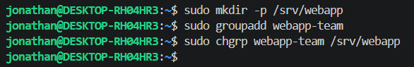

   - Mengatur permission standar dan SGID

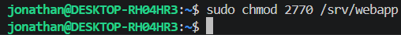

   - Mengubah skrip

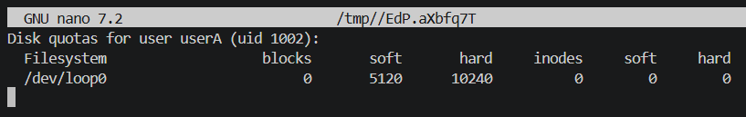

   - Mengatur ACL (Access Control List)

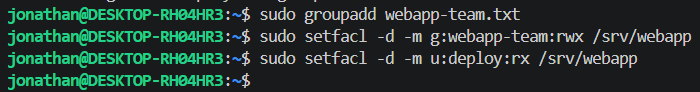

### Latihan 11B

#### Soal

Tuliskan langkah untuk membuat user intern, menambahkannya ke group labgroup, memaksa pergantian password tiap 45 hari (warning 7 hari), memberi izin sudo hanya untuk systemctl status, dan menetapkan quota ruang serta inode sederhana pada /home/.

#### Jawaban

##### Tahap 1 : Manajemen User & Keamanan

1. Membuat user dan grup

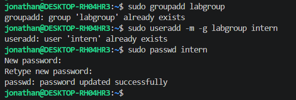

2. Konfigurasi kebijakan password

3. Konfigurasi hak sudo terbatas

##### Tahap 2 : Penyiapan Lingkungan Kuota (Loopback)

4. Membuat file image (100MB) dan format ke ext4

5. Mount dengan opsi kuota

##### Tahap 3 : Aktivasi & Konfigurasi Kuota

6. Inisialisasi database kuota

7. Menetapkan batasan (soft/hard limit)

##### Tahap 4 : Izin Akses & Verifikasi

8. Mengubah kepemilikan folder dan menguji penulisan data

9. Melihat laporan akhir

10. Verifikasi akhir

