# PERTEMUAN 12

Management Service

## Persiapan

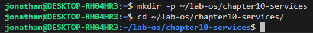

## Praktikum 12.1

1. Melihat semua layanan yang sedang berjalan

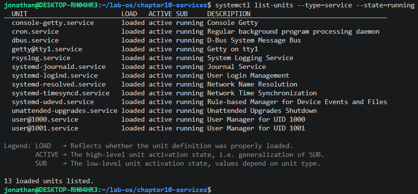

Banyak layanan yang aktif : 13 layanan

2. Melihat semua unit service yang ada (aktif maupun tidak)

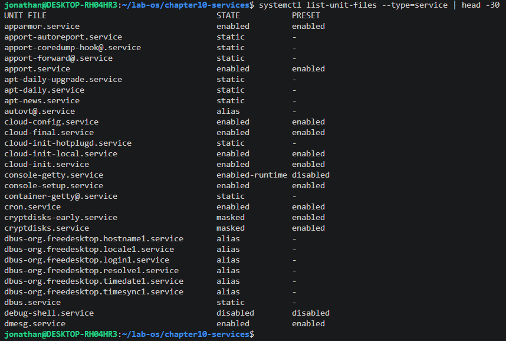

3. Menganalisis waktu boot dan menemukan layanan paling lambat

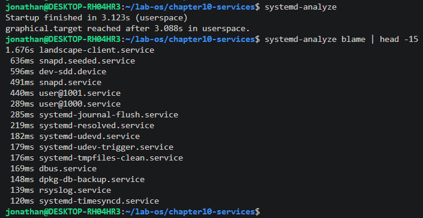

## Tantangan

### Soal

Identifikasi tiga layanan dengan waktu inisialisasi terlama menggunakan systemd-analyze blame. Gunakan pipeline dari Bab 3 (| sort -rh | head -3) untuk mempercepat pencariannya. Untuk setiap layanan, cari tahu Layanannya dengan systemctl cat nama-layanan.

Tuliskan nama layanan, waktu inisialisasinya, dan penjelasan singkat Layanannya.

### Jawaban

Mengidentifikasi tiga layanan dengan waktu inisialisasi terlama menggunakan `systemd-analyze blame`

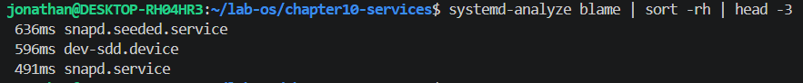

1. Layanan `snapd.seeded.service`

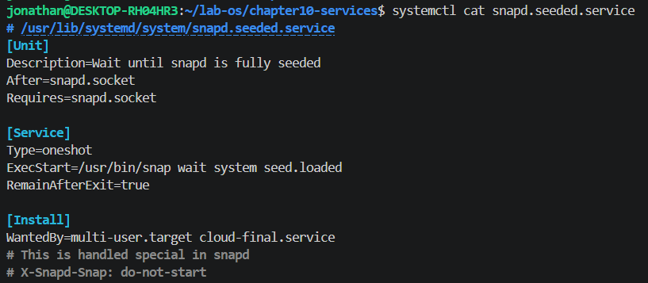

> Nama : `snapd.seeded.service`
>
> Waktu inisialisasi : 636 ms
>
> Fungsi : Melakukan "seeding" (menanamkan atau menginisialisasi) paket-paket Snap bawaan sistem saat sistem operasi pertama kali dipasang (install) atau saat proses booting awal.

2. Layanan `dev-sdd.device`

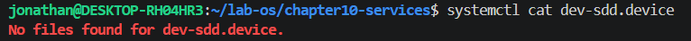

Tidak berhasil karena `dev-sdd.device` tipe device.

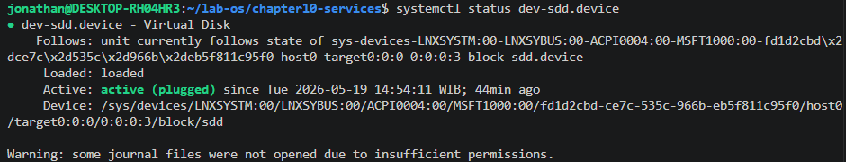

> Nama : `dev-sdd.device`
>
> Waku inisialisasi : 596ms
>
> Fungsi : Memastikan sistem operasi mengenali drive tersebut saat dicolokkan atau saat komputer menyala, sehingga partisi di dalamnya bisa dibaca dan digunakan untuk menyimpan data.

Berhasil dengan perintah lain.

3. Layanan `snapd.service`

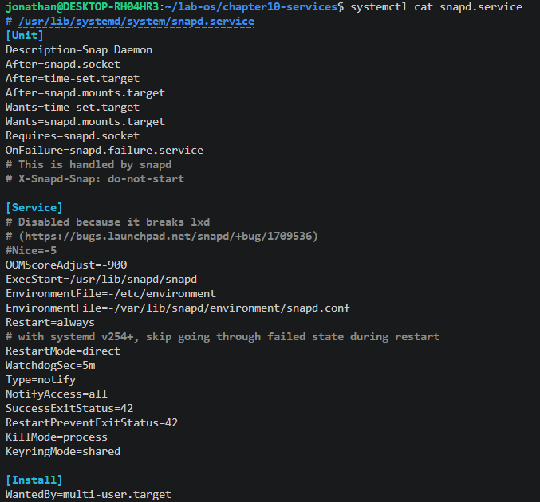

> Nama : `snapd.service`
>
> Waku inisialisasi : 491ms
>
> Fungsi : Mengunduh dan memasang aplikasi Snap baru, menjalankannya dengan aman, dan memeriksa serta mengunduh pembaruan aplikasi Snap secara otomatis di latar belakang.

## Praktikum 12.2

1. Memeriksa status ssh secara menyeluruh

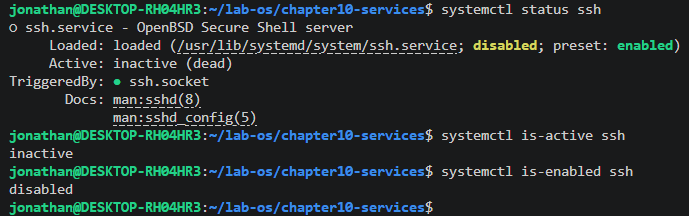

2. Melakukan restart dan memantau perubahannya

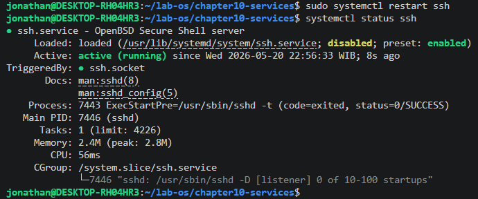

3. Melihat dependensi ssh

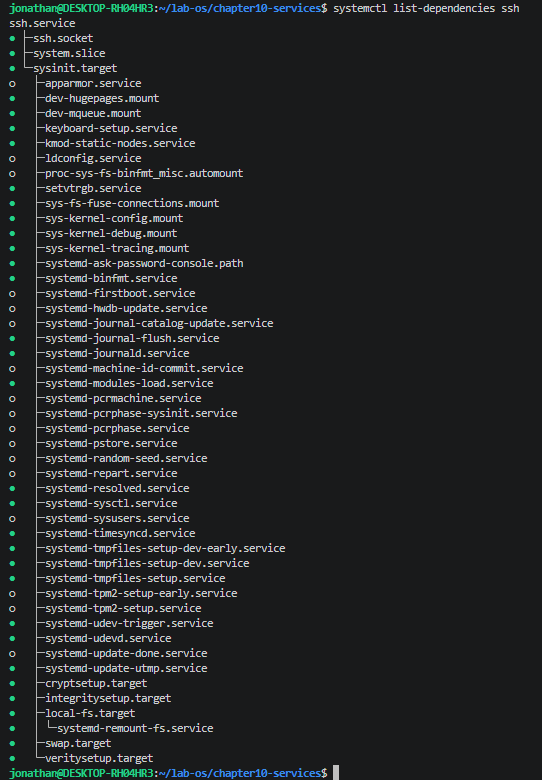

4. Mengecek semua unit yang gagal di sistem

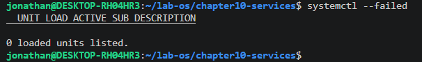

## Tantangan

### Soal

Buat skrip Bash (referensi Bab 7) bernama cek-layanan.sh yang memeriksa status daftar layanan dari sebuah berkas teks. Berkas teks daftar-layanan.txt berisi satu nama layanan per baris (isi minimal: ssh, cron, rsyslog). Skrip membaca setiap nama layanan, memeriksa statusnya dengan systemctl is-active, lalu menulis laporan ke berkas laporan-layanan.log dengan format: [TANGGAL] nama-layanan: ACTIVE/INACTIVE. Gunakan date untuk mendapatkan tanggal.

### Jawaban

1. Membuat file daftar-layanan.txt sekaligus mengisikan daftar nama layanan per baris

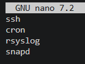

2. Membuat file cek-layanan.sh sekaligus mengisikan skripnya

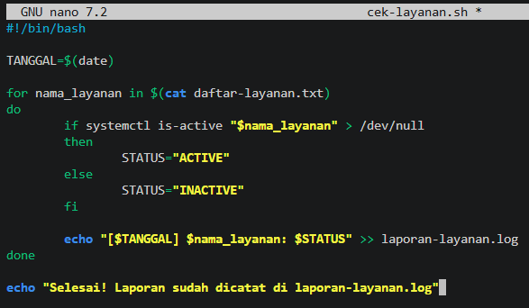

3. Memberi izin eksekusi dan mengeksekusinya

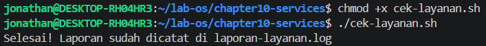

4. Mengecek file laporan-layanan.log

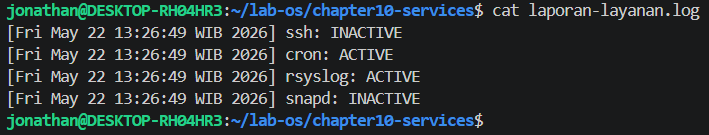

## Praktikum 12.3

1. Menyiapkan konten yang akan dilayani

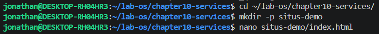

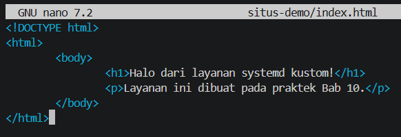

2. Membuat skrip wrapper untuk server HTTP

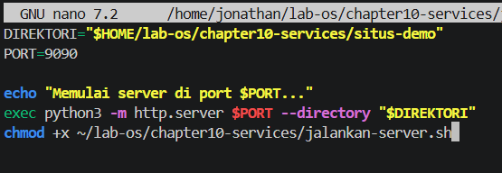

3. Membuat berkas unit systemd untuk layanan ini

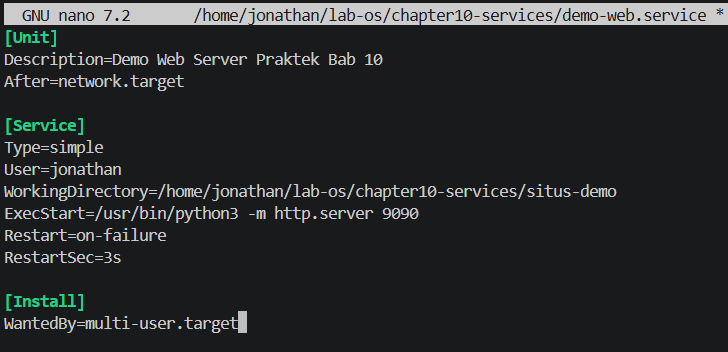

4. Menjalankan layanan dan verifikasi

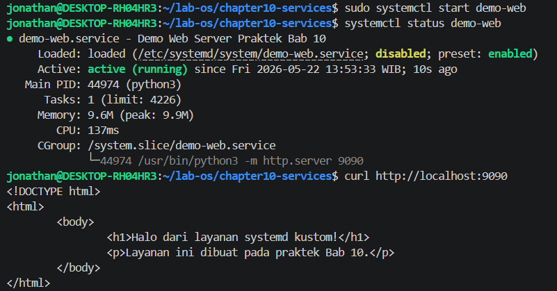

5. Menguji fitur otomatis

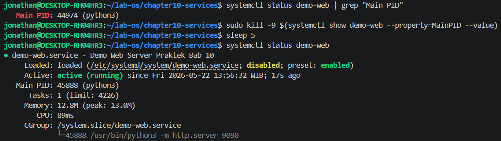

6. Membersihkan layanan uji setelah selesai

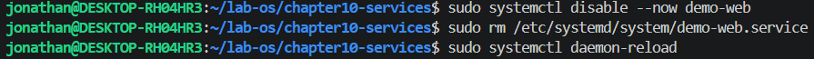

## Tantangan

### Soal

Modifikasi berkas unit demo-web.service sebelum menghapusnya: tambahkan RestartSec=10s agar sistemmenunggu 10 detik sebelum mencoba restart, dan tambahkan Environment="PORT=9091" lalu ubah ExecStart agar menggunakan variabel tersebut. Aktifkan layanan dengan enable dan WantedBy=multi-user.target, lalu uji apakah layanan aktif setelah systemctl daemon-reload. Dokumentasikan perbedaan perilaku dibanding versi sebelumnya.

### Jawaban

1. Masuk ke `demo-web.service` dan mengedit skrip

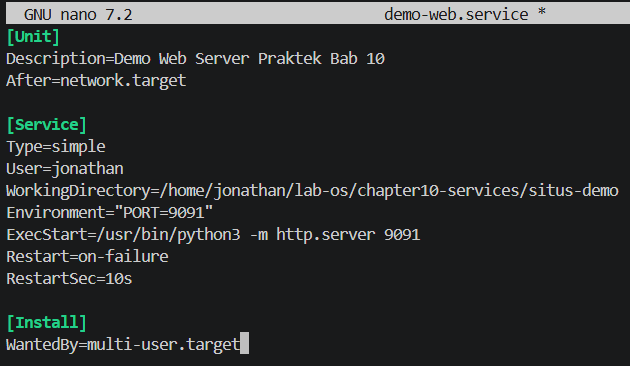

2. Menyalin ke lokasi unit systemd dan meminta systemd membaca ulang berkas unit yang baru diperbarui

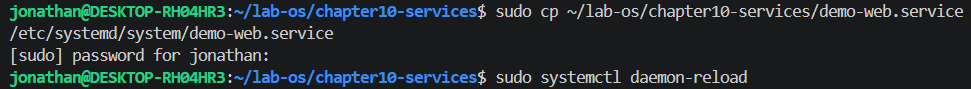

3. Mengaktifkan layanan dengan enable dan start

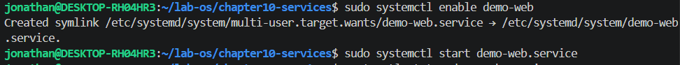

4. Menguji fitur restart otomatis

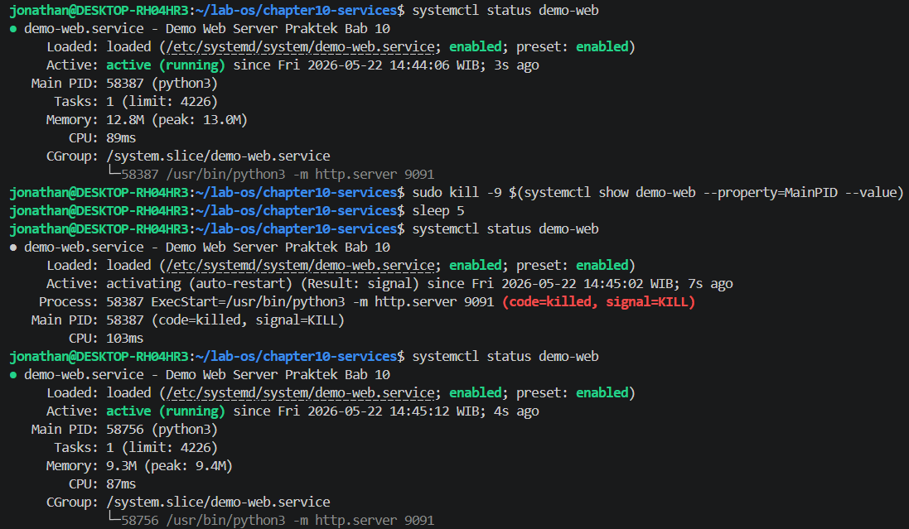

> Perbedaan :
>
> Sebelum dimodifikasi: Aplikasi langsung menyala kembali seketika (instant restart) saat crash, dan port yang digunakan masih versi default.
>
> Setelah dimodifikasi: Aplikasi menahan diri (pingsan dulu) selama 10 detik sebelum otomatis menyala kembali dengan nomor PID baru, serta sukses berjalan di port kustom 9091.

5. Membersihkan layanan uji setelah selesai

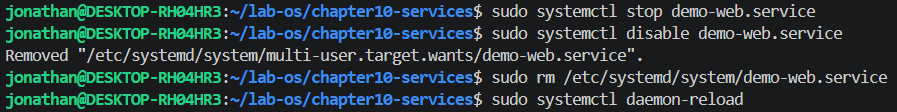

## Praktikum 12.4

1. Melihat log SSH dari satu jam terakhir

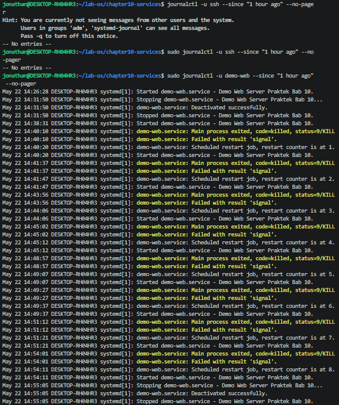

2. Memfilter log berprioritas error ke atas

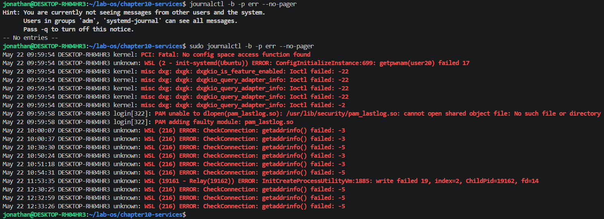

3. Mengikuti log secara real-time sambil memicu aktivitas

Sebelum dikenai oleh aktivitas manapun

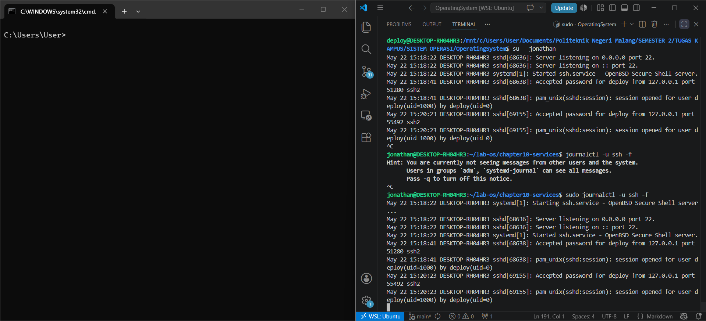

Setelah melakukan login ssh ke localhost dengan `ssh localhost`

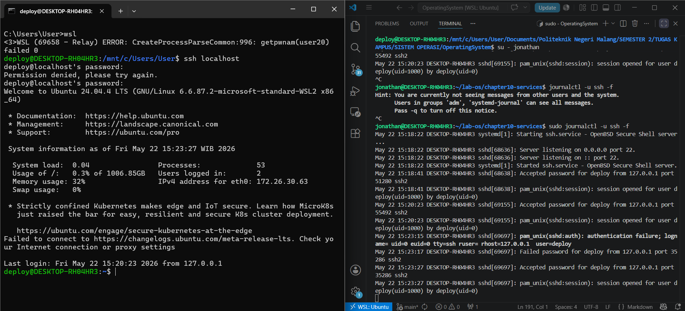

4. Mengekstrak log kee berkas untuk analisis

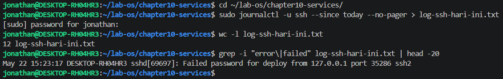

## Tantangan

### Soal

Ekstrak semua log dengan prioritas error (-p err) dari 24 jam terakhir untuk layanan SSH, simpan ke berkas error-ssh-24jam.txt. Gunakan pipeline dari Bab 3 untuk menghitung total jumlah baris error dengan wc -l, lalu tampilkan 10 pesan error yang paling sering muncul menggunakan sort | uniq -c | sort -rn | head -10. Tuliskan perintah lengkap yang kamu gunakan

### Jawaban

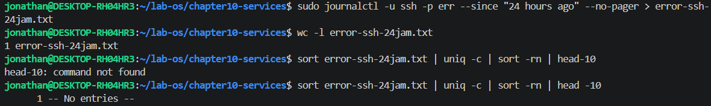

1. Mengekstrak log error 24 jam terakhir dan menyimpannya ke file dengan `sudo journalctl -u ssh -p err --since "24 hours ago" --no-pager > error-ssh-24jam.txt`, serta menghitung jumlah barisnya dengan `wc -l error-ssh-24jam.txt`

2. Menampilkan 10 pesan error yang paling sering muncul dengan `sort error-ssh-24jam.txt | uniq -c | sort -rn | head -10`

## Praktikum 12.5

1. Memeriksa konfigurasi SSH saat ini

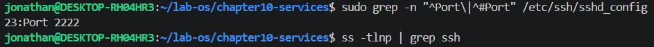

2. Membuat backup dan mengubah port SSH

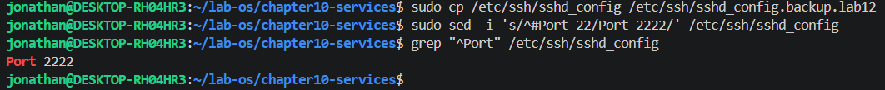

3. Memvalidasi konfigurasi dan me-restart layanan

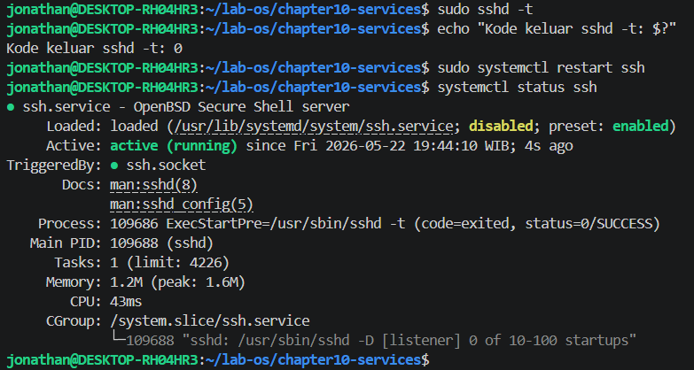

4. Memverifikasi port baru dengan ssh

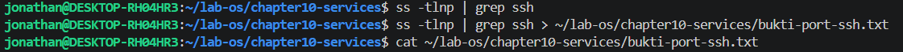

5. Mengembalikan port SSH ke 22 setelah praktek

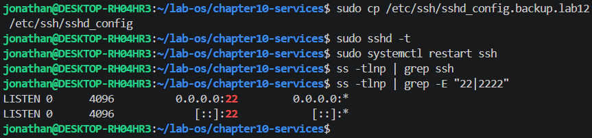

## Tantangan

1. Membuat backup konfigurasi dan mengeditnya

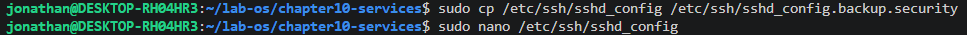

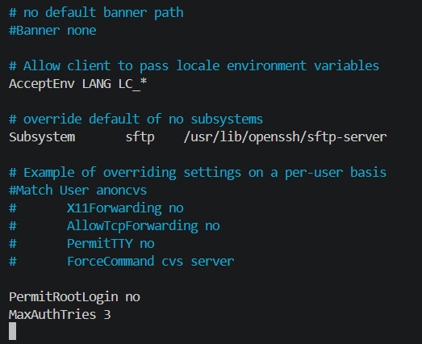

2. Memvalidasi sintaks, menerapkan perubahan, dan verifikasi pengaturan `PermitRoot` dan `MaxAuth`

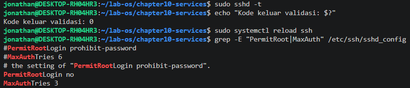

3. Mengecek 20 baris log terakhir untuk memastikan SSH sehat

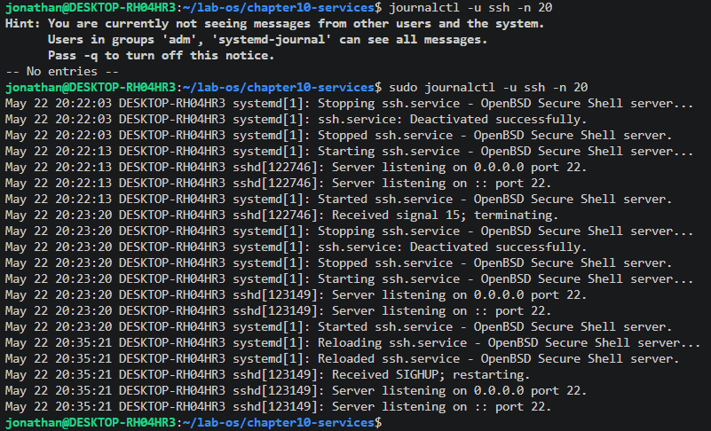

## Latihan

### Latihan 10.1

#### Soal

    
Soal

Lakukan audit menyeluruh terhadap layanan yang berjalan di sistem.

1. Jalankan systemctl list-units –type=service –state=running dan catat semua layanan aktif. Pilih tiga layanan yang kamu kenal, periksa status masing-masing dengan systemctl status, dan jelaskan fungsinya.

2. Jalankan systemd-analyze blame dan identifikasi lima layanan dengan waktu inisialisasi terlama. Tampilkan hasilnya menggunakan pipeline: systemd-analyze blame | head -5.

3. Jalankan systemctl –failed dan dokumentasikan hasilnya. Jika ada layanan yang gagal, cari tahu penyebabnya dengan journalctl -u nama-layanan -n 30.

#### Jawaban

1. Semua layanan yang aktif

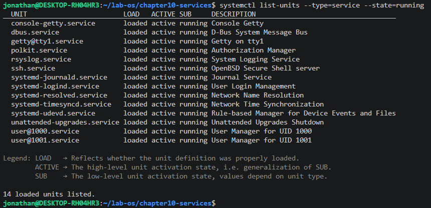

Memilih tiga layanan dan memeriksa statusnya :

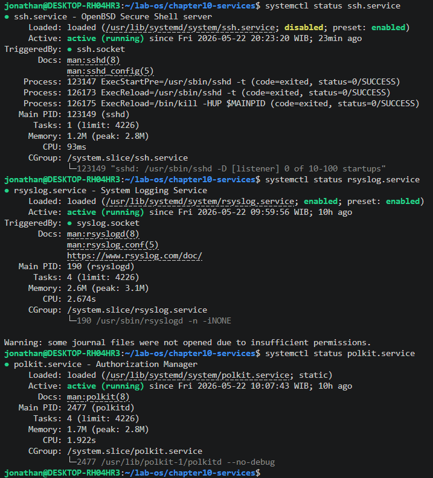

Penjelasan fungsi tiap layanan :

> `ssh.service (OpenBSD Secure Shell server)`
>
> Service ini berfungsi untuk menyediakan jalur komunikasi jarak jauh (remote access) yang terenkripsi dan aman, sehingga kamu atau admin bisa masuk ke terminal Linux dan mengendalikan server dari komputer lain di dalam jaringan.

> `rsyslog.service (System Logging Service)`
> 
> Service ini bertugas sebagai pencatat pusat (logger) yang mengumpulkan, menyaring, dan menyimpan segala aktivitas sistem, pesan error, serta log dari berbagai aplikasi (termasuk log aktivitas login SSH) ke dalam file teks di folder /var/log/.

> `polkit.service (Authorization Manager)`
>
> Service ini (singkatan dari PolicyKit) berfungsi sebagai pengatur kebijakan hak akses yang memungkinkan proses tanpa hak istimewa (unprivileged) untuk berkomunikasi dengan proses yang memiliki hak istimewa tinggi (privileged), seperti memberikan izin kepada pengguna biasa untuk mengeksekusi perintah administratif tertentu tanpa harus sepenuhnya login sebagai root.

2. Identifikasi seluruh layanan

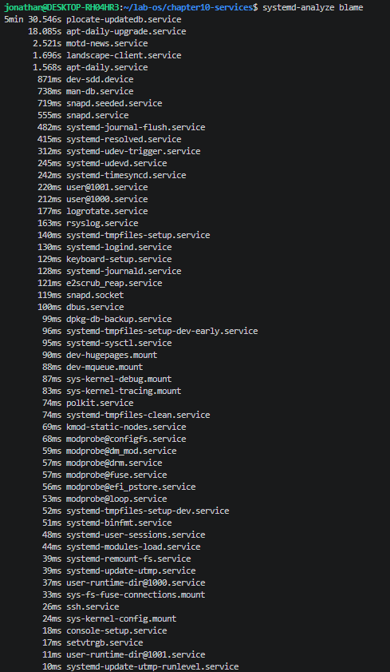

Menyempitkan output menjadi 5 layanan dengan waktu inisialisasi terlama :

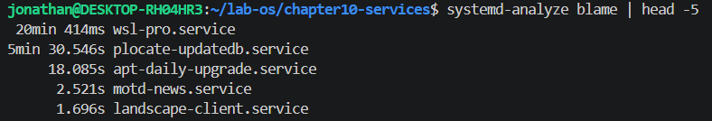

3. Mendokumentasi layanan yang gagal

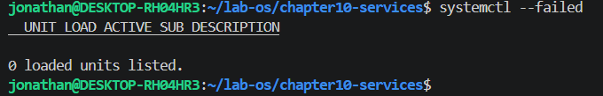

Tidak ditemukan adanya layanan yang gagal.

### Latihan 10.2

#### Soal

    
Soal

Buat layanan systemd kustom yang mendemonstrasikan fitur restart otomatis.

1. Buat skrip Bash (referensi Bab 7) bernama monitor-disk.sh yang setiap 30 detik menuliskan penggunaan disk ke berkas log. Gunakan df -h dan date.

2. Buat berkas unit /etc/systemd/system/monitor-disk.service untuk menjalankan skrip tersebut dengan konfigurasi: Restart=always, RestartSec=5s, dan berjalan sebagai pengguna kamu sendiri.

3. Aktifkan dan jalankan layanan. Verifikasi dengan systemctl status dan pastikan log masuk ke journal.

4. Simulasikan crash dengan membunuh proses secara paksa (kill -9), tunggu 10 detik, dan verifikasi bahwa layanan hidup kembali secara otomatis.

5. Bersihkan: nonaktifkan layanan dan hapus berkas unit setelah selesai.

#### Jawaban

1. Membuat file bash bernama `monitor-disk.sh` dan memberikan izin eksekusi

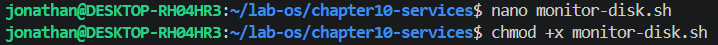

Mengisikan skripnya

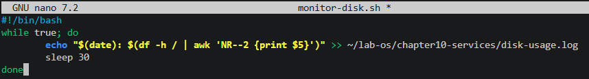

2. Membuat berkas unit untuk menjalankan skrip

Mengisi konfigurasinya

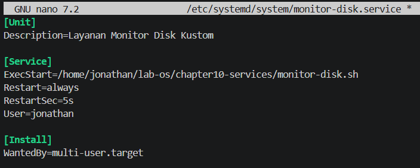

3. Mengaktifkan dan menjalankan layanan dan memverifikasi statusnya

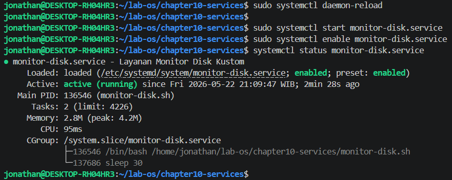

Memastikan log masuk ke journal

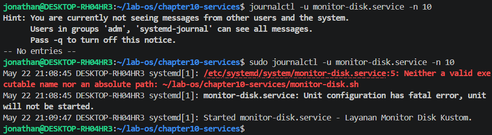

4. Men-simulasikan crash

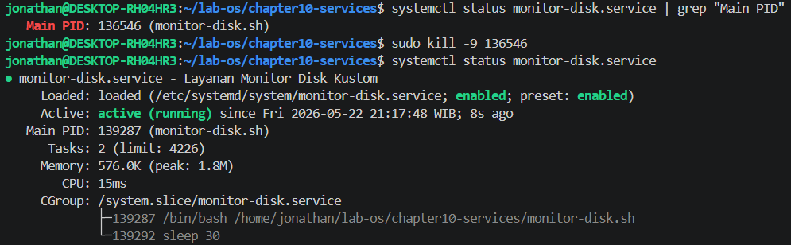

5. Menghentikan dan mematikan layanan

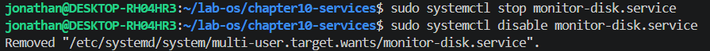

Menghapus berkas unit

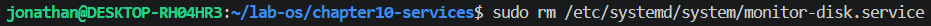

Menghapus skrip yang dibuat

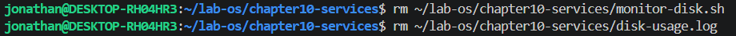

Menyegarkan kembali `systemd`

### Latihan 10.3

#### Soal

    
Soal

Analisis log sistem dan tingkatkan keamanan konfigurasi SSH.

1. Gunakan journalctl -b -p err untuk menemukan semua error sejak boot terakhir. Simpan hasilnya ke berkas dan hitung jumlah baris dengan wc -l.

2. Lakukan tiga perubahan keamanan pada /etc/ssh/sshd_config: tambahkan PermitRootLogin no, MaxAuthTries 3, dan LoginGraceTime 30. Ikuti alur aman: backup, edit, validasi sshd -t, reload.

3. Setelah reload, verifikasi tiga hal: layanan masih berjalan (systemctl status ssh), port masih mendengarkan (ss -tlnp | grep ssh), dan konfigurasi baru terbaca (grep -E "PermitRoot|MaxAuth|GraceTime" /etc/ssh/sshd_config).

4. Kembalikan konfigurasi SSH ke kondisi semula menggunakan berkas backup.

#### Jawaban

1. Mencari error, menghitung jumlah barisnya, dan menyimpannya ke berkas

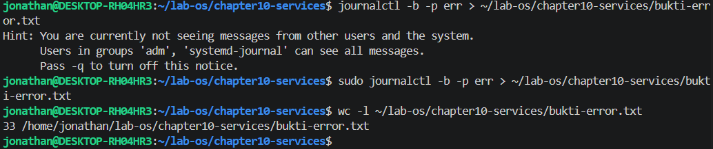

2. Melakukan 3 perubahan keamanan pada `/etc/ssh/ssgd_config` melalui alur aman

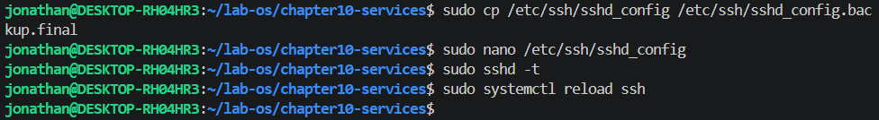

Isi skrip

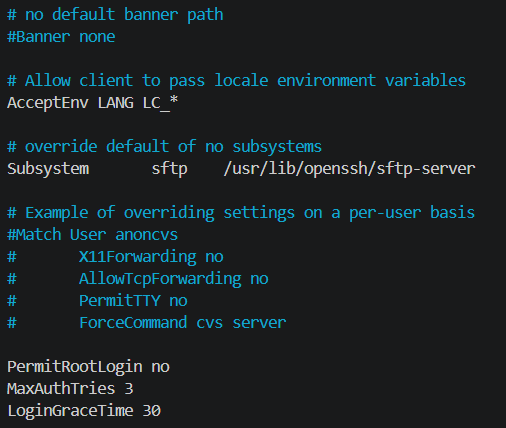

3. Memverifikasi 3 hal

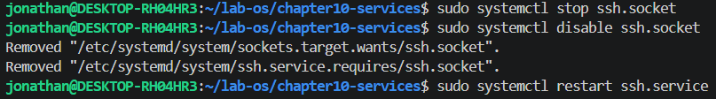

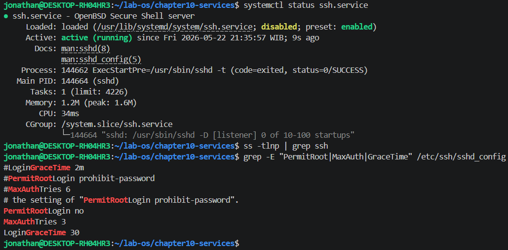

4. Mengembalikan konfigurasi SSH ke kondisi semula

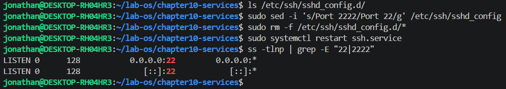