# PERTEMUAN 2

Manajemen Perangkat Keras & Perintah Dasar Sistem Operasi

## Praktikum 2.1

Identifikasi CPU dan Memori

### Tujuan

Memahami spesifikasi CPU dan kondisi memori pada server/VM

### 1. Menampilkan informasi CPU

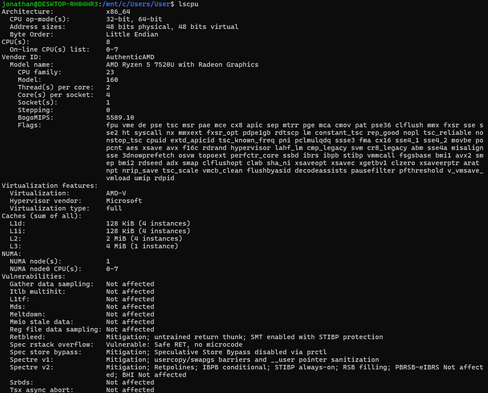

```lscpu```

### 2. Menampilkan ringkasan memori

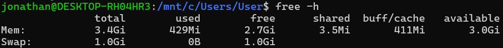

```free -h```

### 3. Mengecek informasi hardware dari DMI/BIOS

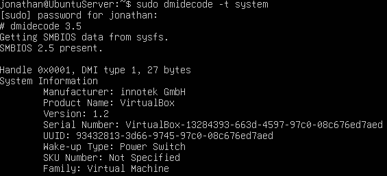

```sudo dmidecode -t system```

## Soal Latihan 2.1
> Catat: (1) jumlah CPU(s), core/thread, (2) total RAM, (3) total swap. 
> Jelaskan perbedaan RAM vs swap dalam 2–3 kalimat.

## Jawaban :
> 1. Jumlah CPU(s)      : 8
> 2. Thread(s) per core : 2
> 3. Core(s) per socket : 4
> 4. Total swap         : 1.0Gi

> RAM (Random Access Memory) adalah memori fisik super cepat untuk data aktif, sedangkan Swap adalah ruang di penyimpanan (HDD/SSD) yang digunakan sebagai memori virtual cadangan saat RAM penuh. RAM bersifat volatile (hilang saat mati), sedangkan Swap lebih lambat dan berfungsi mencegah crash sistem. 

## Praktikum 2.2

### Tujuan

Mengenali perangkat PCI/USB dan melihat driver/modul yang dipakai.

### 1. Melihat daftar perangkat PCI

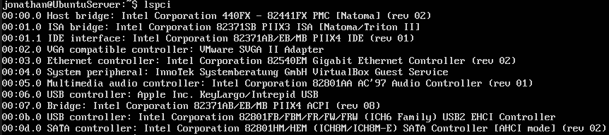

```lspci```

### 2. Melihat perangkat PCI beserta driver kernel yang digunakan

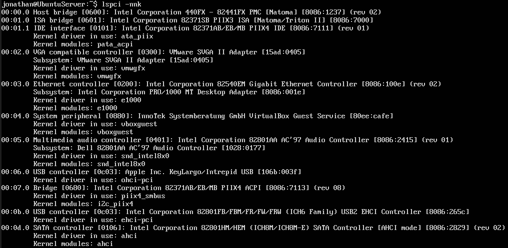

```lspci -nnk```

### 3. Berfokus pada NIC (Ethernet) untuk mencari modul driver

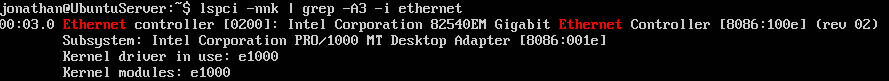

```lspci -nnk | grep -A3 -i ethernet```

### 4. Melihat perangkat USB

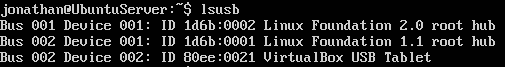

```lsusb```

### 5. Melihat topologi USB (tree)

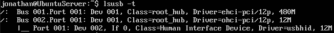

```lsusb -t```

## Soal Latihan 2.2

Temukan 1 perangkat PCI (misal NIC) dan tuliskan: Vendor:Device ID (angka heksadesimal), nama driver/modul kernel, dan deskripsi singkat fungsinya.

## Jawaban


Ethernet controller [0200]
Vendor : 8086:100e
Driver / Modul Kernel : e1000
Deskripsi fungsi : Perangkat ini berfungsi sebagai Network Interface Card (NIC) yang digunakan untuk menghubungkan komputer ke jaringan melalui kabel LAN.

## Praktikum 2.3

### Tujuan

Memahami disk/partisi dan filesystem yang terpasang

### 1. Melihat daftar disk/partisi

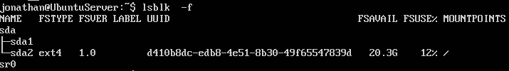

```lsblk -f```

### 2. Menampilkan UUID dan tipe filesystem

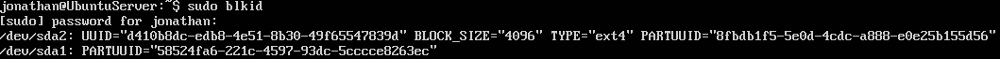

```sudo blkid```

### 3. Melihat mount point untuk root filesystem

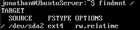

```findmnt /```

## Praktikum 2.4

### Tujuan

Mengenal modul aktif dan keterkaitannya dengan perangkat.

### 1. Mengecek versi kernel

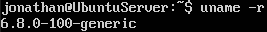

```uname -r```

### 2. Menampilkan daftar modul aktif

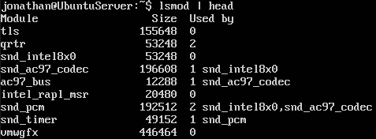

```lsmod | head```

### 3. Memilih salah satu modul (contoh aman: loop) dan melohat detailnya

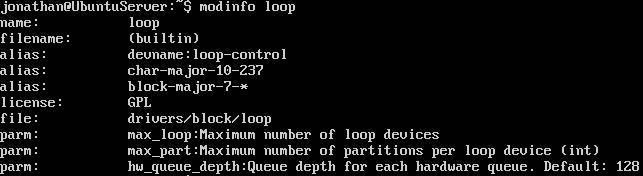

```modinfo loop```

### 4. Memuat modul (jika belum aktif), lalu memverifikasi

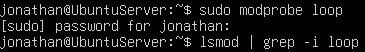

```sudo modprobe loop```

```lsmod | grep -i loop```

### 5. Melihat pesan kernel terbaru

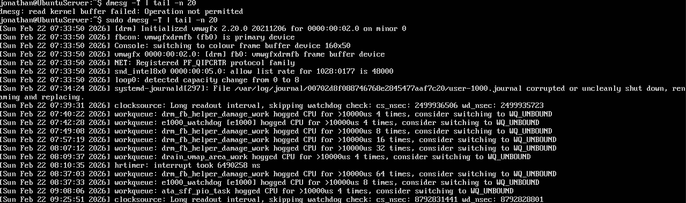

```dmesg -T | tail -n 20```

## Praktikum 2.5

### Tujuan

Memahami cara membuat modul otomatis dimuat atau diblokir.

### 1. Membuat file auto-load

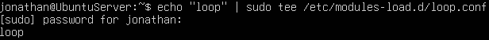

```echo "loop" | sudo tee /etc/modules-load.d/loop.conf```

### 2. Mensimulasikan verifikasi (tanpa reboot) dengan memastikan modul sudah aktif

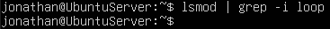

```lsmod | grep -i loop```

## Praktikum 2.6

### Tujuan

Mmbedakan perangkat disk vs terminal.

### 1. Melihat detail salah satu disk (misalnya sda)

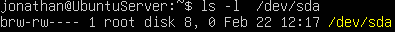

```ls -l /dev/sda```

### 2. Melihat detail device terminal

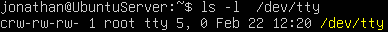

```ls -l /dev/tty```

### 3. Melihat disk dan partisi untuk mengaitkan dengan /dev

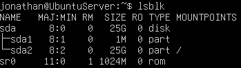

```lsblk``` 

## Soal Latihan 2.3

Dari output ls -l, jelaskan perbedaan penanda file untuk block device dan character device. (Hint: karakter pertama pada permission string)

## Jawaban

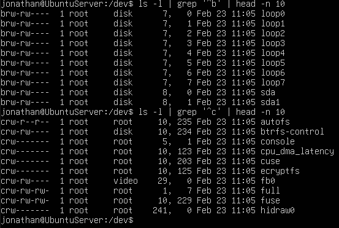

Pada output ls -l, perbedaan antara block device dan character device dapat dilihat dari karakter pertama pada permission string. Block device ditandai dengan huruf b, sedangkan character device ditandai dengan huruf c. Block device digunakan untuk perangkat penyimpanan seperti hard disk, sedangkan character device digunakan untuk perangkat input/output seperti keyboard dan terminal.

## Praktikum 2.7

### Tujuan

Melihat metadata yang dipakai udev untuk membuat device node.

### 1. Mengecek atribut udev untuk disk

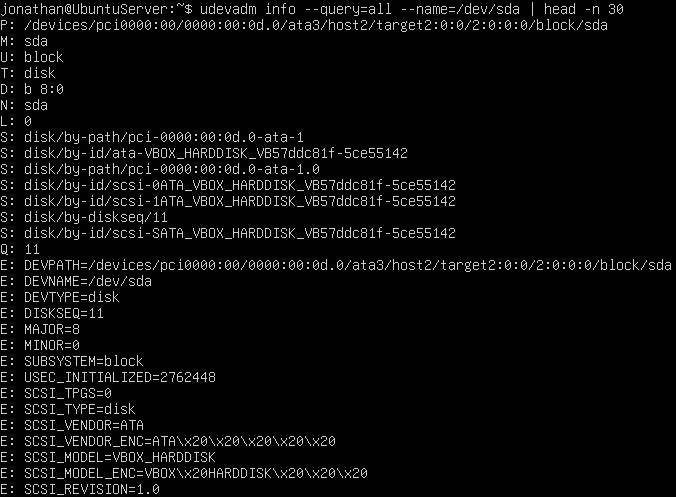

```udevadm info --query=all --name=/dev/sda | head -n 30```

### 2. Mengecek monitor event udev

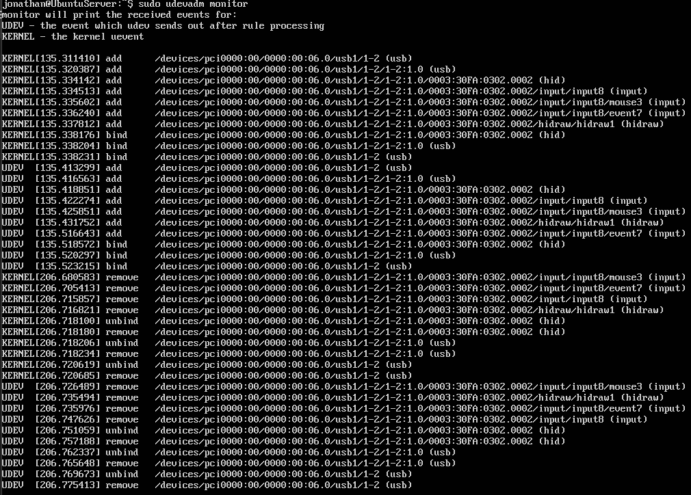

```sudo udevadm monitor```

## Praktikum 2.8

### Tujuan

Membuat area kerja aman untuk semua latihan bab ini.

### 1. Membuat direktori praktikum dan masuk ke dalamnya

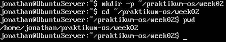

```mkdir -p ~/praktikum-os/week02```
```cd ~/praktikum-os/week02```
```pwd```

### 2. Membuat beberapa file contoh

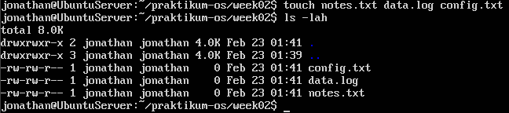

```touch notes.txt data.log config.txt```
```ls -lah```

### 3. Mengisi file log

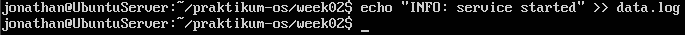

```echo "INFO: service started" >> data.log```
```echo "WARN: disk usage high" >> data.log```
```echo "ERROR: failed to connect" >> data.log```

### 4. Membaca file dengan less

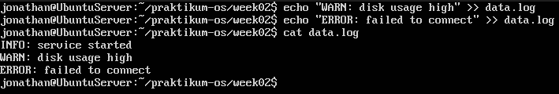

```less data.log```

## Praktikum 2.9

### 1. Mencari baris yang mengandung ERROR pada data.log


```grep "ERROR" data.log```

### 2. Mencari tanpa memperhatikan huruf besar/kecil

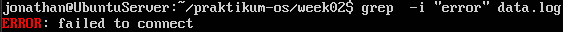

```grep -i "error" data.log```

### 3. Menampilkan nomor baris

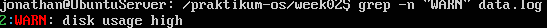

```grep -n "WARN" data.log```

### 4. Menampilkan baris yang tidak cocok (invert match)

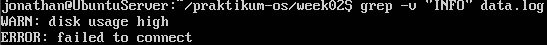

```grep -v "INFO" data.log```

### Soal Latihan 2.4

Gunakan grep untuk menampilkan hanya baris yang mengandung INFO atau
WARN dari data.log. (Hint: gunakan grep -E dengan pola alternatif)

### Jawaban 

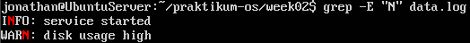

```grep -E "N" data.log```

## Praktikum 2.10

### 1. Menyiapkan file konfigurasi latihan

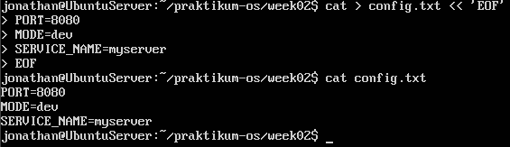

```cat > config.txt << 'EOF'```
```PORT=8080```
```MODE-dev```
```SERVICE_NAME=myserver```
```EOF```
```cat config.txt```

### 2. Mengganti dev menjadi prod (tanpa mengubah file asli)

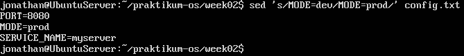

```sed 's/MODE=dev/MODE=prod/' config.txt```

### 3. Menerapkan perubahan langsung ke file (-i)

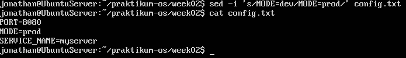

```sed -i 's/MODE=dev/MODE=prod/' config.txt```
```cat config.txt```

### 4. Mengganti semua kemunculan kata (g untuk global), misalnya mengubah ```myserver``` menjadi ```node```

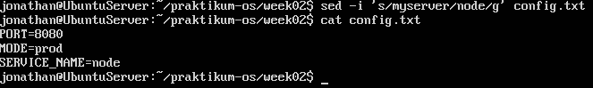

```sed -i 's/myserver/node/g' config.txt```
```cat config.txt```

## Praktikum 2.11

### 1. Melihat output df -h

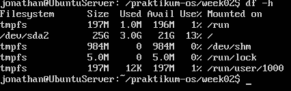

```df -h```

### 2. Mengambil kolom filesystem dan presentase pemakaian

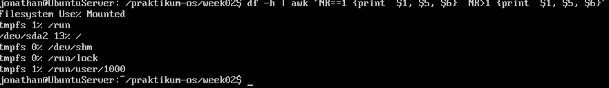

```df -h | awk ’NR ==1 {print $1, $5, $6} NR>1 {print $1, $5, $6}’```

### 3. Memfilter hanya yang pemakaian disk di atas 80%

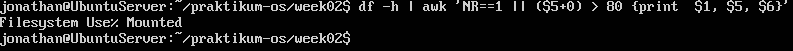

```df -h | awk ’NR==1 || ($5 +0) > 80 {print $1, $5, $6}’```

## Praktikum 2.12

### 1. Menampilkan semua proses (format BSD)

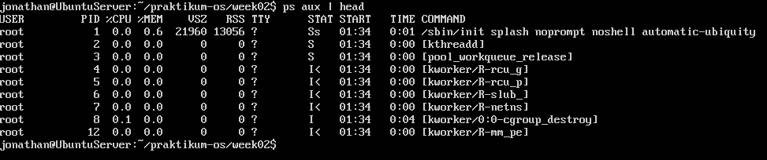

```ps aux | head```

### 2. Mencari proses tertentu (misal sshd)


```ps aux | grep -i sshd```

## Praktikum 2.13

### 1. Menjalankan top

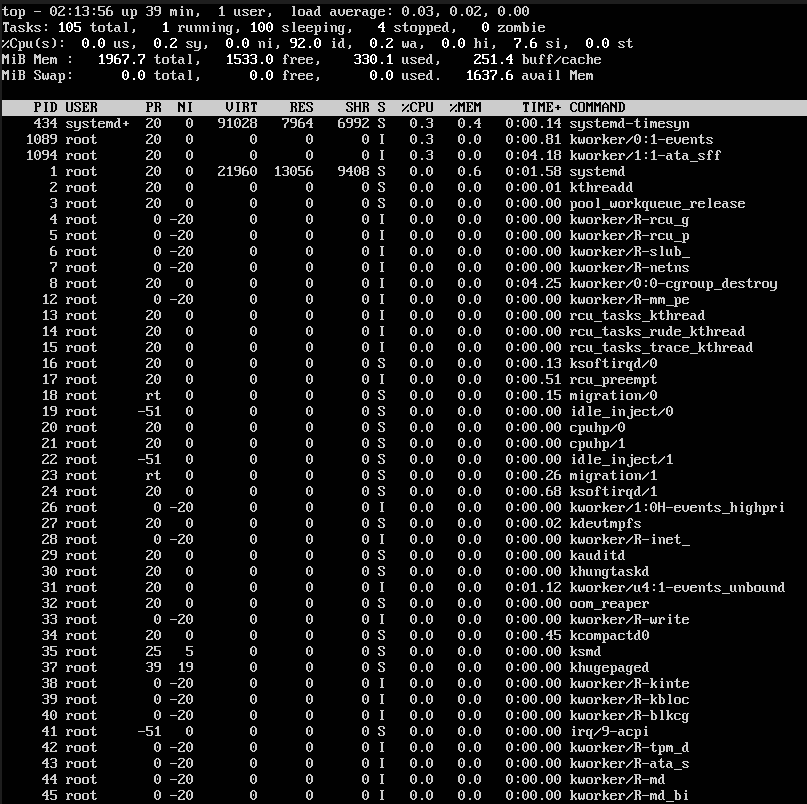

```top```

### 2. Mengamati nilai load average, pemakaian CPU, dan proses teratas

#### - Menginstall htop dan btop

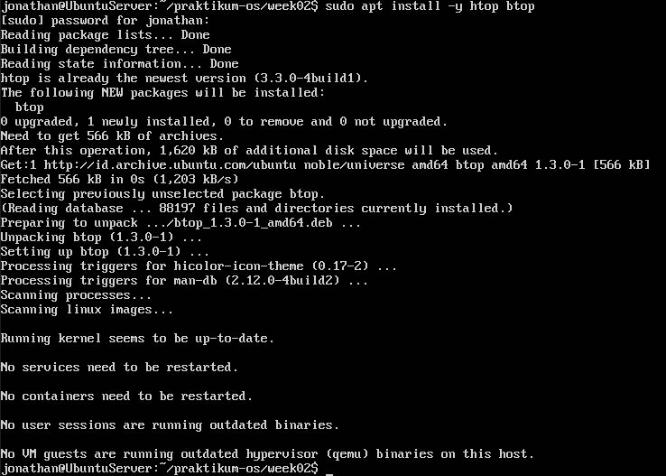

```sudo apt install -y htop btop```

#### - Menjalankan htop

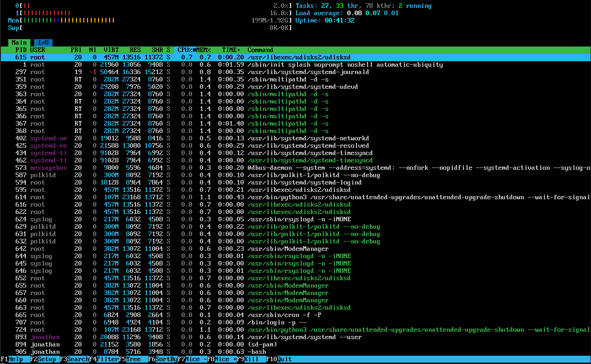

```htop```

#### - Menjalankan btop

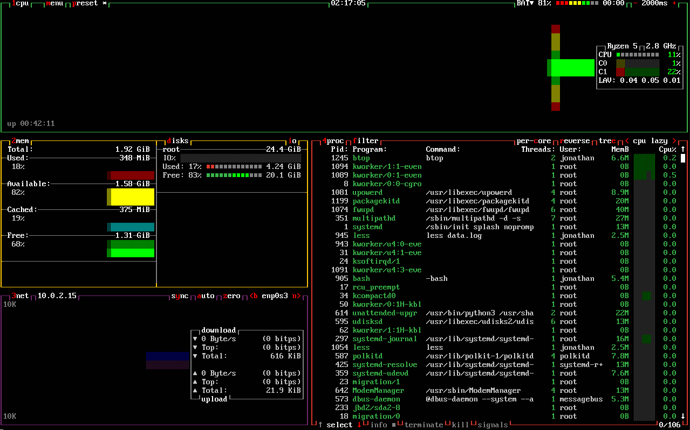

```btop```

## Praktikum 2.14

### 1. Menjalankan proses dummy di background, mencari PID proses sleep, menghentikan dengan SIGTERM, dan memverifikasi proses berhenti

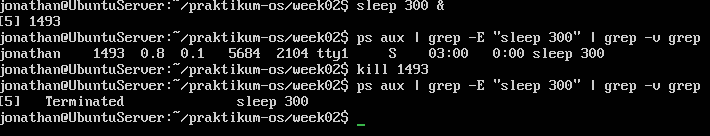

```sleep 300 &```
```ps aux | grep -E "sleep 300" | grep -v grep```
```kill 1493```
```ps aux | grep -E "sleep 300" | grep -v grep```

### 2. Mencoba dengan SIGKILL

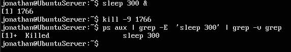

```sleep 300 &```
```kill -9 1766```
```ps aux | grep -E "sleep 300" | grep -v grep```

## Praktikum 2.15

### 1. Mengecek penggunaan disk

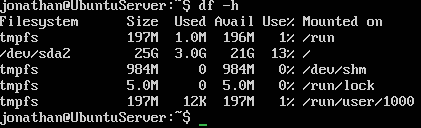

```df -h```

### 2. Mencari direktori yang besar (contoh pada /var)

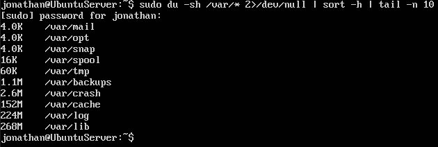

```sudo du -sh /var/* 2>/dev/null | sort -h | tail -n 10```

### 3. Mengecek load dan uptime

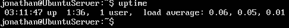

```uptime```

### 4. Mengecek service yang gagal

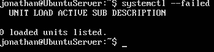

```systemctl --failed```

### 5. Mengambil log error terbaru (jika ada indikasi masalah)


```journalctl -xe | tail -n 50```

## Praktikum 2.16

### Tujuan

Melihat interface, routing, dan port yang sedang listen (berguna untuk
troubleshooting service).

### 1. Melihat interface dan IP


```ip a```

### 2. Melihat routing table


```ip r```

### 3. Melihat port yang sedang listening


```sudo ss -tulpn```

### Soal Latihan 2.5

Pilih satu port yang listening dari output ss -tulpn (misal port 22), lalu
tuliskan service/proses yang membukanya. Jelaskan kegunaan port tersebut
secara singkat.

### Jawaban


Berdasarkan output ss -tulpn, port 53 berada dalam keadaan LISTEN pada protokol TCP dan aktif juga pada UDP. Port tersebut berjalan pada alamat 127.0.0.53 dan 127.0.0.54, yang menunjukkan bahwa layanan DNS berjalan secara lokal. Port 53 digunakan untuk layanan DNS (Domain Name System), yang berfungsi menerjemahkan nama domain menjadi alamat IP agar sistem dapat terhubung ke server melalui jaringan.

## Soal Latihan 2.A

Jalankan lspci -nnk. Pilih 1 perangkat PCI dan tuliskan: nama perangkat,
ID vendor:device, dan kernel driver in use.

## Jawaban


Ethernet controller [0200]
Vendor : 8086:100e
Driver / Modul Kernel : e1000
Deskripsi fungsi : Perangkat ini berfungsi sebagai Network Interface Card (NIC) yang digunakan untuk menghubungkan komputer ke jaringan melalui kabel LAN.

## Soal Latihan 2.B

Tentukan device root filesystem dengan findmnt /. Lalu cocokkan dengan
lsblk -f dan tuliskan tipe filesystem serta UUID-nya.

## Jawaban


Berdasarkan hasil perintah findmnt /, root filesystem berada pada device /dev/sda2 dengan tipe filesystem ext4. Setelah dicocokkan menggunakan perintah lsblk -f, diketahui bahwa device tersebut memiliki UUID d410b8dc-edb8-4e51-8b30-49f65547839d.

## Soal Latihan 2.C

Buat file server.log berisi minimal 10 baris dengan variasi kata: INFO,
WARN, ERROR. Gunakan grep untuk menampilkan hanya baris ERROR.

## Jawaban


## Soal Latihan 2.D

Gunakan sed untuk mengganti semua kata server menjadi node pada file
latihan. Tunjukkan sebelum dan sesudah.

## Jawaban


## Soal Latihan 2.E

Gunakan df -h lalu awk untuk menampilkan filesystem yang penggunaan disk
di atas 70%.

## Jawaban


## Soal Latihan 2.F

Jalankan sleep 600 &. Temukan PID-nya dengan ps. Hentikan dengan
SIGTERM. Jelaskan beda SIGTERM vs SIGKILL.

## Jawaban


Perintah sleep 600 & menjalankan proses di background. PID proses ditemukan menggunakan ps, yaitu 1111. Proses dihentikan menggunakan perintah kill 1111, yang secara default mengirim sinyal SIGTERM (15).

SIGTERM digunakan untuk menghentikan proses secara normal dan memberi kesempatan proses melakukan cleanup sebelum berhenti. Sedangkan SIGKILL (9) digunakan untuk menghentikan proses secara paksa tanpa memberi kesempatan proses melakukan penanganan terlebih dahulu

## Soal Latihan 2.G

Gunakan systemctl –failed. Jika tidak ada yang gagal, pilih satu service
aktif (misal ssh) dan tampilkan status serta 30 baris log terakhirnya.

## Jawaban


