# PERTEMUAN 3

## LATIHAN 3.1

### SOAL

Buatlah script yang:
1. Menampilkan daftar 10 file terbesar di direktori /var/log/
2. Menyimpan hasilnya ke file large-logs.txt
3. Menampilkan output juga di terminal menggunakan tee
4. Menangani error dengan redirect ke error.log


### JAWABAN

1. 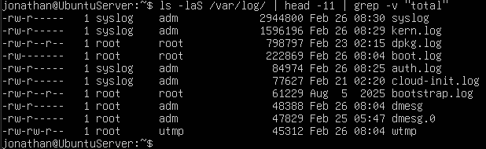
```ls -alS /var/log/ | head -11 | grep -v "total"```

2. 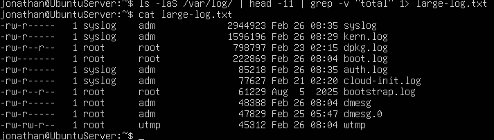
```ls -alS /var/log/ | head -11 | grep -v "total" 1> large-log.txt```
```cat large-log.txt```
   
3. 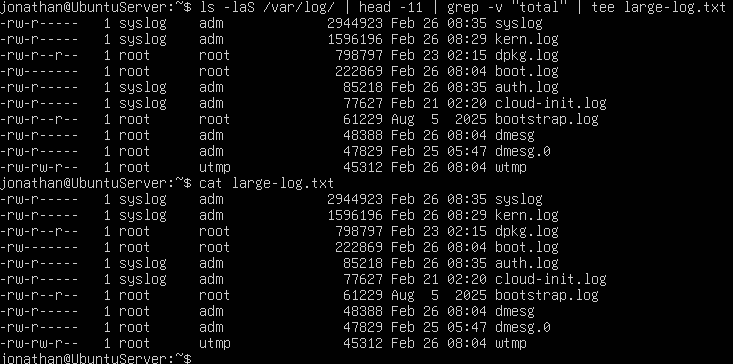
```ls -alS /var/log/ | head -11 | grep -v "total" | tee large-log.txt```
```cat large-log.txt```

4. 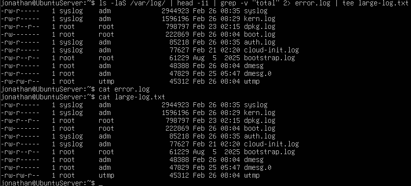
```s -alS /var/log/ | head -11 | grep -v "total" 2> error.log | tee large-log.txt```
```cat error.log```

## LATIHAN 3.2

### SOAL

Buat pipeline yang:
1. Membaca /etc/passwd
2. Mengekstrak username (kolom pertama)
3. Mengurutkan alfabetis
4. Menyimpan ke file sorted-users.txt
Hint: Gunakan cut, sort, dan operator redirect.

### JAWABAN

1. 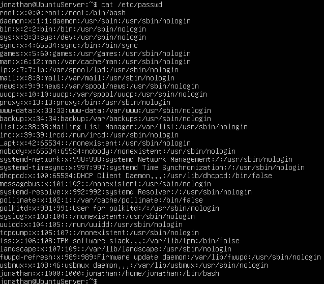
```cat /etc/passwd```

2. 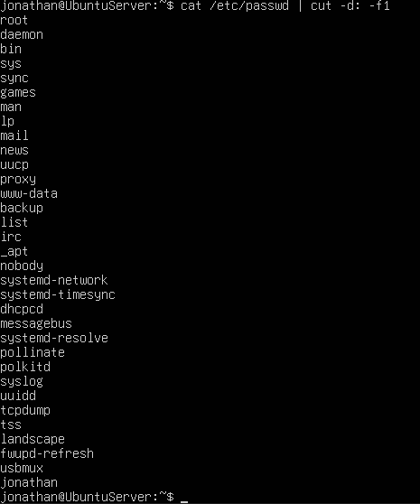
```cat /etc/passwd | cut -d: -f1```

3. 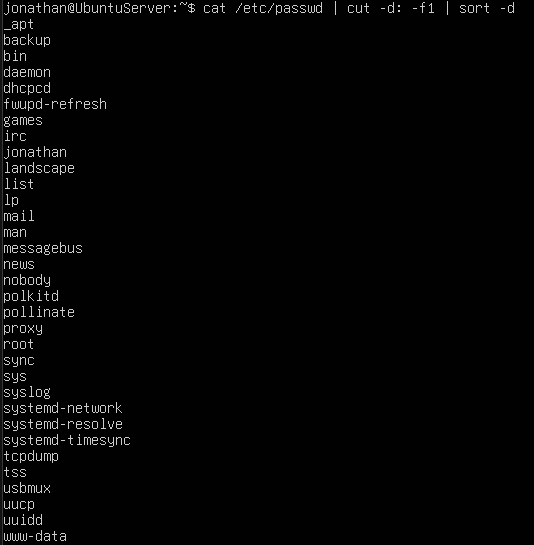
```cat /etc/passwd | cut -d: -f1 | sort -d```

4. 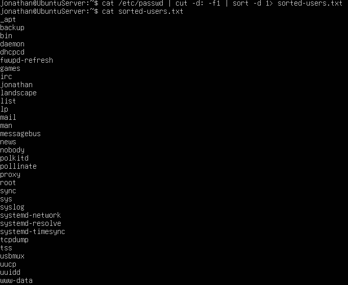
```cat /etc/passwd | cut -d: -f1 | sort -d 1> sorted-users.txt```

## LATIHAN 3.3

### SOAL

Tulis script monitoring yang:
1. Mencatat penggunaan CPU dan memory setiap 5 detik
2. Menyimpan log dengan timestamp
3. Berjalan selama 1 menit (12 iterasi)
4. Output ditampilkan di terminal DAN disimpan ke file

### JAWABAN

1. Menggunakan uptime untuk melihat beban rata-rata sistem sebagai indikator penggunaan CPU dan free untuk melihat statistik penggunaan memori (RAM)

```uptime```
```free```

2. Menggunakan date untuk menyimpan log timestamp

```date```

3. Menggunakan perulangan for untuk mengulang sebanyak 12 kali selama 1 menit dengan selisih 5 detik setiap pencatatan.

```for i in {1..12}; do```

4. Menggunakan tee untuk menampilkan hasil di terminal sekaligus menyimpannya di file.

Hasil akhir

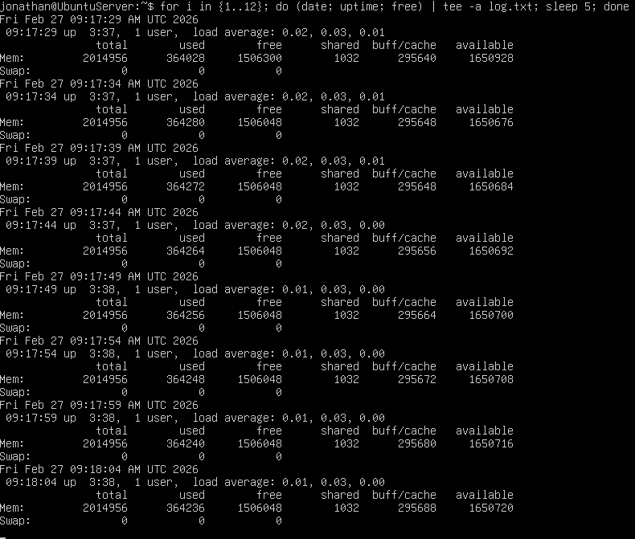

```for i in {1..12}; do (date; uptime; free) | tee -a log.txt; sleep 5; done```

## LATIHAN 3.4

### SOAL

Buat perintah yang:
1. Mencari semua file .conf di sistem
2. Membuang pesan "Permission denied"
3. Menghitung jumlah file yang ditemukan
4. Menyimpan daftar path lengkap ke file

### JAWABAN

1. 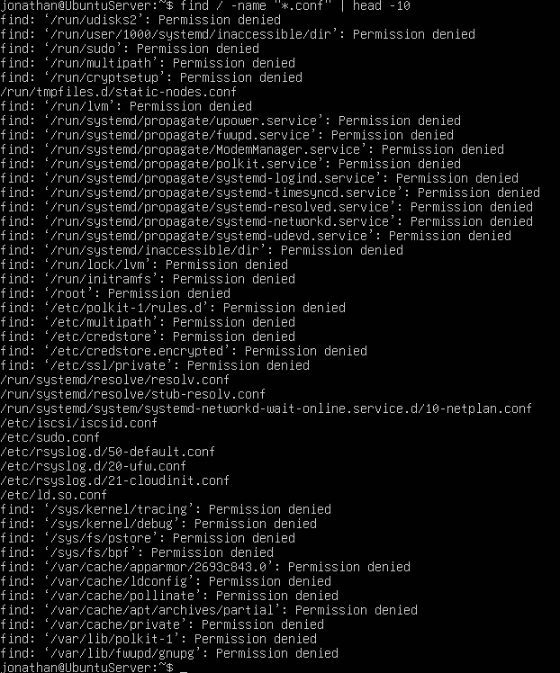
```find / -name "*.conf"```

2. 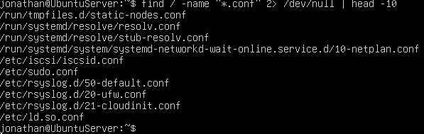
```find / -name "*.conf" 2> /dev/null```

3. 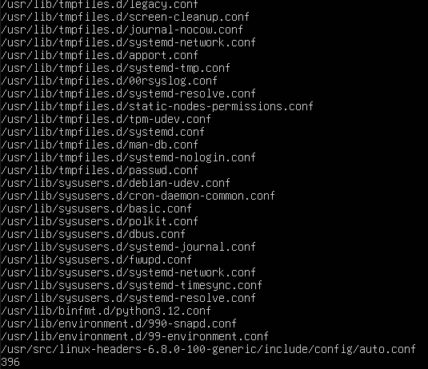
```find / -name "*.conf" 2> /dev/null; find / -name "*.conf" 2> /dev/null | wc -l```

4. 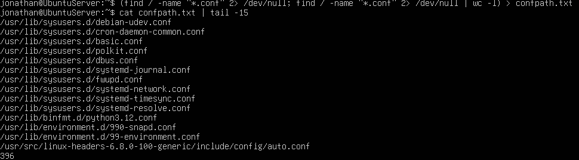
```(find / -name "*.conf" 2> /dev/null; find / -name "*.conf" 2> /dev/null | wc -l) > confpath.txt```

*note: cek dengan ```cat confpath.txt | tail -15```

## LATIHAN 3.5

### SOAL

Implementasikan script backup yang:
1. Menggunakan tar untuk backup direktori
2. Menampilkan progress dengan tee
3. Mencatat stdout ke backup-success.log
4. Mencatat stderr ke backup-error.log
5. Menambahkan timestamp di setiap log entry

### JAWABAN

1. Melakukan backup (mengarsip) direktori. Opsi -v (verbose) berfungsi mengeluarkan daftar file yang sedang diproses agar bisa dibaca oleh perintah selanjutnya.

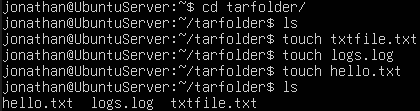

```tar -cvf backup.tar tarfolder/```

2. Mencatat stderr ke backup-error.log + Timestamp. 2> menangkap error (seperti "Permission Denied"). while read line mengambil setiap baris error, lalu echo "$(date): $line" menambahkan jam/tanggal di depannya.

```2> >(while read line; do echo "$(date): $line"; done > backup-error.log)```

3. Menambahkan Timestamp di setiap stdout (proses sukses). Setiap file yang berhasil masuk ke .tar akan diberi label waktu di depannya.

```while read line; do echo "$(date): $line"; done```

4. Menampilkan progress di terminal DAN mencatatnya ke backup-success.log.

```tee backup-success.log```

Hasil akhir : 

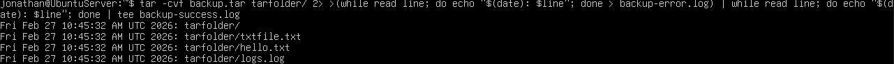

```tar -cvf backup.tar tarfolder/ 2> >(while read line; do echo "$(date): $line"; done > backup-error.log) | while read line; do echo "$(date): $line"; done | tee backup-success.log```

Cek dengan :

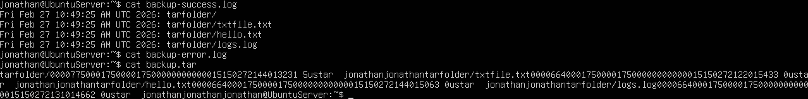

```cat backup-success.log```
```cat backup-error.log```
```cat backup.tar```