# PERTEMUAN 3

Operasi file dan struktur direktori

## TUGAS PENDAHULUAN

### SOAL

1. Apa yang dimaksud perintah-perintah direktori: ```pwd```, ```cd```, ```mkdir```, dan ```rmdir``` ?
   
2. Apa yang dimaksud perintah-perintah manipulasi file: ```cp```, ```mv```, dan ```rm``` (sertakan format yang digunakan) ?
   
3. Jelaskan perbedaan _Symbolic link_ menggunakan _hard link_ (_direct_) dan _soft link_ (_indirect_) !
   
4. Tuliskan maksud perintah-perintah: ```file```, ```find```, ```which```, ```locate```, dan ```grep``` !

### JAWABAN

1. - ```pwd``` merupakan singkatan dari "print working directory" yang digunakan untuk menampilkan path (semacam alamat lokasi) yang lengkap dari lokasi saat ini dalam hierarki sistem file.

   - ```cd``` merupakan singkatan dari "change directory" yang digunakan untuk bernavigasi pada direktori yang spesifik yang dituliskan setelah ```cd```, misalnya ```cd Documents```. Selain itu, ada juga ```cd ..``` yang digunakan untuk berpindah ke tepat 1 direktori sebelumnya dan ```cd``` atau ```cd ~``` yang digunakan untuk kembali ke Home.

   - ```mkdir``` merupakan singkatan dari "make directory" yang digunakan untuk membuat direktori atau yang dikenal sebagai "folder" dengan menyertakan nama direktori setelah ```mkdir```, misalnya ```mkdir Assignments```.

   - ```rmdir``` merupakan singkatan dari "remove directory" yang digunakan untuk menghapus direktori dengan menyertakan nama dari direktori yang ingin dihapus setelah ```rmdir```, misalnya ```rmdir UnusedFiles```.

2. - ```cp``` merupakan singkatan dari "copy" yang digunakan untuk menyalin file atau direktori dari satu lokasi ke lokasi yang lain, misalnya ```cp Halo.txt HaloDir```, yang artinya menyalin file "Halo.txt" ke dalam direktori "HaloDir". Format yang sering digunakan antara lain:
      1. ```-i``` (interactive) : ```cp -i file.txt /home/user/Documents/```, artinya memberikan kesempatan pada user untuk melakukan konfirmasi jika file yang disalin sudah ada pada direktori yang dituju.
   
      2. ```-n``` (no-clobber) : ```cp -n file.txt /home/user/Documents/```, artinya menghindari aktivitas menyalin file jika nama file yang akan disalin sudah ada pada direktori yang dituju.
   
      3. ```-v``` (verbose) : ```cp -v file.txt /home/user/Documents/```, artinya menunjukkan informasi detail pada proses penyalinan yang terjadi.
   
      4. ```-f``` (force) : ```cp -f file.txt /home/user/Documents/```, artinya memaksa untuk melakukan penyalinan bahkan meskipun sudah ada file dengan nama yang sama pada direktori yang dituju dan berakhir dengan penggantian file lama dengan file baru.
   
      5. ```-a``` (archive) : ```cp -a file.txt /home/user/Documents/```, artinya menyalin file atau direktori tanpa mengubah sedikit pun identitas aslinya.

   - ```mv``` merupakan singkatan dari "move" yang digunakan untuk memindahkan atau mengganti nama dari file atau direktori tertentu misalnya ```mv Hello.txt /home/user/Documents/HelloDoc/``` yang artinya memindahkan file "Hello.txt" ke direktori "/home/user/Documents/HelloDoc/", ```mv OldDir /home/user/Documents/``` yang artinya memindahkan direktori "OldDir" ke dalam direktori "/home/user/Documents/", dan ```mv oldname.txt newname.txt``` yang artinya mengganti nama file dari "oldname" menjadi "newname". Format yang sering digunakan antara lain:
  
       1. ```-i``` (interactive) : ```mv -i file.txt /home/user/Documents/```, artinya memberikan kesempatan pada user untuk melakukan konfirmasi jika file yang dipindah sudah ada pada direktori yang dituju.
   
       2. ```-u``` (update) : ```mv -u file.txt /home/user/Documents/```, artinya melakukan perpindahan file hanya jika file yang akan dipindah lebih baru daripada file/direktori yang dituju atau jika file/direktori yang dituju tidak ada.
   
       3. ```-v``` (verbose) : ```mv -v file.txt /home/user/Documents/```, artinya menunjukkan informasi detail pada proses perpindahan yang terjadi. 

   - ```rm``` merupakan singkatan dari "remove" yang digunakan untuk menghapus file atau direktori tertentu, misalnya ```rm alog.```log yang artinya menghapus file "alog.log", ```rm unuseddir``` yang artinya menghapus direktori "unuseddir", dan ```rm file1.txt file2.txt``` yang artinya menghapus "file1.txt" dan "file2.txt".
  
       1.  ```-f``` (force) : ```rm -f file.txt /home/user/Documents/```, artinya memaksa untuk menghapus file bahkan untuk file yang diproteksi write-protected.
   
       2.  -r (recursive) : rm -r file.txt /home/user/Documents/, artinya menghapus direktori dan semuah hal yang ada di dalamnya (jika berupa direktori).
   
       3.  ```-i``` (interactive) : ```rm -i file.txt /home/user/Documents/```, artinya memberikan kesempatan pada user untuk melakukan konfirmasi pada file yang akan dihapus.

3. Pada bentuk soft link, _symbolic link_ dapat dilakukan pada file yang tidak ada, sedangkan pada hard link tidak dimungkinkan. Perbedaan lain, _symbolic link_ dapat dibentuk melalui media disk atau partisi yang berbeda dengan soft link, tetapi pada hard link terbatas pada partisi disk yang sama.

4. - ```file``` : Digunakan untuk melihat jenis file yang dilaporkan dengan deskripsi level tinggi.

   - ```find``` :  Digunakan untuk mencari file dan direktori dalam hierarki direktori berdasarkan berbagai kriteria, seperti nama, jenis, ukuran, tanggal modifikasi, kepemilikan, dan perizinan. 
  
   - ```which``` : Digunakan untuk mengetahui letak system utility tertentu.
  
   - ```locate``` : Digunakan untuk mencari file pada semua direktori dengan lebih cepat dan ditampilkan dengan path yang penuh.
  
   - ```grep``` : Digunakan untuk mencari konten di dalam isi file dan akan menampilkan baris yang sesuai dengan pattern yang diberikan.


## PERCOBAAN

### PERCOBAAN 1 : DIREKTORI

1. Melihat direktori HOME
   
   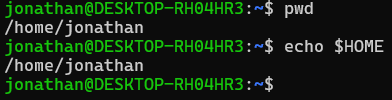

2. Melihat direktori aktual dan parent direktori

   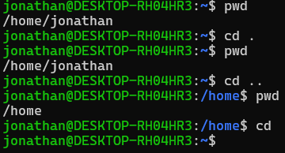
   
3. Membuat satu direktori, lebih dari satu direktori atau sub direktori
   
   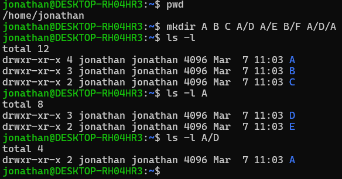

4. Menghapus satu atau lebih direktori hanya dapat dilakukan pada direktori kosong dan hanya dapat dihapus oleh pemiliknya kecuali bila diberikan ijin aksesnya
   
   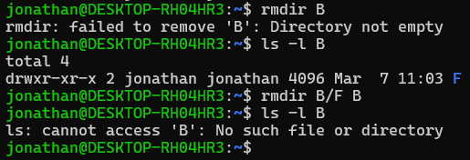

   Terdapat pesan error setelah memberi perintah `rmdir B` karena perintah `rmdir` hanya menghapus direktori yang benar-benar kosong dengan alasan keamanan data.

   Setelah berhasil menghapus direktori B karena sudah menghapus isi dari direktori B terlebih dahulu, yakni F, user berusaha untuk mengakses direktori B dengan perintah `ls -l B`, yakni dengan melihat isi dari direktori tersebut. Namun, terminal memberikan pesan error karena direktori tersebut sudah terhapus sehingga tak dapat diakses kembali.

5. Navigasi direktori dengan instuktri `cd` untuk pindah dari satu direktori ke direktori lain
   
   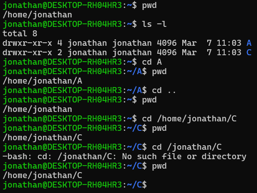

   Terdapat pesan error ketika memberi perintah `cd /jonathan/C` bukan karena direktori C tidak ada, melainkan karena kesalahan penulisan pada perintah. Perintah seharusnya `cd jonathan/C` tanpa `/` di awal nama user karena `/` menyatakan root (hierarki tertinggi pada struktur file Linux) dan user berada di bawah home, bukan di bawah root sehingga tidak memerlukan `/` sebelum user.

### PERCOBAAN 2 : MANIPULASI FILE

1. Perintah `cp` untuk mengkopi file atau seluruh direktori

   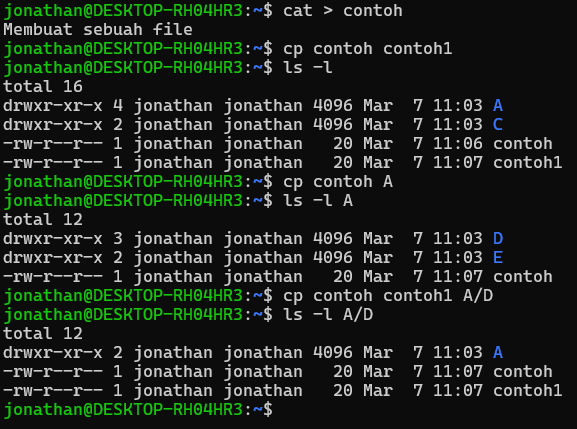

2. Peritnah `mv` untuk memindah file

   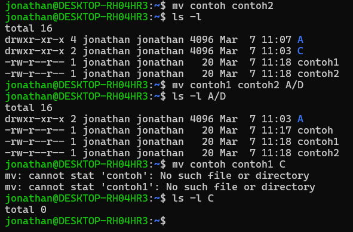

3. Perintah `rm` untuk menghapus file

   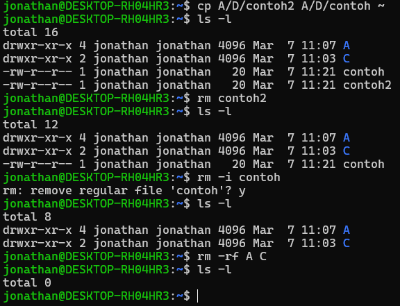

### PERCOBAAN 3 : SYMBOLIC LINK

1. Membuat shortcut (file link)

   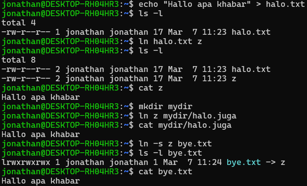

### PERCOBAAN 4 : MELIHAT ISI FILE

   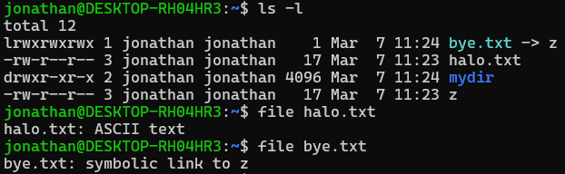

### PERCOBAAN 5 : MENCARI FILE

1. Perintah `find`

   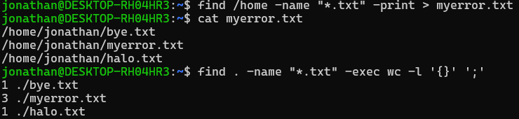

2. Perintah `which`

   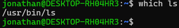

3. Perintah `locate`

   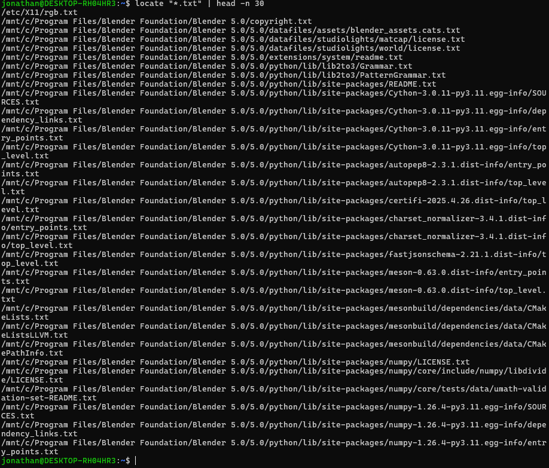

### PERCOBAAN 6 : MENCARI TEXT PADA FILE

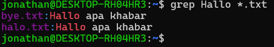

## LATIHAN

1. Mencoba beberapa urutan perintah.

   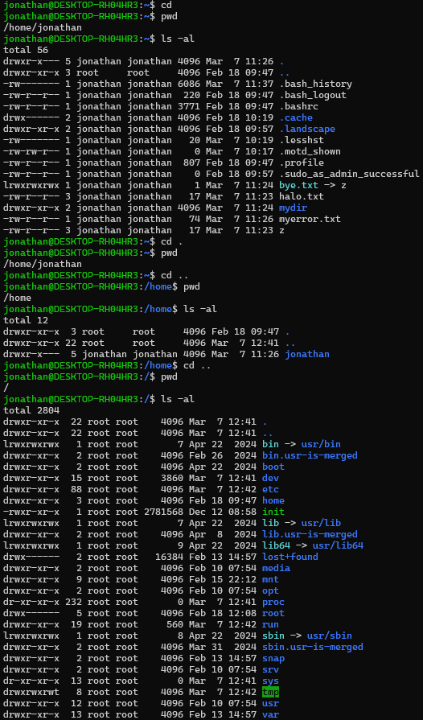

   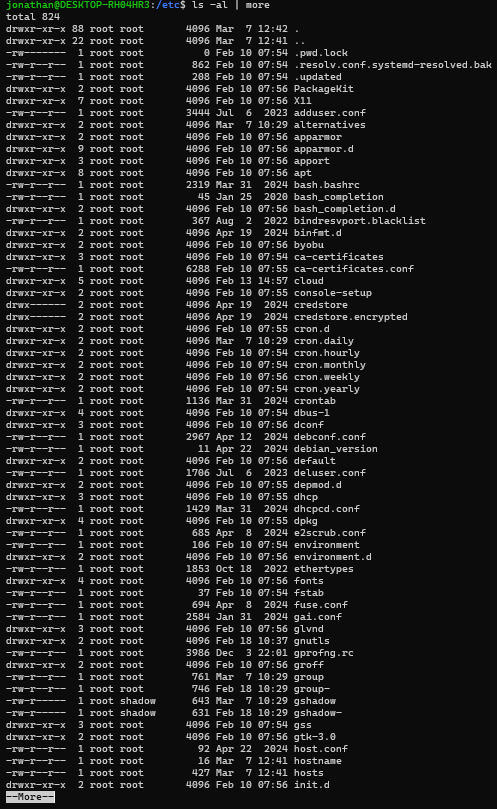

   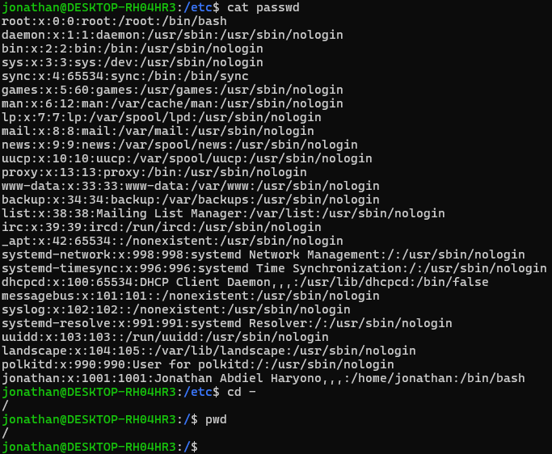

2. Melanjutkan penelurusan dengan `cd`, `ls`, `pwd`, dan `cat` pada direktori `/bin`, `/usr/bin`, `/sbin`, `/tmp`, dan `/boot`.

   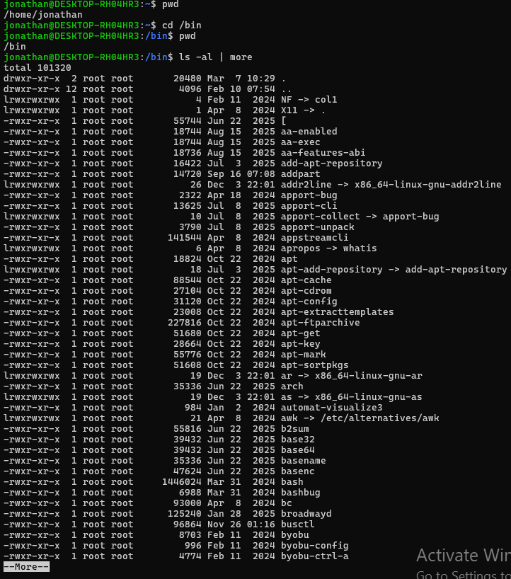

   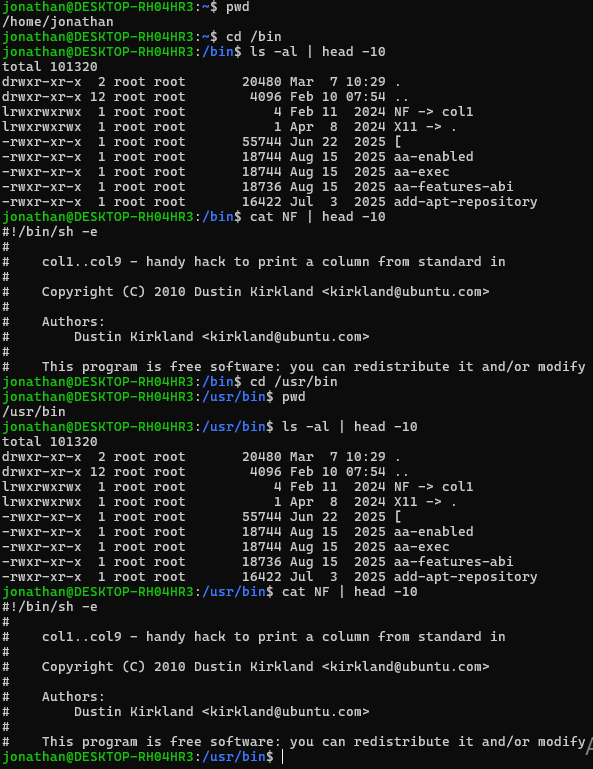
   
   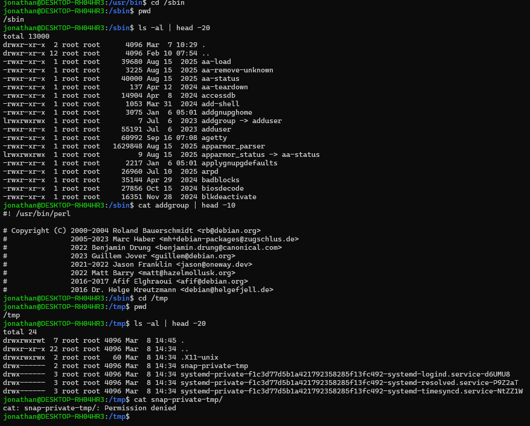

   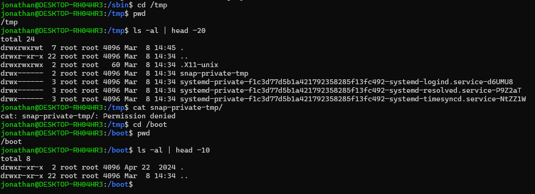

3. Menelusuri direktori `/dev`, mengidentifikasi tty (terminal) dan mencari tahu siapa pemilik tty.

   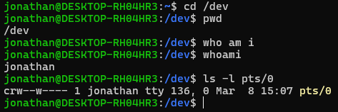

4. Menelurusi direktori `/proc`, menampilkan isi file `interrupts`, `devices`, `cpuinfo`, `meminfo`, dan `uptime`.

   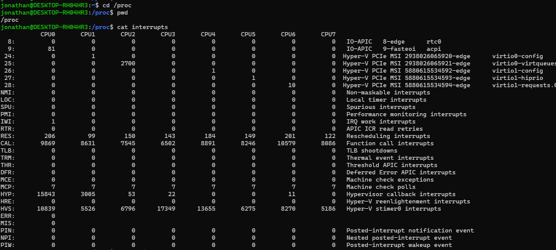

   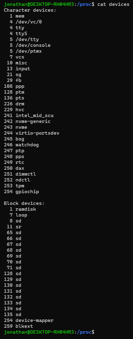

   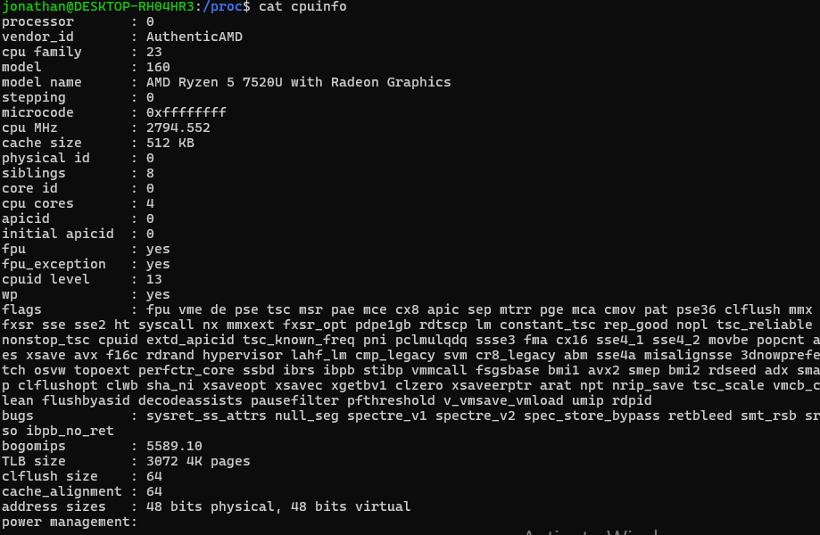

   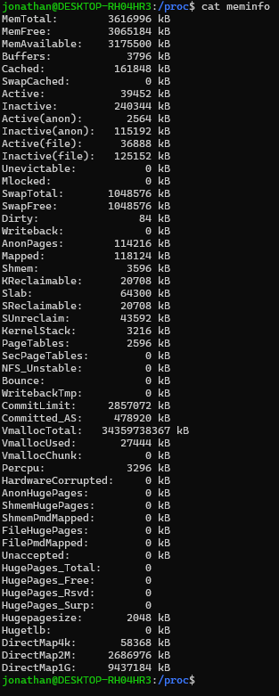

   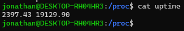

   Direktori `/proc` disebut pseudo-filesystem karena ia hanya ada di dalam RAM (bersifat virtual). Ia bertindak sebagai antarmuka untuk berinteraksi langsung dengan struktur data kernel dan memetakannya ke dalam bentuk file biasa, sehingga bisa memantau kesehatan sistem hanya dengan perintah sederhana seperti `cat`. Data di dalamnya selalu berubah sesuai dengan aktivitas sistem (contoh: subdirektori PID untuk setiap proses).

5. Mengubah direktori home ke user lain secara langsung menggunakan `cd ~username`

   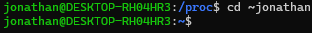

6. (6 dan 7) Mengubah kembali ke direktori home dan membuat subdirektori `work` dan `play`

   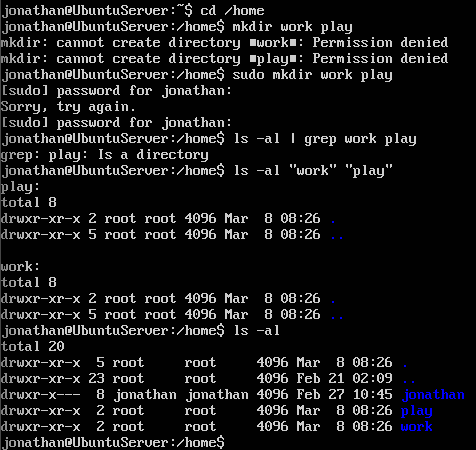

8. Menghapus subdirektori `work`

   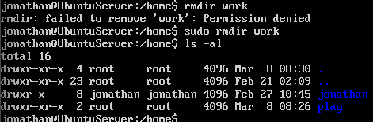

9. Meng-copy file `/etc/passwd` ke direktori home

   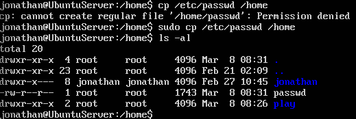

10. Memindahkannya ke subdirektori `play`

   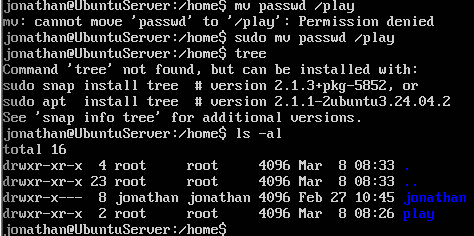

11. Mengubah ke subdirektori `play` dan membuat _symbolic link_ `terminal` yang menunjuk ke perangkat `tty`.

   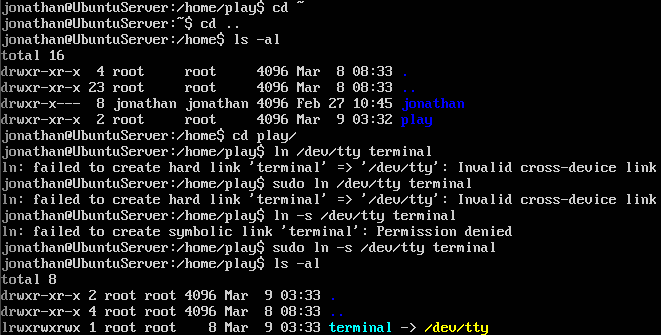

   Jika melakukan hard link ke perangkat `tty`, sistem akan memunculkan pesan error `ln: failed to create hard link 'terminal' => '/dev/tty': Invalid cross-device link` karena melanggar 2 hukum utama tentang _symbolic link_.
   
   - **Batasan antar partisi (cross-device).**
     Hard link bekerja dengan cara menunjuk ke nomor _inode_ yang sama pada satu partisi hard drive sehingga linux tidak bisa menghubungkan `/dev/tty` yang berada di sistem file khusus bernama devtmpfs (RAM) dengan direktori play milik user (jonathan) yang berada di partisi disk utama (seperti ext4)
   
   - **Keamanan perangkat (_Special Files_)**
     Linux secara desain membatasi pembuatan hard link untuk file perangkat (_special files_) guna menjaga integritas struktur sistem file.

12. Membuat file bernama `hello.txt` yang berisi kata "hello word" dengan menggunakan "`cp`" dengan "`terminal`" sebagai file asal untuk menghasilkan efek yang sama.
    
   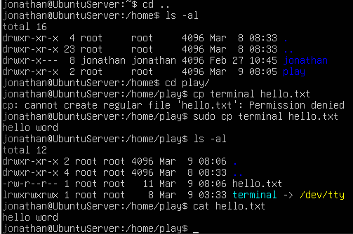

13. Meng-copy `hello.txt` ke terminal.

   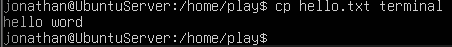

   Isi dari file `hello.txt`, yakni "hello word", akan langsung tercetak di layar terminal. Mengapa hal ini terjadi? Perintah `cp` bertugas menyalin data dari sumber ke tujuan. Pada kasus ini, `hello.txt` berperan sebagai sumber dan `terminal` sebagai tujuan. Namun, karena `terminal` tadi sudah dihubungkan dengan `tty` melalui _symbolic link_, sistem tidak menyimpan data tersebut ke dalam file baru, melainkan "membuangnya" ke layar agar bisa dibaca manusia.

14. Meng-copy keseluruhan direktori `play` ke direktori `work` dengan _symbolic link_.

   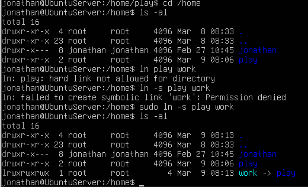

15. Menghapus direktori `work` dan isinya dengan satu perintah.

   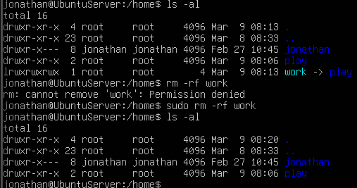

## LAPORAN RESMI

### SOAL

1. Analisa hasil percobaan yang Anda lakukan.
   
   a. Analisa setiap hasil tampilannya.

   b. Pada Percobaan 1 poin 3 buatlah pohon dari struktur file dan direktori.

   c. Bila terdapat pesan error, jelaskan penyebabnya.

2. Kerjakan latihan di atas dan analisa hasil tampilannya

3. Berikan kesimpulan dari praktikum ini

### JAWABAN

1. a. Hasil analisa sudah bersama dengan hasil screenshot.

   b. 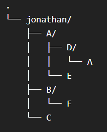

   c. Penjelasan sudah dilampirkan bersama dengan hasil screenshot.

2. Seluruh latihan telah dikerjakan dengan analisanya.

3. - Struktur Hierarki: Sistem file Linux diatur secara hirarkis menyerupai pepohonan (tree) yang dimulai dari direktori root ("/") sebagai pusatnya.

   - Filosofi "Everything is a File": Linux memperlakukan hampir semua komponen sistem, termasuk perangkat keras (hardware) di direktori /dev, sebagai file biasa.
  
   - Tipe File & Atribut: Terdapat berbagai tipe file (biasa, direktori, character/block device, link) yang masing-masing memiliki atribut unik seperti izin akses, pemilik, dan jumlah link.
  
   - Mekanisme Link:
      - Hard Link: Memberikan nama baru pada data yang sama dalam satu partisi yang sama.

      - Symbolic Link (Soft Link): Bertindak sebagai shortcut yang menunjuk ke lokasi file asli, bahkan jika berada di partisi yang berbeda.

   - Pseudo-Filesystem /proc: Direktori /proc bersifat virtual (ada di RAM) dan berfungsi sebagai antarmuka untuk mengakses struktur data kernel serta informasi proses secara real-time.
  
   - Manipulasi File & Direktori: Perintah dasar seperti mkdir, rmdir, cp, mv, dan rm memungkinkan pengelolaan data secara efektif, namun memerlukan pemahaman tentang sifat rekursif dan hak akses (terutama saat menghapus direktori yang berisi).


