# PERTEMUAN 6

MANAJEMEN PROSES

## PRAKTIKUM 6.1 - Melihat Proses dan Thread

1. Menampilkan semua proses yang berjalan

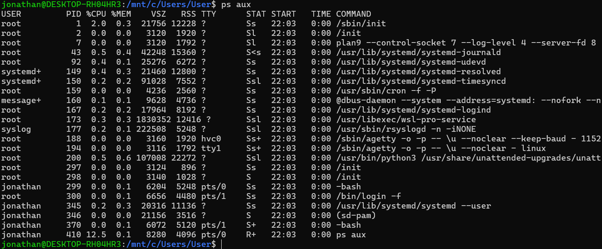

2. Menampilkan proses beserta thread-nya pada kolom LWP (Light Weight Process ID)

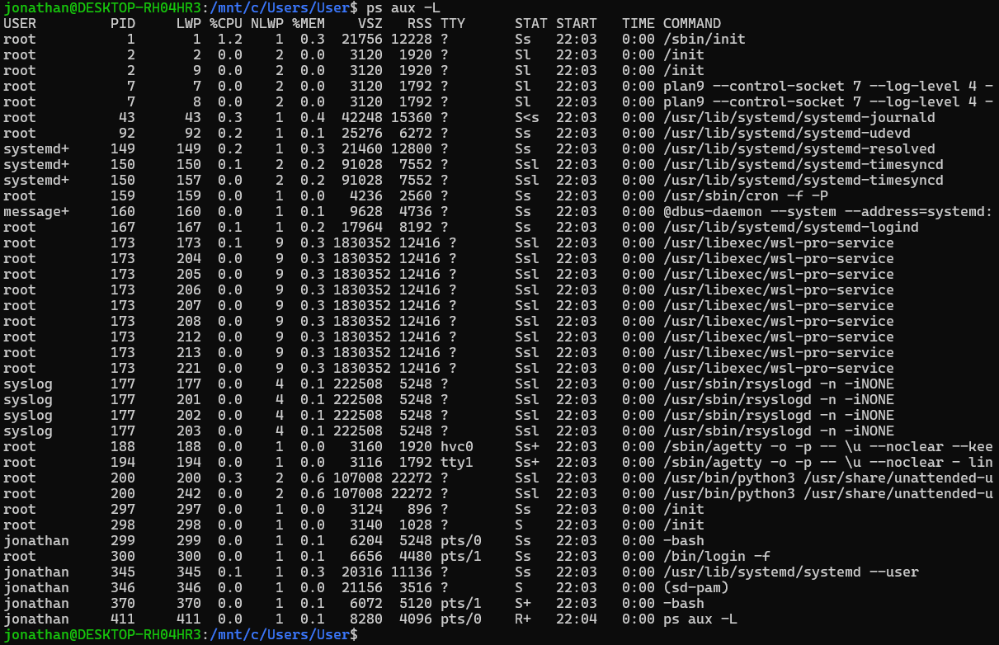

3. Melihat PID shell aktif dan detail prosesnya

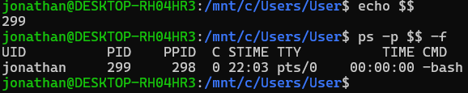

4. Melihat hierarki proses secara visual

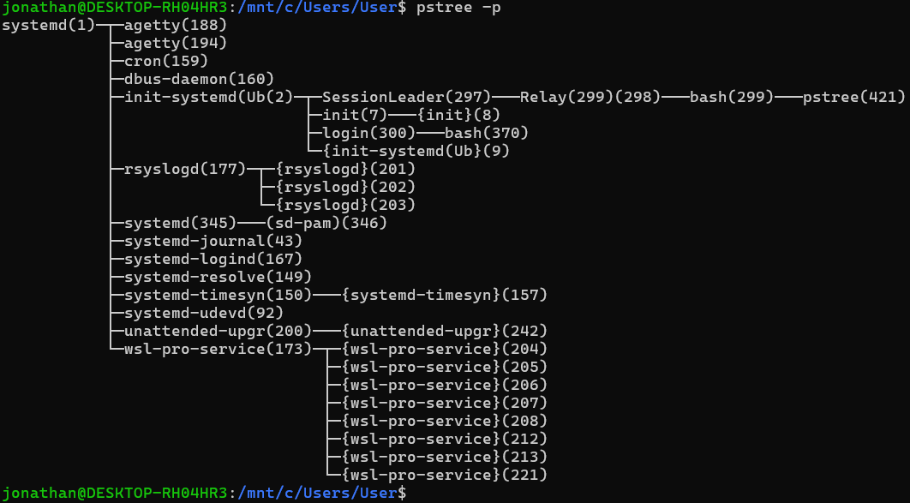

## LATIHAN 6.1

### SOAL

Jalankan ps aux dan amati outputnya:
1. Berapa total proses yang berjalan? Proses apa yang memiliki PID terkecil?

2. Jalankan pstree -p dan temukan proses bash Anda. Proses apa yang menjadi induk (PPID) dari bash tersebut?

3. Bandingkan output ps aux dan ps aux -L. Apa perbedaan yang Anda lihat?

### JAWABAN

1. Total proses yang berjalan ada sebanyak 23 proses. Proses yang memiliki PID terkecil adalah root dengan command /sbin/init.

2. Proses yang menjadi induk (PPID) dari bash tersebut adalah Relay (dengan PID 299).

3. Command `ps aux` tidak menampilkan thread-nya, sedangkan `ps aux -L` menampilkan thread-nya berupa kolom LWP (Light-Weight Process) dan NLWP (Number of Light-Weight Processes).

## PRAKTIKUM 6.2 - Mengamati Siklus Hidup Proses

1. Membuat proses di background

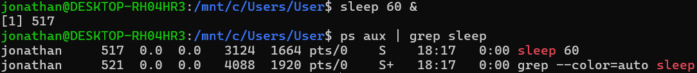

2. Mengamati perubahan exit code dan perintah yang berhasil dan gagal

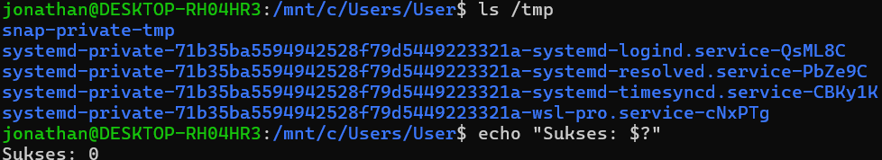

## LATIHAN 6.2

### SOAL

1. Jalankan `sleep 120 &` dan amati kolom STAT pada `ps aux`. Kondisi apa yang ditampilkan? Mengapa proses sleep berada di kondisi tersebut?

2. Jalankan beberapa perintah yang berhasil dan yang gagal, lalu catat exit code masing-masing. Pola apa yang Anda temukan?

### JAWABAN

1. Kondisi STAT yang ditampilkan adalah kondisi S (singkatan dari Interruptible Sleep artinya menunggu kejadian atau waktu tertentu). Karena proses sleep memang dirancang untuk tidak melakukan apa-apa selama durasi yang ditentukan (dalam kasus ini 120 detik). Karena ia tidak sedang menggunakan CPU untuk memproses data, sistem "menidurkannya" sementara agar sumber daya CPU dapat digunakan untuk proses lain.

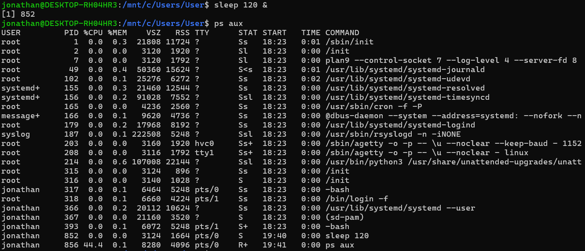

2. - Perintah pertama --> Sukses: 0. Exit code 0 artinya perintah berjalan sukses tanpa kendala
   
   - Perintah kedua   --> Gagal: 2. Exit code 2 artinya terjadi kesalahan (error) dalam mengetikkan opsi perintah atau argumen.

## PRAKTIKUM 6.3 - Mengatur Prioritas Proses

1. Menjalankan proses dengan prioritas rendah

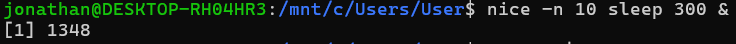

2. Memverifikasi nilai nice pada kolom NI

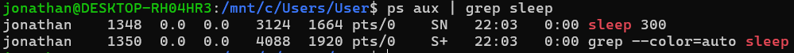

3. Mengubah nilai nice proses yang sudah berjalan

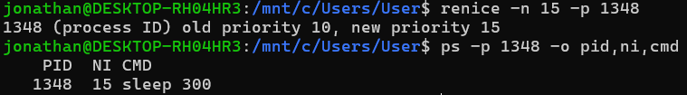

4. Membersihkan proses percobaan

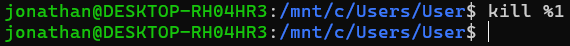

## LATIHAN 6.3

### SOAL

1. Jalankan nice -n 5 sleep 200 & dan verifikasi nilai NI-nya dengan ps.

2. Ubah nilai nice menjadi 10 menggunakan renice, lalu verifikasi kembali.

3. Coba ubah nilai nice menjadi -5 tanpa sudo. Apa yang terjadi? Mengapa Linux membatasi hal ini untuk user biasa?

### JAWABAN

1. Nilai NI (Nice Value)-nya adalah 5.

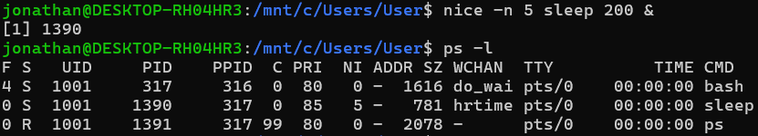

2. Nilai NI-nya berubah menjadi 10.

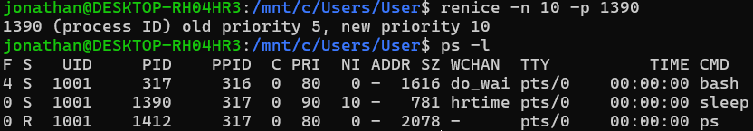

3. Output berisi pesan error "Permission denied", karena bertujuan untuk mencegah monopoli CPU oleh pengguna tertentu guna menjaga stabilitas dan keadilan distribusi sumber daya sistem.

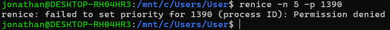

## PRAKTIKUM 6.4 - Mengirim Sinyal ke Proses

1. Membuat proses percobaan

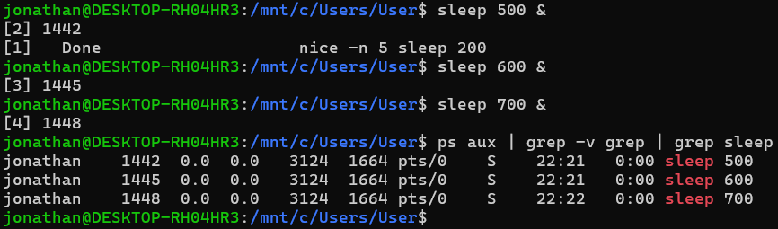

2. Menghentikan satu proses dengan SIGTERM dan verifikasi

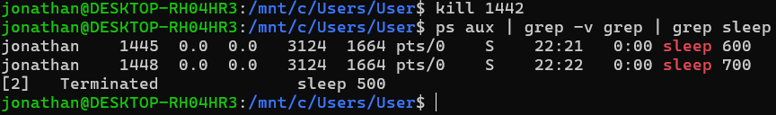

3. Menjeda dan melanjutkan proses dengan SIGSTOP/SIGCONT

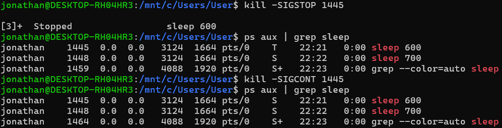

4. Menghentikan semua proses sleep sekaligus

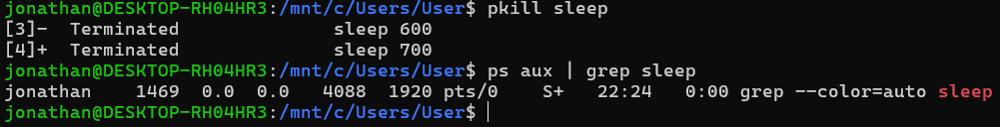

## LATIHAN 6.4

### SOAL

1. Jalankan sleep 400 &, kirim SIGSTOP, dan amati perubahan kolom STAT. Kondisi apa yang muncul?

2. Kirim SIGCONT dan verifikasi proses kembali berjalan.

3. Hentikan proses dengan SIGTERM lalu verifikasi sudah tidak ada. Kapan Anda memilih SIGKILL daripada SIGTERM?

### JAWABAN

1. Kondisi STAT berubah dari S (interruptible sleep) menjadi T (stopped).

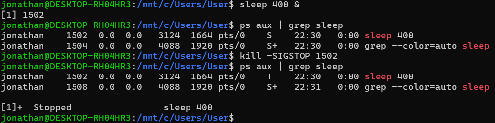

2. STAT kembali menjadi S.

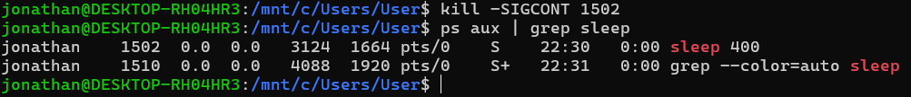

3. SIGKILL lebih dipilih daripada SIGTERM ketika menghadapi proses yang tidak responsif sehingga tidak menanggapi sinyal SIGTERM sama sekali dan juga digunakan ketika sebuah proses mulai memakan memori (RAM) secara liar dan mengancam kestablian sistem.

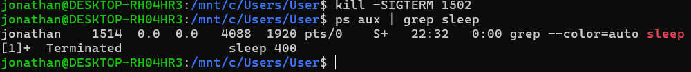 

## PRAKTIKUM 6.5 - Manajemen Job Foreground dan Background

1. Menjalankan tiga job di background

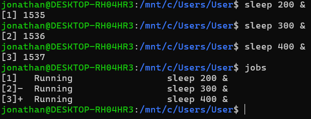

2. Membawa job pertama ke foreground, menjeda, lalu mengembalikannya ke background

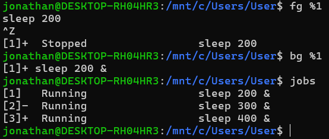

3. Menghentikan semua job

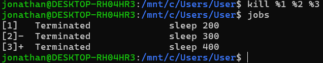

## LATIHAN 6.5

### SOAL

1. Jalankan top di foreground. Apa yang terjadi di terminal?

2. Tekan Ctrl+Z dan cek statusnya dengan jobs. Kondisi apa yang ditampilkan?

3. Pindahkan ke background dengan bg. Apakah top dapat berjalan dengan baik di background? Mengapa?

4. Kembalikan ke foreground dengan fg, lalu keluar dengan q.

### JAWABAN

1. Terminal akan berubah menjadi tampilan tabel interaktif yang memperbarui daftar proses secara _real time_

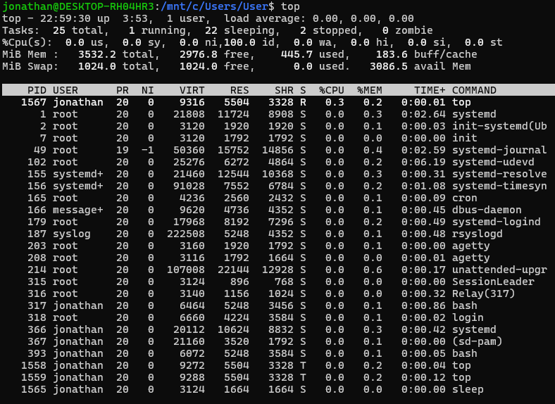

2. Setelah menekan Ctrl + Z dan mengecek statusnya dengan `jobs`, terminal memunculkan pesan "[1]+ Stopped sleep 400" T\setelah erminated

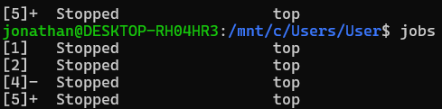

3. Tidak. Karena `top` adalah program interaktif yang membutuhkan akses ke layar (Tty) untuk memperbarui tampilan secara terus-menerus. Sedangkan, Linux melarang proses di background untuk menulis langsung ke layar yang digunakan oleh proses lain di foreground. Karena `top` tidak bisa menggambar tampilannya di background, sistem menghentikannya sampai ia dikembalikan ke depan.

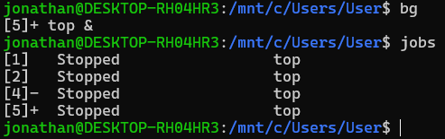

4. Mengembalikan dengan `fg`, lalu keluar dengan `q`.

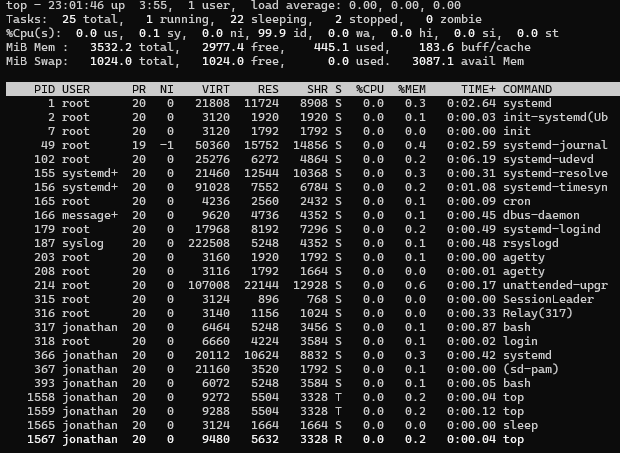

## PRAKTIKUM 6.6 - Pemantauan Proses

1. Menemukan proses dengan penggunaan CPU dan memori tertinggi

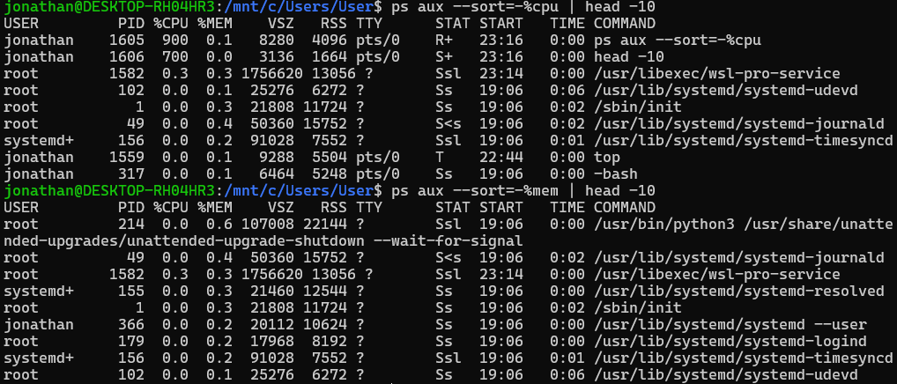

2. Menjalankan `top` dan eksplorasi shortcut-nya

Menekan M

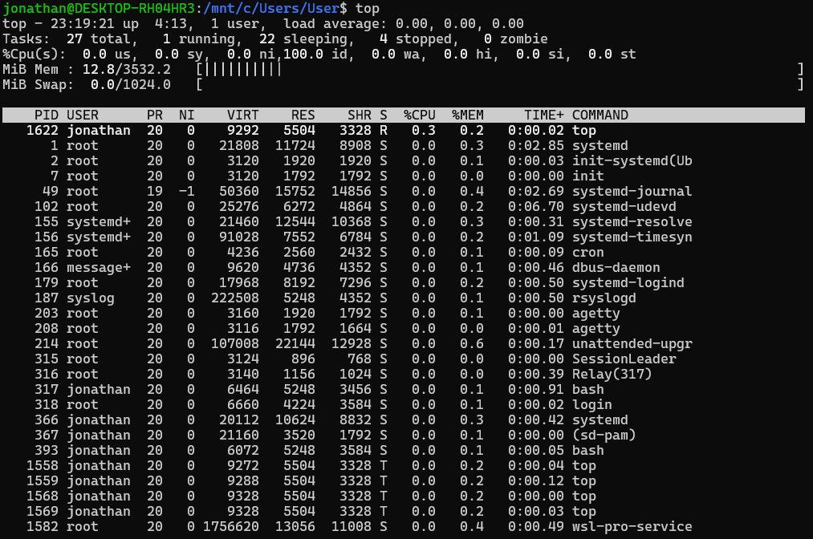

Menekan P

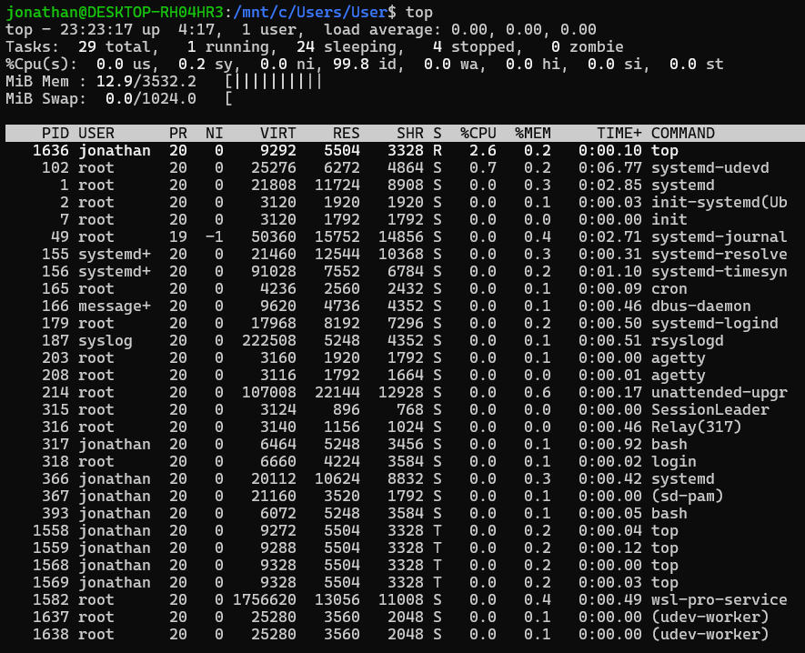

Menekan 1

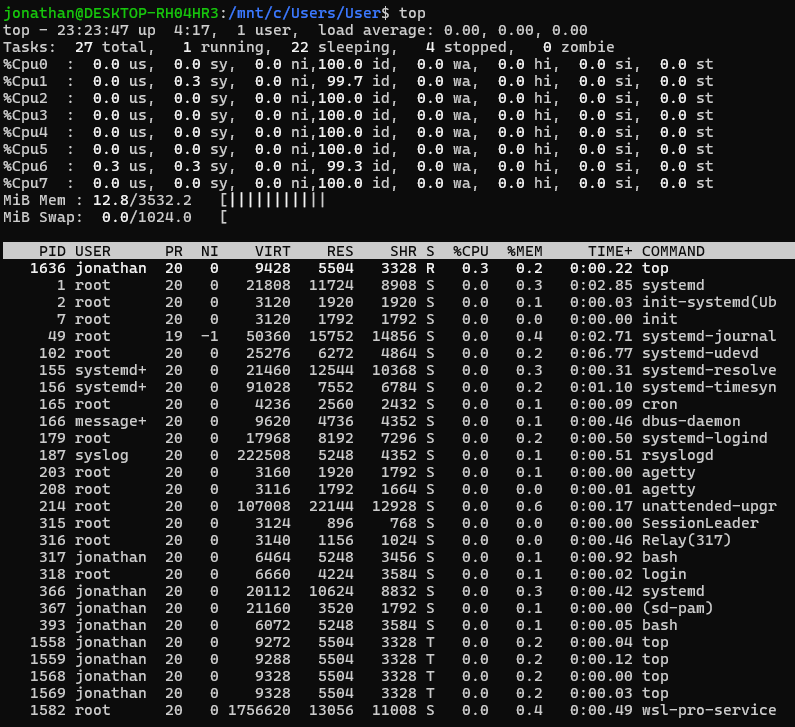

Menekan u

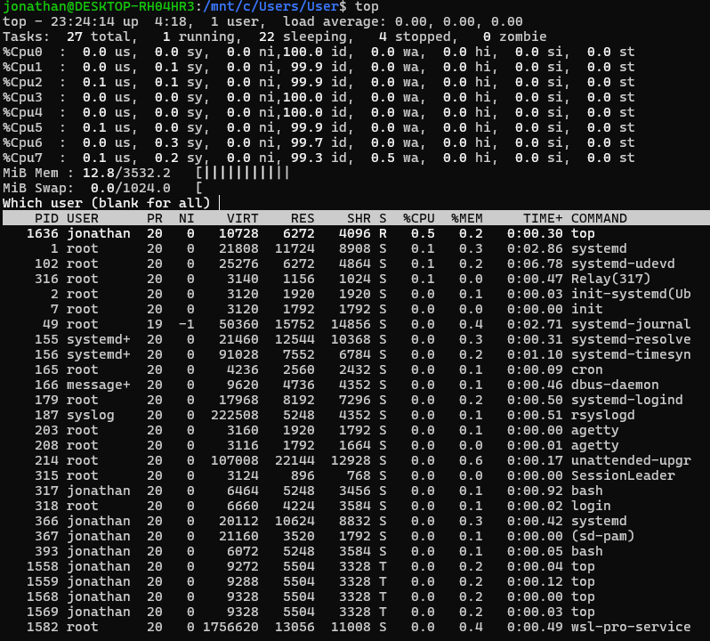

Menekan q untuk keluar

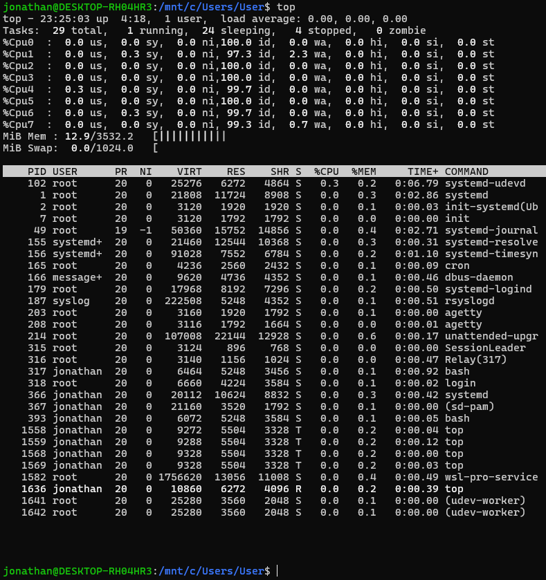

3. Menginstall dan menjalankan `htop`

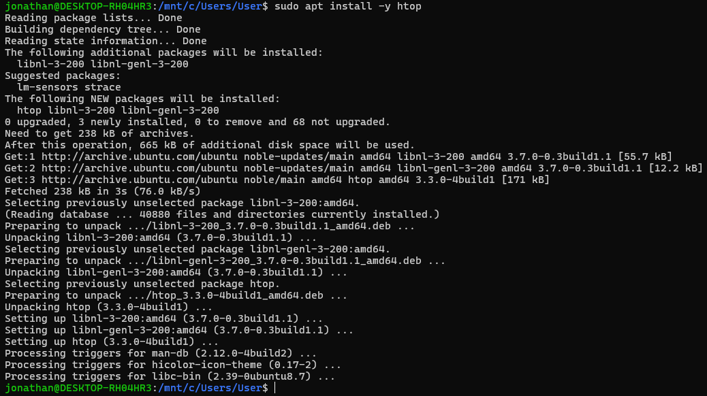

Menekan F6 untuk pilih kolom pengurutan

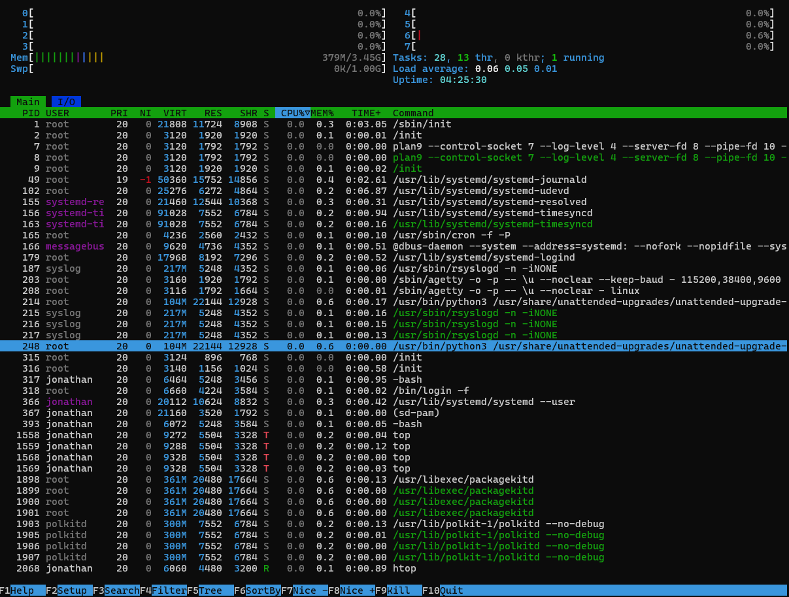

Menekan F10 atau q untuk keluar

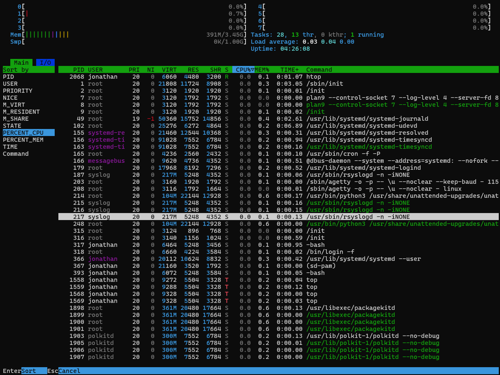

## LATIHAN 6.6

### SOAL

1. Gunakan ps aux –sort=%mem untuk menemukan proses yang menggunakan memori paling banyak di VM Anda. Proses apa itu?

2. Di dalam top, tekan 1. Apa yang berubah pada tampilan? Mengapa informasi ini berguna?

3. Di dalam htop, navigasikan ke proses sshd menggunakan tombol panah. Tekan F9 dan amati opsi sinyal yang tersedia.

### JAWABAN

1. Proses yang menggunakan memori paling banyak jatuh kepada `/usr/bin/python3 /usr/share/unattended-upgrades/unattended-upgrade-shutdown` dengan penggunaan memori sebesar 0.6% pada user root.

2. Menekan 1 pada top akan mengubah tampilan ringkasan CPU di bagian atas dari satu baris gabungan (%Cpu(s)) menjadi rincian per core/processor (misalnya Cpu0, Cpu1, Cpu2, dst). Informasi ini berguna karena dapat digunakan untuk mendeteksi ketimpangan beban, yakni mengecek apakah ada satu core yang bekerja sangat berat sementara core lainnya menganggur. Selain itu, informasi ini juga berguna bagi programmer untuk mengetahui apakah aplikasi mereka sudah mendukung multi-threading (menggunakan semua core) atau hanya berjalan di satu core saja.

3. Banyak sekali opsi sinyal yang tersedia. Beberapa diantaranya adalah sebagai berikut :

    - SIGTERM (15): Sinyal standar untuk meminta proses berhenti secara normal (pilihan paling aman).

    - SIGKILL (9): Menghentikan proses secara paksa (digunakan jika proses macet).
    
    - SIGHUP (1): Memberi tahu proses untuk memuat ulang file konfigurasinya tanpa harus mati total (sangat berguna untuk servis seperti sshd atau nginx).
    
    - SIGSTOP (19): Menunda/menghentikan sementara proses (seperti Ctrl+Z).

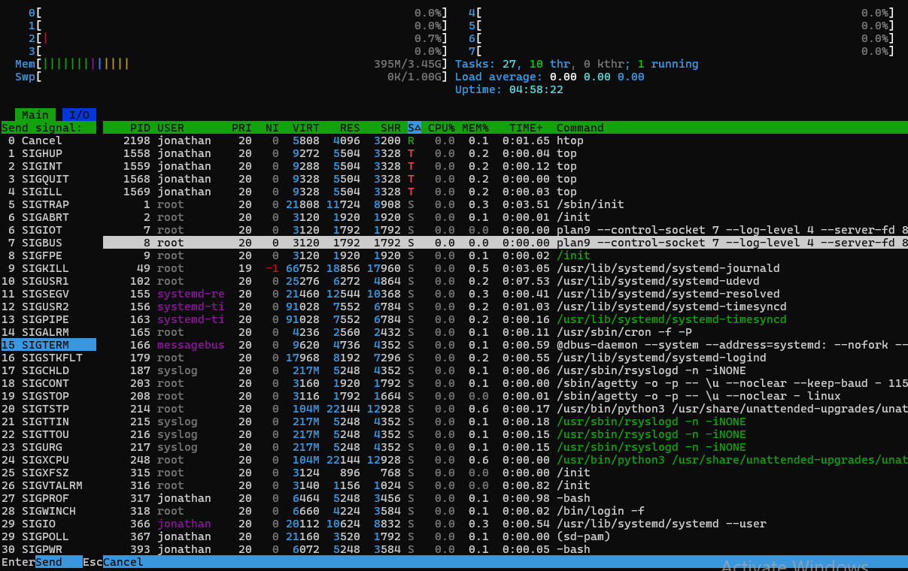

## LATIHAN

### LATIHAN 6.A

#### Eksplorasi Proses Sistem

##### SOAL

1. Jalankan ps aux –forest dan temukan proses dengan PID 1. Apa nama dan fungsi proses tersebut dalam sistem Linux modern?

2. Hitung berapa proses yang dimiliki oleh user root dan berapa yang dimiliki oleh user Anda. Mengapa root memiliki lebih banyak proses?

3. Temukan semua proses yang berada dalam kondisi S. Mengapa sebagian besar proses di sistem berada dalam kondisi ini?

##### JAWABAN

1. Proses dengan PID 1 adalah /sbin/init (yang pada sistem modern merujuk ke systemd), di mana proses ini berfungsi sebagai induk pertama dari seluruh proses di Linux yang bertugas menginisialisasi sistem saat booting, mengelola layanan latar belakang, serta mengadopsi proses yang kehilangan induknya.

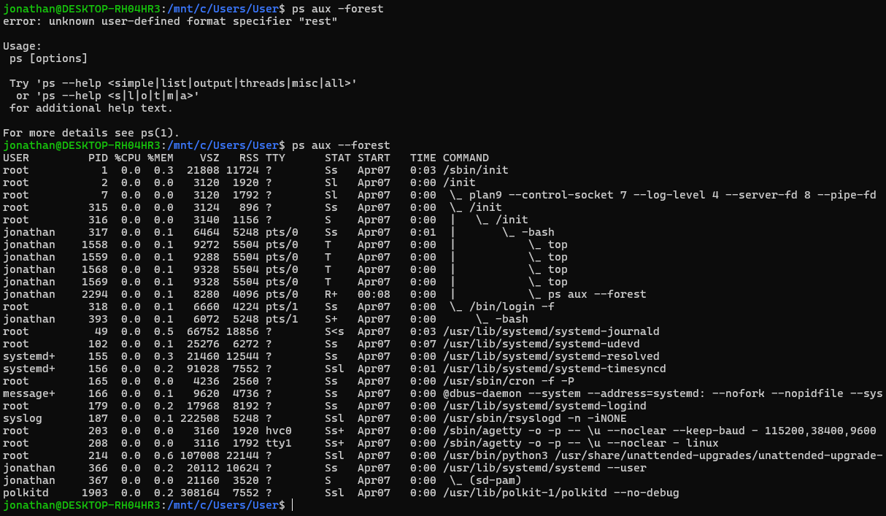

2. Berdasarkan daftar tersebut, user root memiliki sekitar 16 proses sementara user jonathan memiliki 8 proses, di mana root memiliki lebih banyak proses karena ia bertanggung jawab menjalankan berbagai layanan inti sistem operasi, manajemen perangkat keras, dan tugas administratif yang memerlukan hak akses tertinggi agar sistem tetap berjalan stabil.

3. Proses dalam kondisi S (Interruptible Sleep) meliputi sebagian besar layanan seperti cron, rsyslogd, dan dbus-daemon, di mana mayoritas proses berada dalam kondisi ini karena mereka bersifat pasif dan hanya akan aktif jika menerima perintah atau data tertentu, sehingga sistem menidurkannya sementara untuk menghemat penggunaan sumber daya CPU.

### LATIHAN 6.B

#### Simulasi Manajemen Job

##### SOAL

1. Jalankan tiga perintah sleep dengan durasi 100, 200, dan 300 detik di background. Verifikasi ketiganya dengan jobs.

2. Bawa job kedua ke foreground, jeda dengan Ctr +Z, lalu kembalikan ke background dengan bg.

3. Hentikan job pertama dengan kill %1. Tampilkan kembali daftar job. Berapa job yang tersisa?

##### JAWABAN

1. Eksekusi Background dan Verifikasi
Menambahkan simbol & di akhir perintah sleep berfungsi untuk mengirim proses langsung ke background. Hal ini memungkinkan beberapa proses berjalan sekaligus tanpa mengunci terminal. Perintah jobs kemudian digunakan untuk menampilkan daftar job aktif yang dikelola oleh shell saat ini, lengkap dengan nomor urut job di dalam kurung siku.

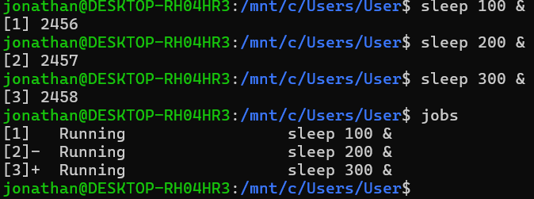

2. Manipulasi State Proses (Foreground & Background)
Perintah fg (foreground) menarik proses dari latar belakang agar menjadi fokus utama terminal. Menekan Ctrl + Z akan mengirim sinyal SIGTSTP, yang menghentikan sementara (suspend) eksekusi proses tersebut dan mengubah statusnya menjadi Stopped. Untuk melanjutkan proses tersebut di latar belakang tanpa mengganggu input terminal, digunakan perintah bg (background).

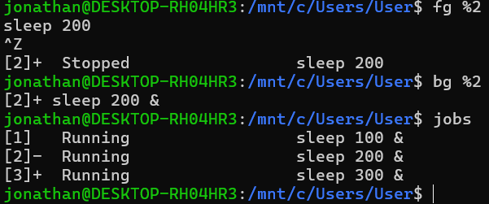

3. Terminasi Job Spesifik
Penggunaan kill %1 mengirimkan sinyal SIGTERM secara spesifik ke nomor urut job pertama, bukan berdasarkan PID. Setelah perintah ini dijalankan, daftar job akan diperbarui dan menyisakan dua proses lainnya yang masih aktif berjalan di latar belakang.

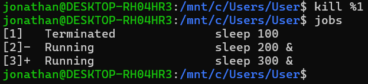

### LATIHAN 6.C

#### Prioritas dan Sinyal

##### SOAL

1. Jalankan dua proses sleep: satu dengan nice +5 dan satu dengan nice +15. Verifikasi nilai NI keduanya dengan ps.

2. Gunakan renice untuk mengubah nice proses pertama menjadi +10. Proses mana yang kini lebih diprioritaskan scheduler?

3. Kirim SIGSTOP ke salah satu proses, verifikasi kondisi T-nya, lalu kirim SIGCONT. Akhiri semua proses percobaan dengan pkill sleep.

##### JAWABAN

1. Inisiasi dan Verifikasi Nice Value
Berdasarkan screenshot pertama, perintah nice -n 5 sleep 300 & dan nice -n 15 sleep 300 & telah berhasil dijalankan. Verifikasi menggunakan ps -l menunjukkan bahwa proses dengan PID 2533 memiliki nilai NI 5, sedangkan proses dengan PID 2534 memiliki nilai NI 15.

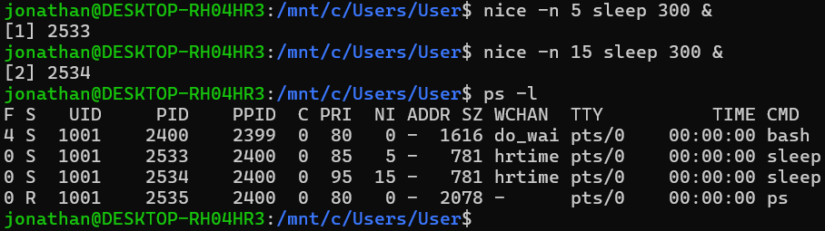

2. Penggunaan renice dan Prioritas Scheduler
Setelah menjalankan perintah renice -n 10 -p 2533, nilai NI untuk proses tersebut berubah dari 5 menjadi 10.

Proses mana yang lebih diprioritaskan? Kini, proses pertama (PID 2533 dengan NI 10) tetap lebih diprioritaskan oleh scheduler dibandingkan proses kedua (PID 2534 dengan NI 15).

Alasannya: Dalam Linux, semakin kecil nilai nice, semakin tinggi prioritas aksesnya ke CPU. Karena 10 lebih kecil daripada 15, maka proses pertama dianggap "kurang ramah" dan berhak mendapatkan jatah waktu CPU lebih banyak daripada proses kedua.

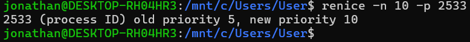

3. Sinyal SIGSTOP, SIGCONT, dan Terminasi
Berdasarkan screenshot ketiga, pengiriman sinyal telah berhasil dibuktikan dengan urutan berikut:

SIGSTOP: Sinyal kill -SIGSTOP 2534 mengubah status proses (STAT) menjadi TN (T = Stopped, N = Low priority), yang berarti proses tersebut berhenti total sementara.

SIGCONT: Sinyal kill -SIGCONT 2534 mengembalikan status proses menjadi SN, yang menandakan proses telah bangun dan melanjutkan aktivitasnya di latar belakang.

Terminasi Akhir: Perintah pkill sleep secara efektif menghentikan seluruh proses sleep yang tersisa, dibuktikan dengan munculnya keterangan Terminated pada output terminal.

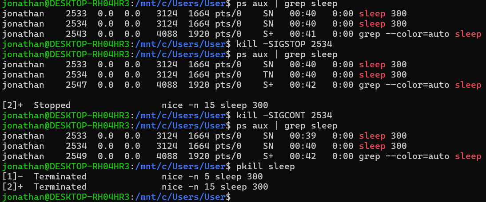