# PERTEMUAN 7

## PRAKTIKUM 7.1

1. Melihat shell login dan shell aktif saat ini
   
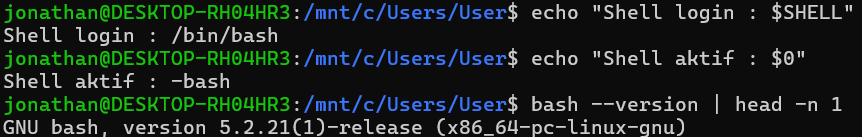

2. Melihat proses shell yang sedang berjalan
   
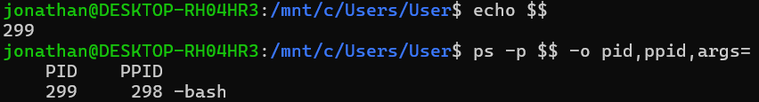

3. Membuat workspace praktikum

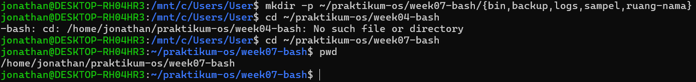

4. Membuat beberapa file contoh

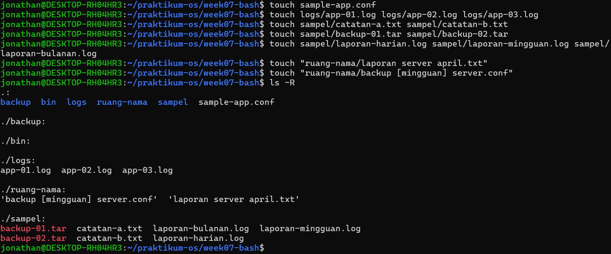

## PRAKTIKUM 7.2

1. Masuk ke workspace praktikum

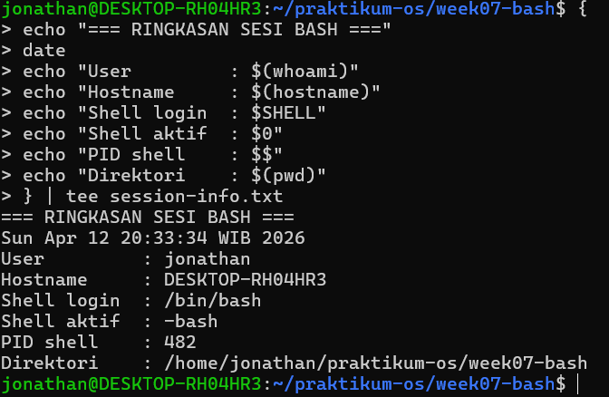

2. Menyimpan informasi sesi terminal ke file laporan

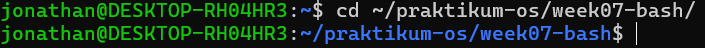

3. Memverifikasi isi file laporan
   
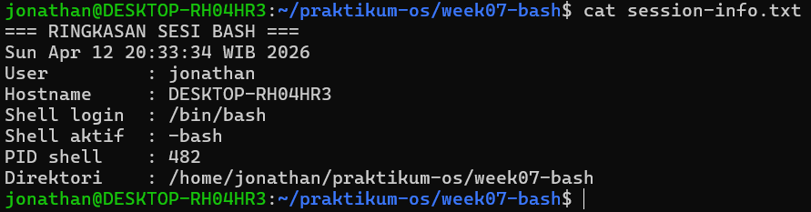

## PRAKTIKUM 7.3

1. Melihat file konfigurasi Bash pada home dir

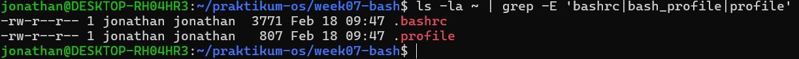

2. Membuat backup .bashrc

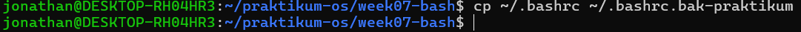

3. Menambahkan blok konfigurasi praktikum

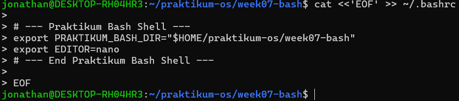

4. Menerapkan konfigurasi tanpa logout
   
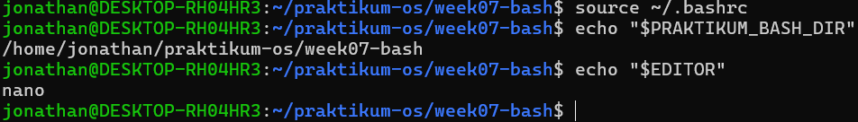

## PRAKTIKUM 7.4

1. Membackup .bash_profile jika sudah ada

2. Tambahkan konfigurasi login shell

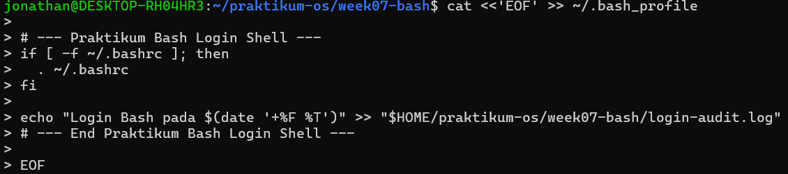

3. Mengujinya dengan membuka login shell baru

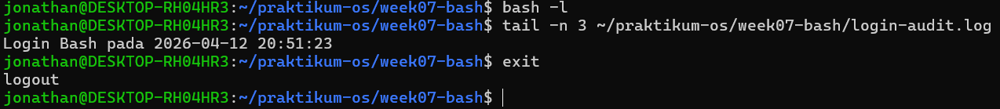

## PRAKTIKUM 7.5

1. Membuat variabel lokal

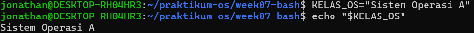

2. Membuat subshell dan mengecek apakah variabel masih ada

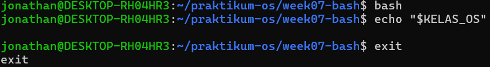

3. Mengubahnya menjadi environment variable

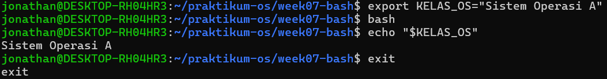

4. Melihat isi PATH dan lokasi beberapa perintah

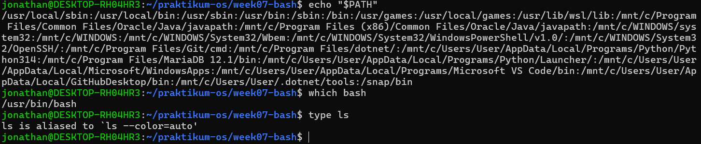

## PRAKTIKUM 7.6

1. Memastikan direktori bin praktikum tersedia

2. Menambahkan direktori tersebut ke PATH melalui .bashrc

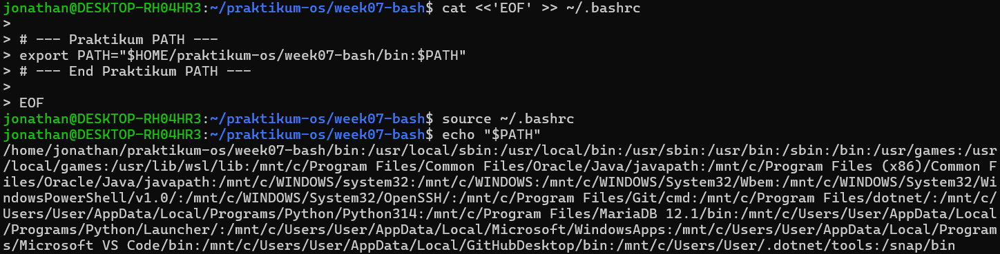

3. Membuat script ringkasan sistem

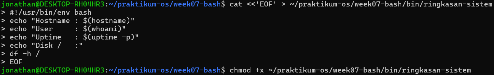

4. Menjalankan script dari direktori yang berbeda

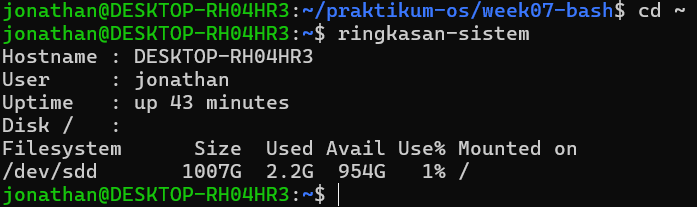

## PRAKTIKUM 7.7

1. Menambahkan alias ke .bashrc

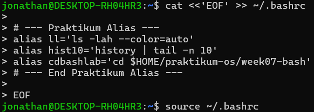

2. Menguji alias

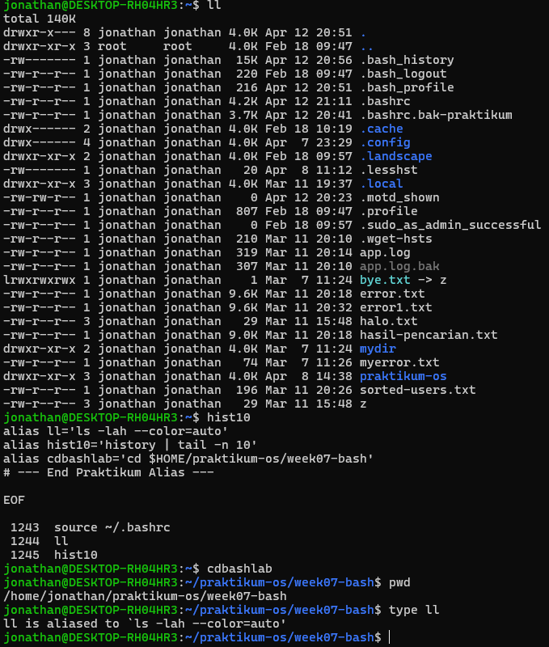

## PRAKTIKUM 7.8

1. Menyimpan file konfigurasi

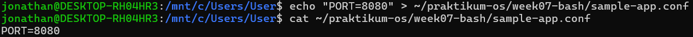

2. Menambahkan fungsi ke .bashrc

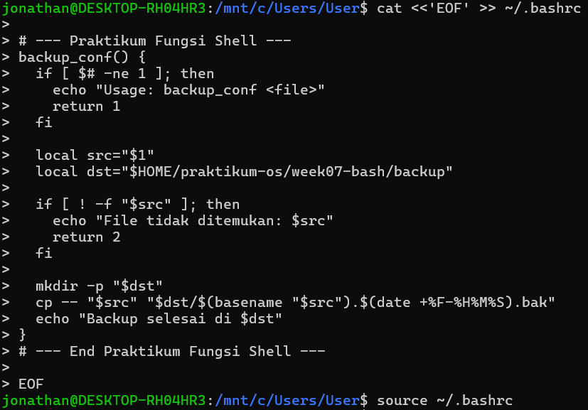

3. Menguji fungsi

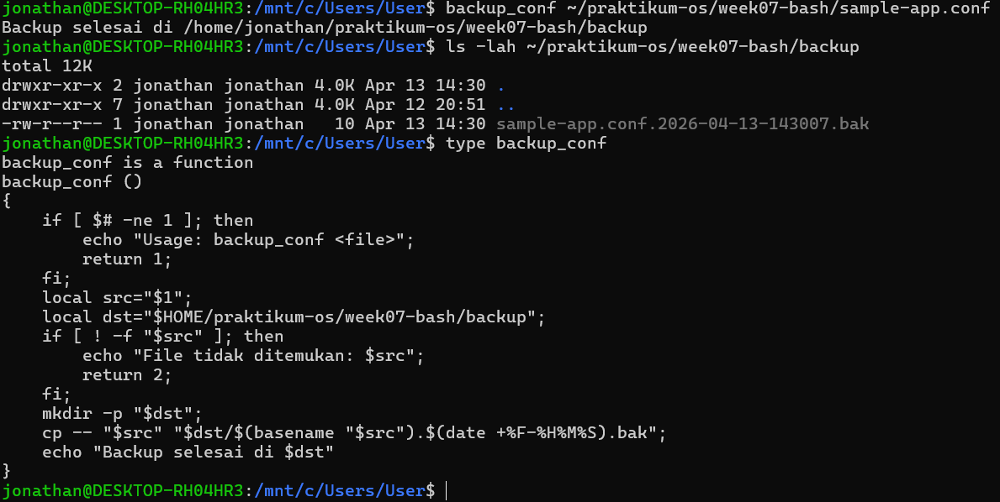

## PRAKTIKUM 7.9

1. Memastikan file contoh tersedia

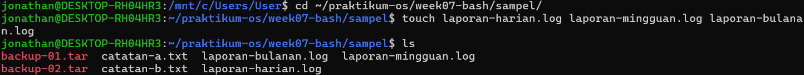

2. Menguji completion file

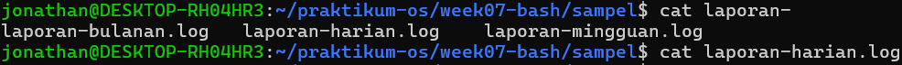

3. Menjalankan beberapa perintah sederhana

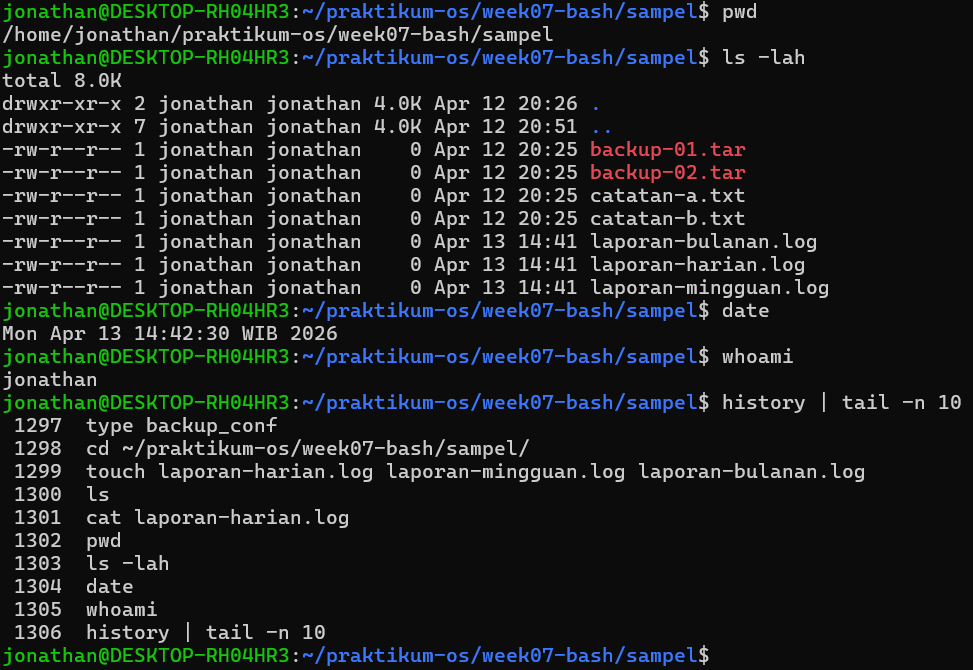

## PRAKTIKUM 7.10

1. Menjalankan beberapa perintah diagnostik

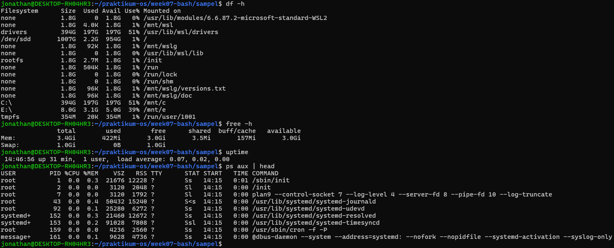

2. Mencari ulang perintah diagnostik dari history

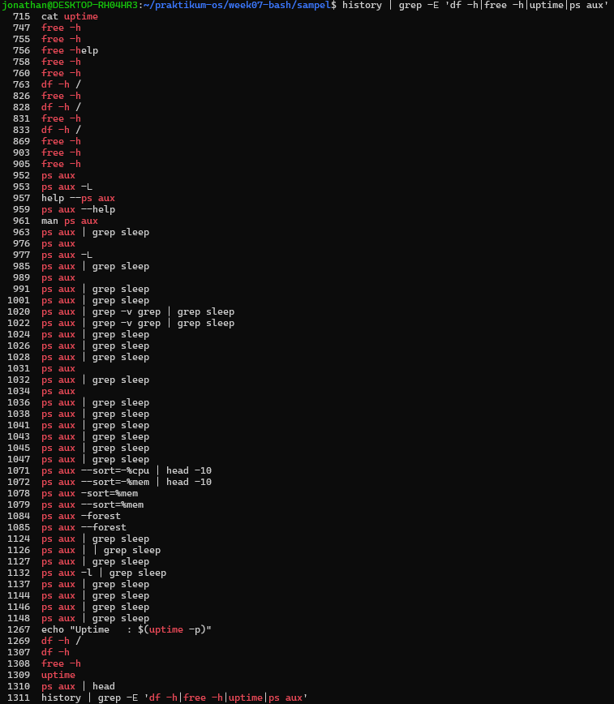

3. Menjalankan ulang salah satu perintah berdasarkan nomor history

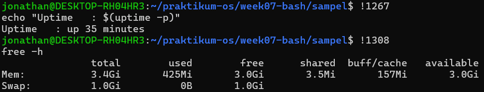

4. Menyimpan potongan history ke file dokumentasi

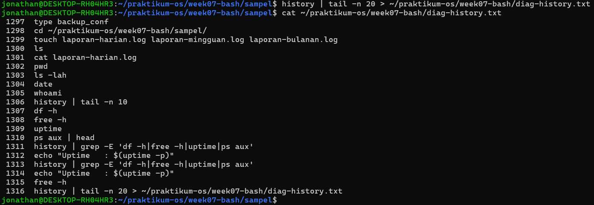

## PRAKTIKUM 7.11

1. Masuk ke direktori sampel

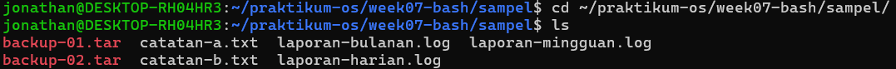

2. Mencoba beberapa pola wildcard

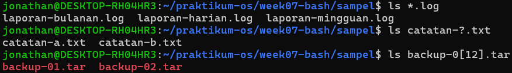

3. Mencoba beberapa ekspansi lain

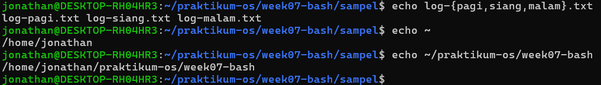

## PRAKTIKUM 7.12

1. Menyimpan file log tambahan

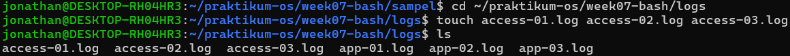

2. Preview file yang akan diproses

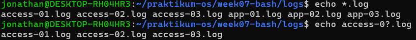

3. Memindahkan semua file log ke folder arsip

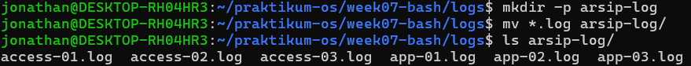

4. Kompres folder arsip

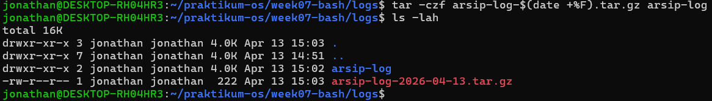

## PRAKTIKUM 7.13

1. Menguji single quote dan double quote

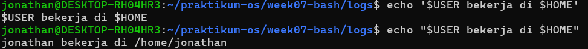

2. Menguji escape karakter spasi

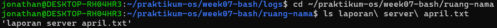

3. Menguji akses file yang sama dengan double quote

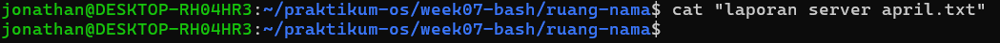

## PRAKTIKUM 7.14

1. Memastikan file target tersedia

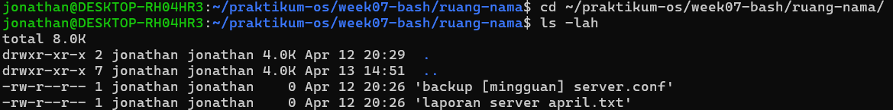

2. Menyalin file dengan nama kompleks ke folder backup

3. Menggunakan variabel untuk memproses path dengan aman

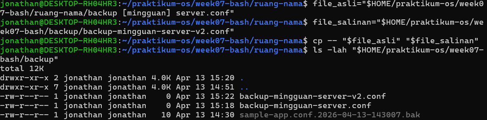

4. Menampilkan daftar file hasil backup

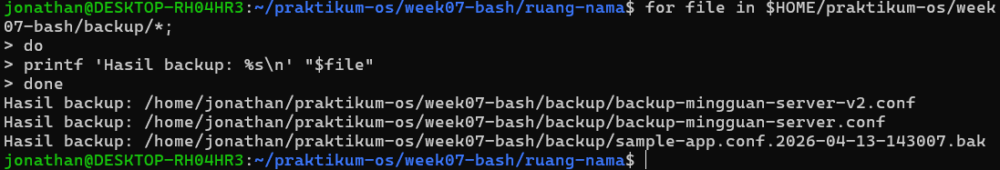

## TUGAS PRAKTIKUM 1 - Toolkit Bash Administrator Pribadi

### SOAL

#### Konteks Riil

Seorang administrator sering mengulang perintah yang sama setiap hari. Agar pekerjaan lebih efisien dan konsisten, ia perlu memiliki toolkit Bash pribadi yang otomatis aktif setiap login.

#### Instruksi Tugas

1. Tambahkan konfigurasi pada .bashrc untuk:
   
   - menambahkan direktori bin pribadi ke PATH,

   - membuat minimal 2 alias yang membantu kerja harian,

   - membuat minimal 1 fungsi shell yang berguna untuk administrasi.

2. Pastikan konfigurasi tersebut aktif kembali saat membuka shell login.

3. Buat satu script sederhana di direktori bin pribadi, misalnya script untuk menampilkan ringkasan sistem.

4. Uji dari direktori yang berbeda untuk memastikan script dapat dipanggil tanpa menuliskan path lengkap.

5. Simpan bukti pengujian ke file toolkit-bash-report.txt.

#### Minimal Luaran:

- isi blok konfigurasi yang ditambahkan ke .bashrc,

- output echo $PATH,

- output type untuk alias, fungsi, dan script,

- file laporan toolkit-bash-report.txt.

### JAWABAN

1. Membuat folder bin pribadi dan konfigurasi .bashrc

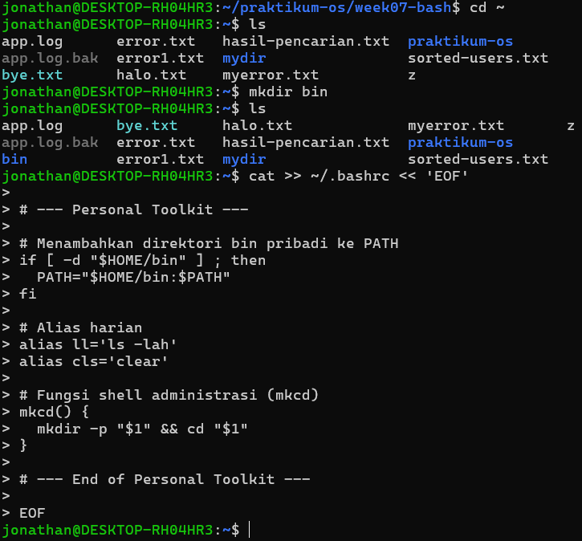

2. Aktivasi konfigurasi

3. Mengetes hasil konfigurasi

- Perintah "ll"

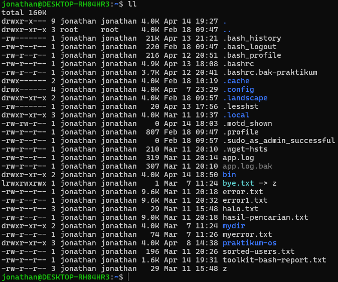

- Perintah "cls"

- Perintah "mkcd"

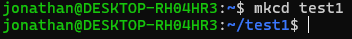

4. Mengecek apakah bin sudah masuk PATH

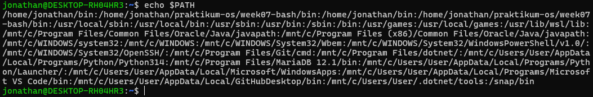

5. Membuat skrip sysinfo

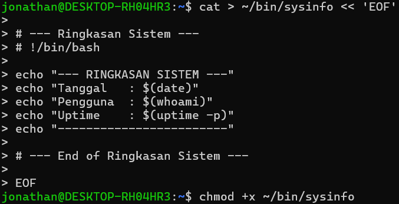

6. Menguji hasil skrip sysinfo

7. Membuat file laporan

8. Menguji file laporan

## TUGAS PRAKTIKUM 2 - Audit File Konfigurasi dan Logging Aman

### SOAL

#### Konteks Riil

Saat troubleshooting, administrator sering perlu menginventarisasi file konfigurasi dan memisahkan output normal dari pesan error.

#### Instruksi Tugas:

1. Buat file laporan bernama audit-konfigurasi-$(date +%F).txt.

2. Cari file *.conf di dalam /etc dan simpan hasilnya ke file laporan.

3. Catat jumlah total file konfigurasi yang ditemukan.

4. Jika ada pesan error, simpan ke file terpisah misalnya audit-error.log.

5. Tampilkan isi laporan ke terminal dan sekaligus simpan menggunakan tee.

6. Tambahkan ringkasan singkat 3–5 baris yang menjelaskan mengapa pemisahan stdout dan stderr penting dalam audit sistem.

#### Syarat Konsep yang Harus Muncul

- redirection >, 2>, atau &>,

- pipeline,

- tee,

- penggunaan variabel atau command substitution.

#### Minimal Luaran

- file laporan audit,

- file log error,

- perintah yang digunakan,

- analisis singkat hasil audit.

### JAWABAN

1. Menyiapkan variable nama file

2. Mengeksekusi audit (find, redirect, dan error handling)

3. Menghitung total dan menggunakan tee

4. Menampilkan hasil akhir

## TUGAS PRAKTIKUM 3 - Mini Health Check Harian Server

### SOAL

#### Konteks Riil

Administrator perlu membuat pemeriksaan cepat (health check) untuk mengetahui kondisi dasar server sebelum dan sesudah maintenance.

#### Instruksi Tugas

1. Buat script Bash bernama daily-healthcheck pada direktori bin pribadi.

2. Script minimal harus menampilkan:

   - tanggal dan waktu,

   - hostname,

   - user aktif,

   - shell aktif,

   - uptime,

   - penggunaan memori,

   - penggunaan filesystem root,

   - 10 baris terakhir history command yang relevan dengan pengecekan.

3. Simpan hasil ke file log harian, misalnya healthcheck-$(date +%F).log.

4. Tampilkan hasil ke terminal dan ke file secara bersamaan.

5. Jika Anda menggunakan pipeline dengan tee, cek juga status exit command utama.

#### Syarat konsep yang harus muncul:

- environment variable,

- PATH,

- alias atau fungsi pendukung,

- history,

- tee,

- penanganan error dasar.

#### Minimal luaran:

- file script yang executable,

- contoh isi file log hasil eksekusi,

- penjelasan singkat fungsi tiap bagian script.

### JAWABAN

1. Membuat skrip daily-healthcheck

2. Membuat fungssi/alias pendukung

3. Menjalankan perintah `hc` dan mengecek file log

- Tampilan pada terminal

- Tampilan pada file log

4. Berikut adalah penjelasan fungsi tiap bagian
   
   - `$HOSTNAME, $USER, $SHELL`: Menggunakan Environment Variables bawaan Linux untuk mengambil informasi identitas tanpa perlu menjalankan perintah tambahan.
   
   - `{ ... } | tee -a "$LOG_FILE"`: Tanda kurung kurawal mengelompokkan semua perintah echo dan health check menjadi satu aliran data, yang kemudian dikirim ke tee. Flag -a (append) memastikan log lama tidak terhapus.

   - `PIPESTATUS[0]`: Dalam sebuah pipeline, $? hanya menangkap status perintah terakhir (tee). Untuk mengetahui apakah perintah pengecekan sistem di awal berhasil atau gagal, kita harus menggunakan variabel array PIPESTATUS.

   - `history 10`: Memberikan konteks pada administrator mengenai apa yang baru saja dilakukan sebelum sistem diperiksa, sangat berguna untuk melacak penyebab error.

   - `exit 1`: Menghentikan skrip dengan kode error jika pengecekan gagal, sesuai standar praktik administrasi sistem yang baik.

## TUGAS PRAKTIKUM 4 - Penanganan File dengan Nama Kompleks dan Arsip Aman

### SOAL

#### Konteks Riil

File hasil backup, ekspor, atau laporan sering memiliki nama yang mengandung spasi atau karakter khusus. Administrator harus tetap dapat memproses file-file tersebut tanpa salah target.

#### Instruksi Tugas

1. Buat minimal 4 file contoh dengan nama yang bervariasi, termasuk:

- nama file yang mengandung spasi,

- nama file yang mengandung tanda kurung siku atau karakter khusus,

- file dengan pola nama serupa untuk diuji dengan wildcard.

2. Tunjukkan perbedaan hasil jika file diakses tanpa quoting dan dengan quoting yang benar.

3. Lakukan preview wildcard dengan echo sebelum dipakai untuk operasi nyata.

4. Salin file-file tersebut ke direktori backup dengan nama yang aman.

5. Buat arsip tar.gz dari hasil backup.

6. Simpan riwayat perintah yang Anda gunakan ke file riwayat-arsip.txt.

#### Syarat Konsep yang Harus Muncul

- single quote, double quote, dan escaping,

- wildcard,

- variabel path,

- history,

- operasi file lanjutan yang aman.

#### Minimal luaran:

- daftar file awal,

- daftar file hasil backup,

- file arsip tar.gz,

- file riwayat-arsip.txt,

- refleksi singkat tentang pentingnya quoting di Bash.

### JAWABAN

1. Membuat file dengan nama yang unik

2. Demonstrasi peran dari quoting

3. Preview wildcard & operasi aman

4. Membuat arsip dan riwayat

5. Hasil akhir (luaran minimal)

