# **PERTEMUAN 9 : Pemrograman Bash**

## Praktikum 9.1

### Percobaan

1. Membuat workspace praktikum

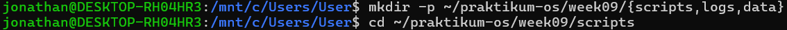

2. Membuat script dengan nano

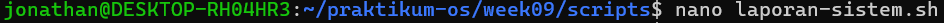

3. Mengisi file

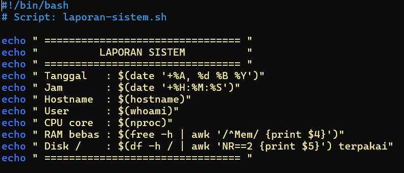

4. Memberi izin dan menjalankan

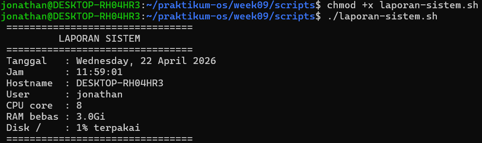

### Latihan 9.1

#### SOAL

Modifikasi laporan-sistem.sh agar menyimpan output ke file laporan-YYYY-MM-DD.txt sekaligus menampilkannya di terminal. Petunjuk: gunakan tee yang sudah dipelajari di bab sebelumnya.

#### JAWABAN

1. Membuka dan mengedit file laporan-sistem.sh dengan nano

2. Menambahkan kurung kurawal {} yang mengapit seluruh kode sebelumnya

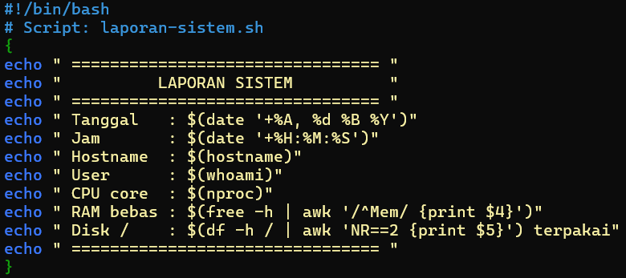

3. Menambahkan `| tee "laporan-$(date '+%Y-%m-%d').txt"` agar menyimpan output ke file dengan format nama laporan-YYYY-MM-DD.txt sekaligus menampilkannya di terminal

4. Menjalankan bash dengan ./laporan-sistem.sh

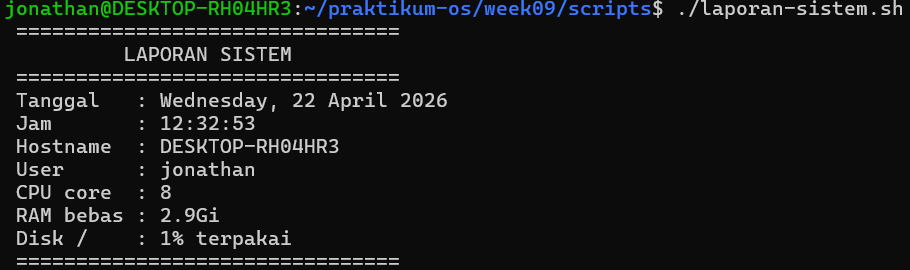

5. Mengecek keberadaan file dengan ls

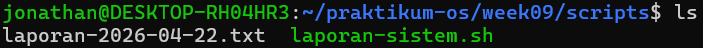

6. Mengecek isi file apakah sudah sesuai atau belum

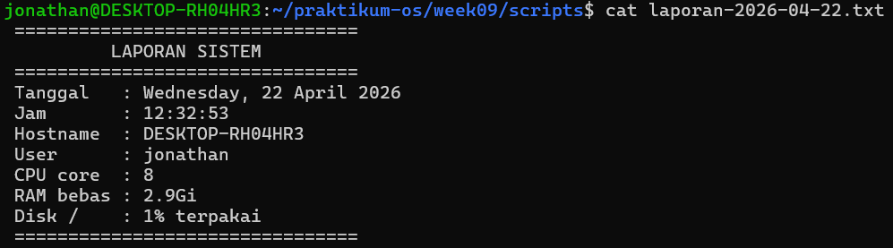

## Praktikum 9.2

### Percobaan

1. Membuat script

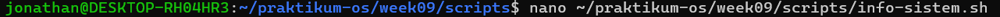

2. Mengetik isi script

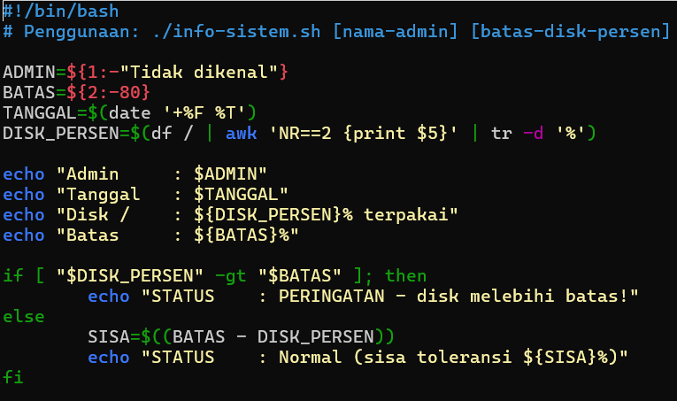

3. Menyimpan, memberi izin, dan mengujinya dengan berbagai kombinasi argumen

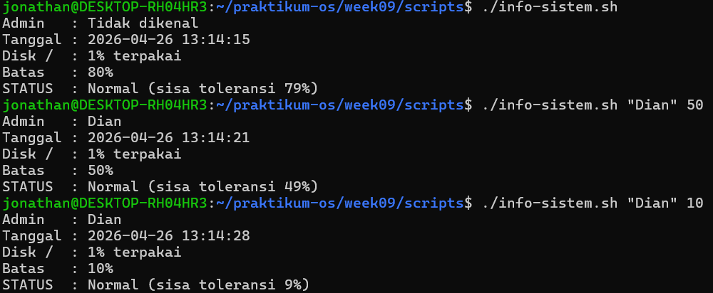

### Latihan 9.2

#### SOAL

Buat script kalkulator.sh yang menerima tiga argumen: <angka1>
<operator> <angka2> dengan operator +, -, *, atau /. Contoh: ./kalkulator.sh 20 + 5 menghasilkan 25. Gunakan case untuk memilih operasi, dan validasi jika argumen tidak lengkap.

#### JAWABAN

1. Menuju ke direktori yang akan digunakan sekaligus membuat dan membuka file bash dengan nama kalkulator menggunakan perintah nano

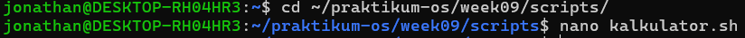

2. Mengisinya dengan berbagai perintah sesuai dengan yang diinginkan

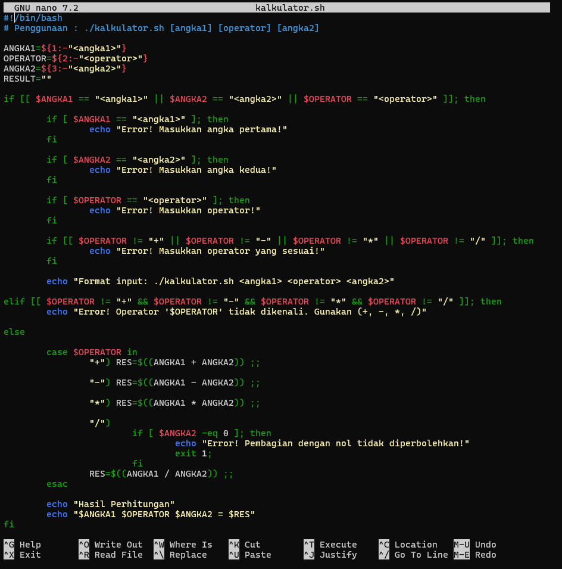

3. Menambahkannya pada file yang diberi izin dan kemampuan untuk dieksekusi

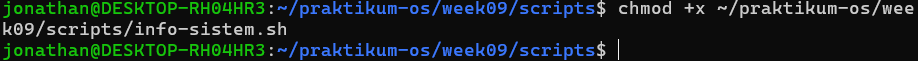

4. Mengujinya tanpa argumen

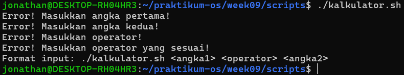

5. Mengujinya dengan berbagai argumen (+, -, *, /)

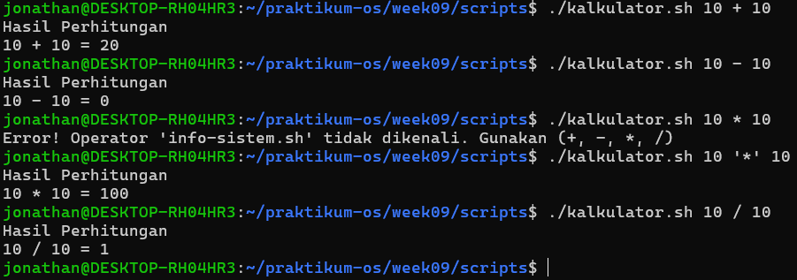

**Keterangan** :

> Pada pengujian ketiga, yakni dengan operasi perkalian (*), pemgujian `./kalkulator.sh 5 * 5` tidak berhasil dan berakhir dengan error operator tidak dikenali karena tanda `*` adalah sebuah wildcard digunakan untuk mencocokkan dengan semua file/folder yang ada di direktori saat ini, dalam kasus ini `info-sistem.sh`, sehingga bash melihat string `info-sistem.sh` sebagai operator dan tidak mengenalinya.

> Namun, ketika menambahkan tanda petik tunggal (''), kita seakan membuat apa yang ada di dalam petik tersebut sebagai teks biasa dan tidak mengandung command atau wildcard apapun, sehingga bash mengenalinya sebagai string bintang (*).

## Praktikum 9.3

### Percobaan

1. Membuat script grading dan memulainya dengan nano

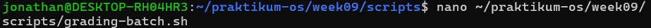

2. Mengetik isi script

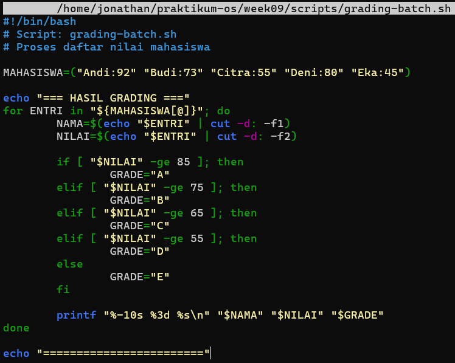

3. Menyimpannya, memberi izin, dan menjalankannya

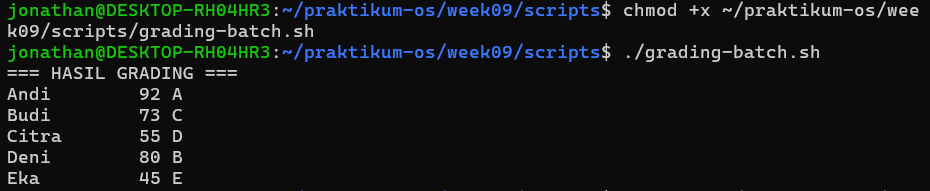

4. Membuat script menu interaktif dan memulainya dengan nano

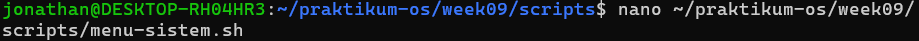

5. Mengetik isi script

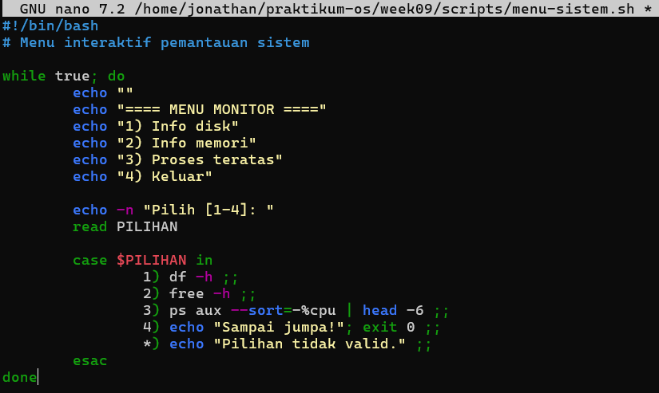

6. Memberi izin dan menjalankannya dengan beberapa case

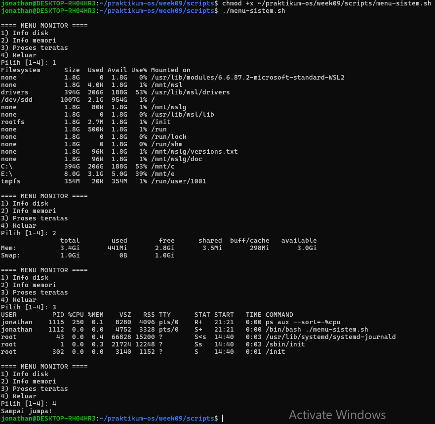

### Latihan 9.3

#### SOAL

Tambahkan ke script grading-batch.sh sebuah ringkasan di bagian bawah
yang menampilkan: jumlah mahasiswa per grade (A, B, C, D, E) menggunakan
perulangan for kedua yang mengiterasi array MAHASISWA.

#### JAWABAN

1. Membuka dan mengedit kembali file grading-batch.sh

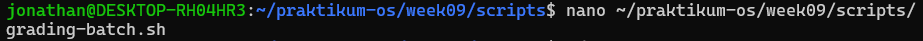

2. Menambahkan beberapa script yang sesuai

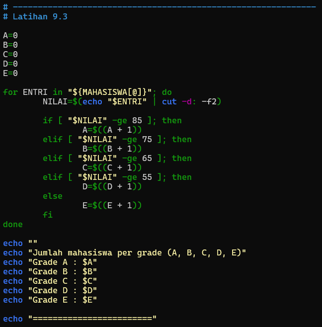

3. Mengujinya

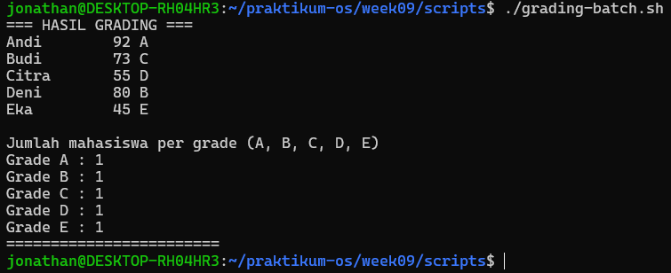

## Praktikum 9.4

### Percobaan

1. Membuat file library dengan nano

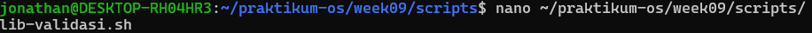

2. Mengisinya dengan script

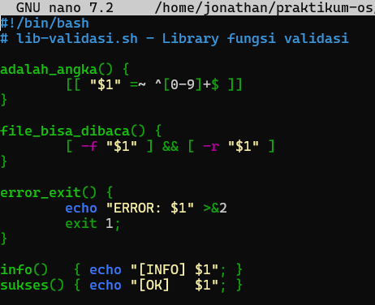

3. Membuat script yang menggunakan library

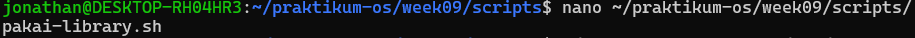

4. Mengisinya dengan script yang sesuai

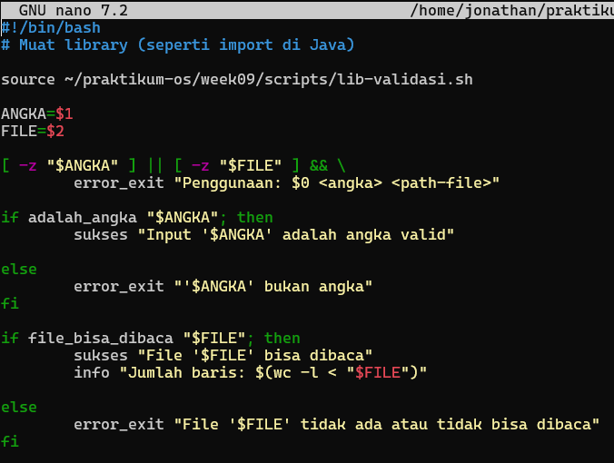

5. Memberi izin dan menguji semua skenario

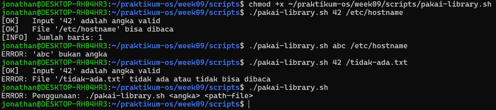

### Latihan 9.4

#### SOAL

Tambahkan fungsi konfirmasi() ke lib-validasi.sh. Fungsi ini menampilkan pertanyaan, membaca input Y/N dari user, mengembalikan 0 jika Y dan 1 jika N. Buat script demo yang memanggil fungsi ini sebelum menghapus sebuah file.

#### JAWABAN

1. Masuk ke lib-validasi.sh dengan nano untuk mulai mengeditnya

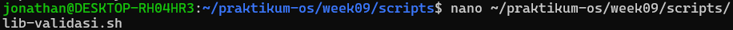

2. Menambahkan fungsi konfirmasi

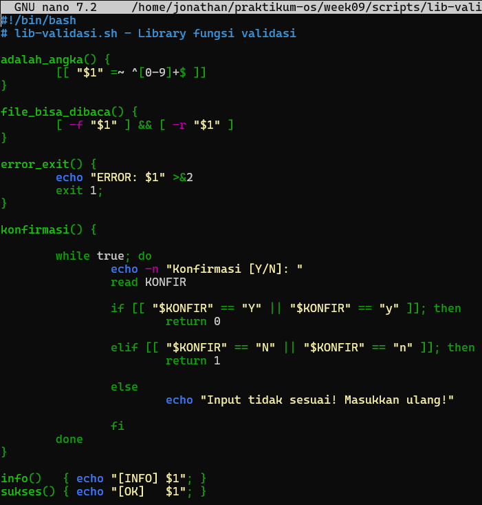

3. Masuk ke pakai-library.sh dengan nano untuk mulai mengeditnya

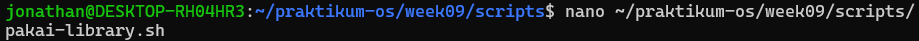

4. Menambahkan kondisi telah dikonfirmasi atau belum

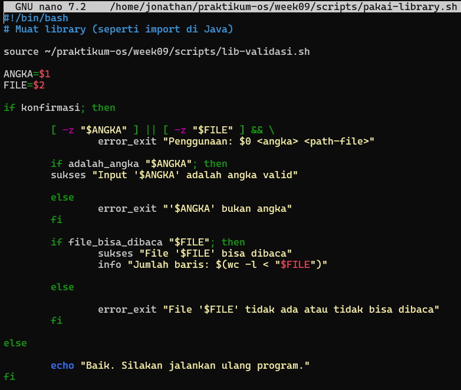

5. Mengujinya dengan berbagai skenario

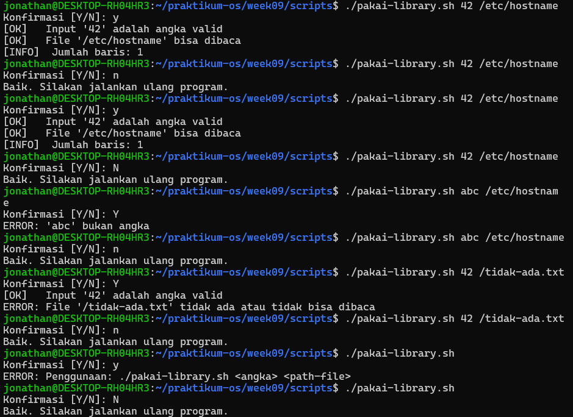

## Praktikum 9.5

1. Membuat wadah script pada backup-data.sh dengan nano

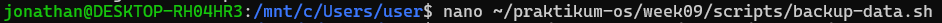

2. Mengisinya dengan script

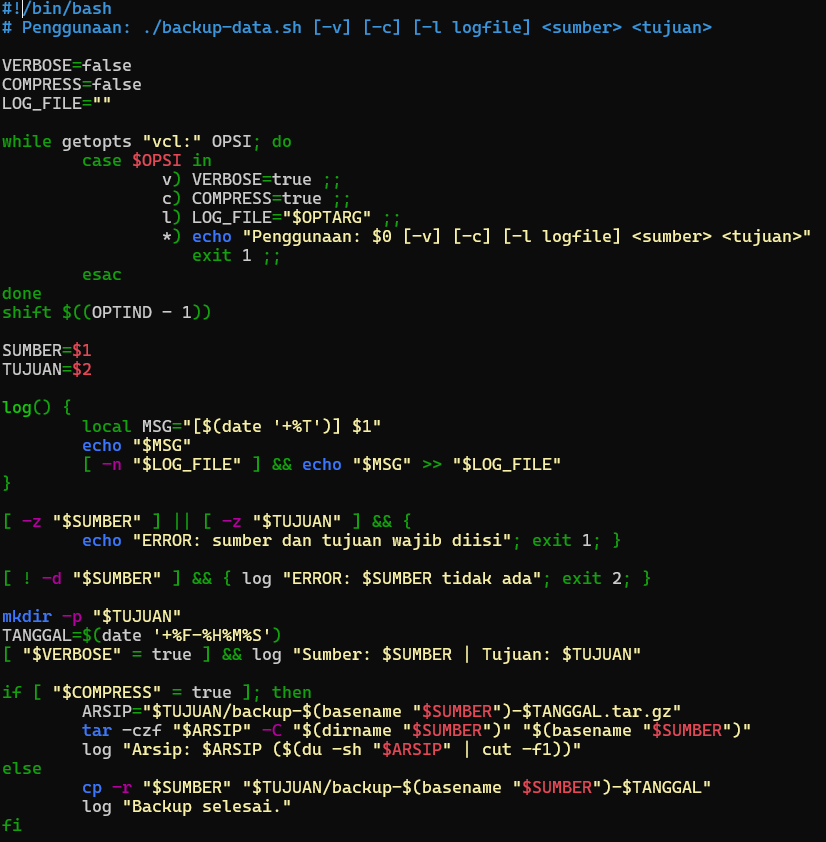

3. Memberi izin dan mengujinya

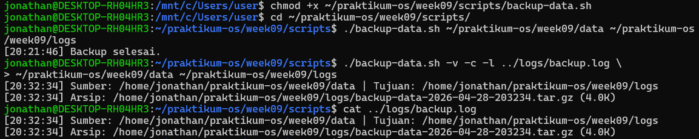

## Praktikum 9.6

### Percobaan

1. Membuat script dengan nano untuk dianalisis

2. Mengetik isi script

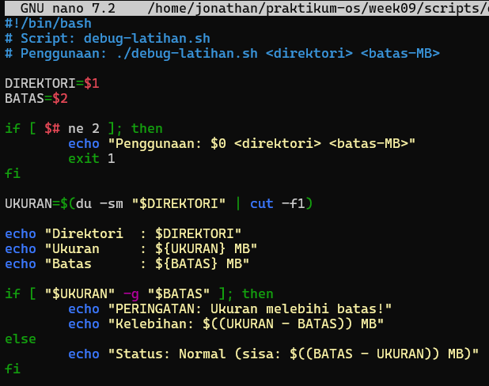

3. Mengecek sintaks dan menjalankannya dengan tracing

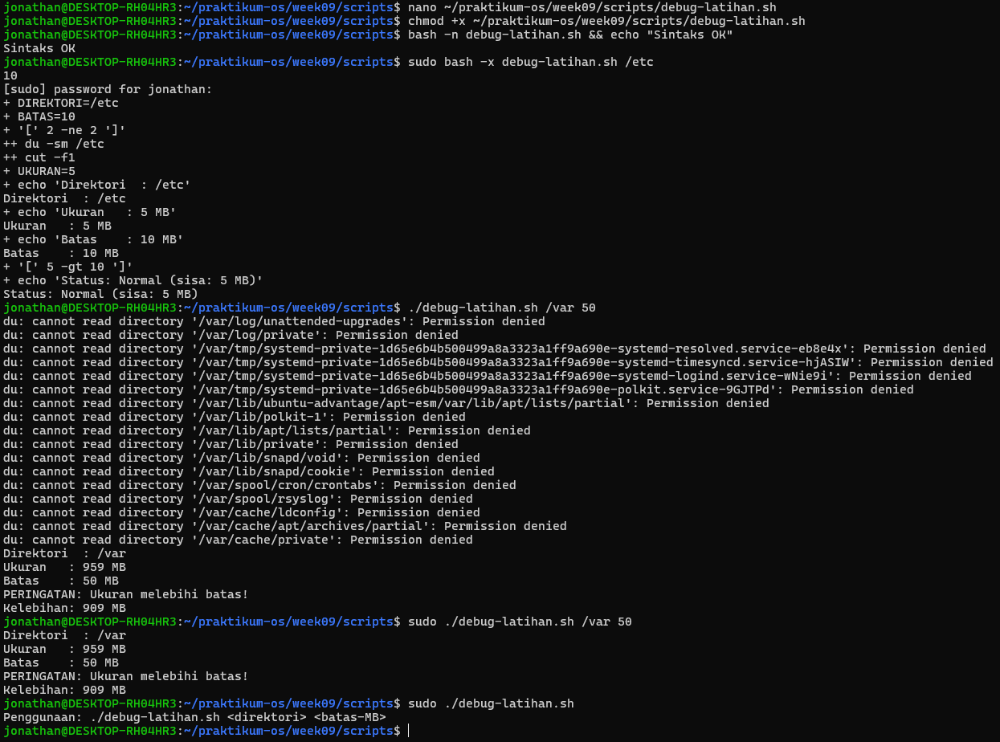

### Latihan 9.6

#### SOAL

Script debug-latihan.sh tidak menangani direktori yang tidak ada. Perbaiki dengan menambahkan:

- set -e di baris kedua

- Pengecekan -d "$DIREKTORI" sebelum memanggil du

- Pesan error yang informatif jika direktori tidak ditemukan

Uji dengan direktori yang tidak ada.

#### JAWABAN

1. Masuk ke dalam debug-latihan.sh dengan nano untuk mengeditnya

2. Menambahkan `set -e` pada baris kedua, menambahkan pengecekan `-d "$DIREKTORI"` sebelum memanggil `du`, dan menambahkan pesan error yang informatif jika direktori tidak ditemukan

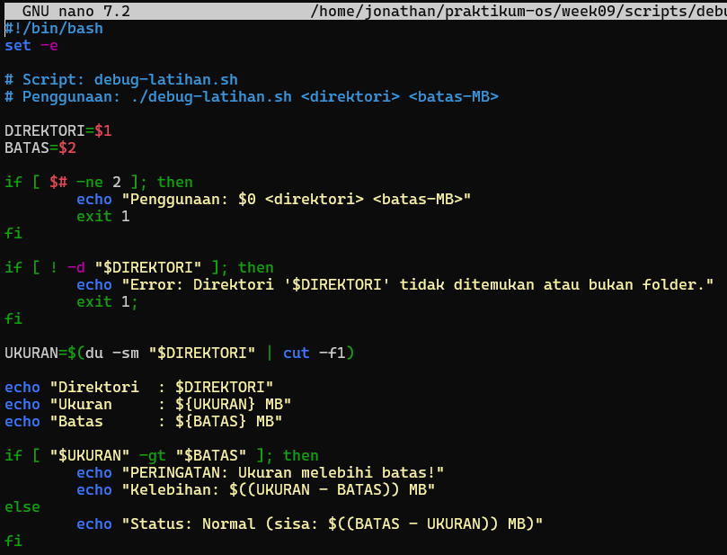

3. Mengujinya dengan direktori yang tidak ada dan membandingkannya dengan yang ada

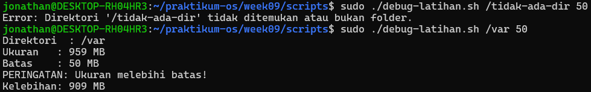

## Tugas Praktikum

### Tugas 1

#### SOAL

1. Buat script absensi.sh yang:

- Menerima argumen nama mahasiswa dan status (hadir/izin/alpha)

- Menyimpan entri ke absensi-YYYY-MM-DD.txt dengan format [HH:MM] NAMA - STATUS

- Opsi -r: tampilkan rekapitulasi (jumlah per status)

- Opsi -h: tampilkan bantuan

2. Rekam minimal 5 entri dan tampilkan rekapitulasinya.

Konsep wajib: variabel, parameter posisional, getopts, if, for, fungsi, dan redirection ke file.

#### JAWABAN

1. Membuat file bash baru dengan nama absensi.sh sekaligus masuk untuk mengedit dengan nano

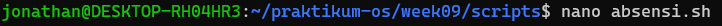

2. Mengisinya dengan script yang sesuai

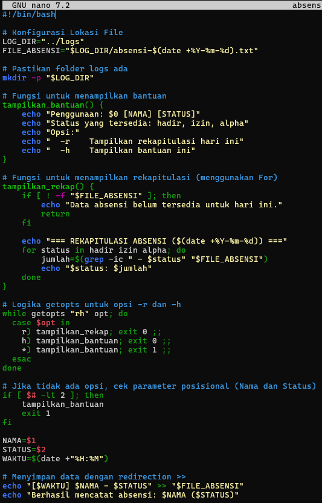

3. Memberikan izin dan kemampuan untuk dapat dieksekusi

4. Mengujinya dengan 5 entri

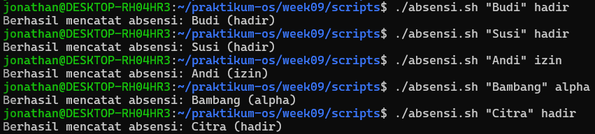

5. Menampilkan rekapitulasi

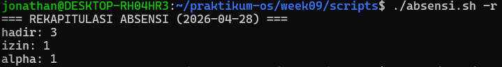

6. Menampilkan bantuan

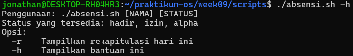

7. Mengecek hasil file di folder logs

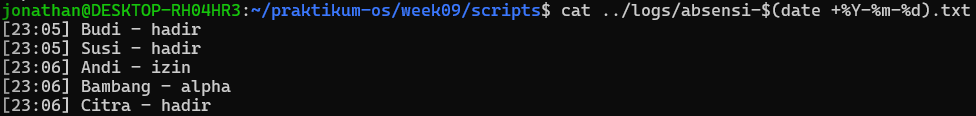

### Tugas 2

#### SOAL

Konteks: administrator membuat pemeriksaan kondisi server sebelum maintenance.

Instruksi:

1. Buat script healthcheck.sh menggunakan template profesional dari bagian Best Practices.

2. Script menampilkan: tanggal/waktu, hostname, uptime, penggunaan CPU, memori, dan disk untuk setiap filesystem yang terpasang.

3. Jika penggunaan disk mana pun melebihi 80%, tampilkan peringatan.

4. Simpan hasil ke healthcheck-YYYY-MM-DD.log dan tampilkan ke terminal sekaligus menggunakan tee.

5. Opsi -t <persen> mengubah batas peringatan disk (default 80). 
 
Konsep wajib: set -euo pipefail, trap, getopts, fungsi dengan local, for, if, dan tee.

#### JAWABAN

1. Membuat file bash baru dengan nama healthcheck.sh sekaligus masuk untuk mengedit dengan nano

2. Mengetik script yang dibutuhkan

    
Code

    #!/bin/bash

    # 1. Best Practices: set -euo pipefail
    # -e: berhenti jika ada error
    # -u: error jika ada variabel yang belum didefinisikan
    # -o pipefail: menangkap error di dalam pipe (|)
    set -euo pipefail

    # Konfigurasi File Log
    LOG_DIR="../logs"
    mkdir -p "$LOG_DIR"
    LOG_FILE="$LOG_DIR/healthcheck-$(date +%Y-%m-%d).log"

    # Batas default (80%)
    THRESHOLD=80

    # 2. Trap: Membersihkan atau memberi pesan saat script selesai/interupsi
    trap 'echo "[$(date +%T)] Pemeriksaan Selesai."' EXIT

    # 3. Fungsi dengan variabel local
    tampilkan_info() {
        local host=$(hostname)
        local waktu=$(date "+%Y-%m-%d %H:%M:%S")
        local up=$(uptime -p)
        
        echo "------------------------------------------"
        echo "WAKTU    : $waktu"
        echo "HOSTNAME : $host"
        echo "UPTIME   : $up"
    }

    cek_cpu_mem() {
        echo "--- CPU & MEMORY ---"
        # Mengambil penggunaan CPU (menggunakan top)
        local cpu_load=$(top -bn1 | grep "Cpu(s)" | awk '{print $2 + $4}')
        local mem_usage=$(free -m | awk '/Mem:/ { printf("%.2f%%", $3/$2*100) }')
        
        echo "CPU Usage: $cpu_load%"
        echo "Mem Usage: $mem_usage"
    }

    cek_disk() {
        echo "--- DISK FILESYSTEM ---"
        # Loop 'for' untuk mengecek setiap baris hasil df
        # Membaca filesystem, ukuran, dan persentase
        df -h | grep '^/dev/' | while read -r line; do
            local fs=$(echo "$line" | awk '{print $1}')
            local pcn=$(echo "$line" | awk '{print $5}' | sed 's/%//')
            
            echo "Filesystem $fs: ${pcn}% digunakan"
            
            # 'if' untuk mengecek ambang batas
            if [ "$pcn" -gt "$THRESHOLD" ]; then
                echo ">> PERINGATAN: $fs hampir penuh! ($pcn%) <<"
            fi
        done
    }

    # 4. Getopts: Opsi -t untuk mengubah threshold
    while getopts "t:h" opt; do
    case $opt in
        t) THRESHOLD=$OPTARG ;;
        h) echo "Penggunaan: $0 [-t threshold_angka]"; exit 0 ;;
        *) exit 1 ;;
    esac
    done

    # 5. Eksekusi Utama dengan 'tee'
    # Semua output dari fungsi-fungsi ini akan masuk ke terminal DAN log file
    {
        tampilkan_info
        cek_cpu_mem
        cek_disk
        echo "------------------------------------------"
    } | tee -a "$LOG_FILE"

3. Memberikan izin dan kemampuan untuk dapat dieksekusi

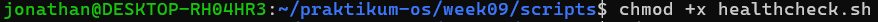

4. Melakukan berbagai pengujian sekaligus mengecek hasil log yang disimpan

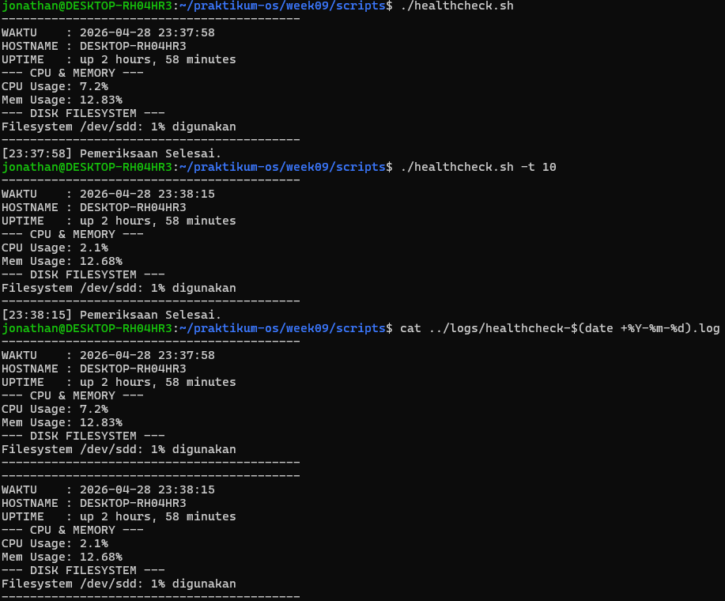